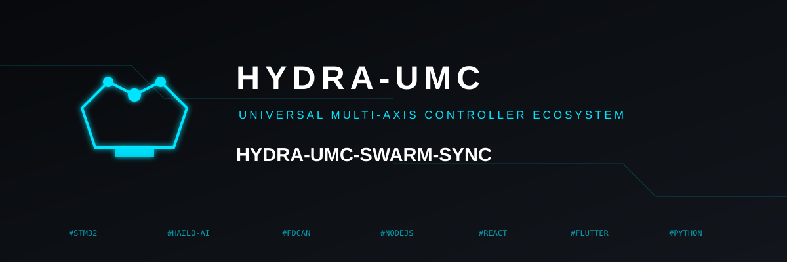
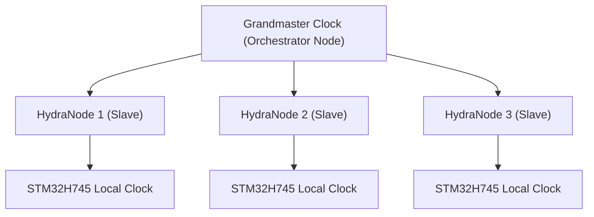

<p align="center">
  
</p>

# ⏱️ HYDRA-UMC-SWARM-SYNC

<p align="center">🇺🇸 <b>English</b> | <a href="README_spa.md">🇪🇸 Español</a> | <a href="README_fra.md">🇫🇷 Français</a> | <a href="README_ita.md">🇮🇹 Italiano</a> | <a href="README_deu.md">🇩🇪 Deutsch</a> | <a href="README_zho.md">🇨🇳 简体中文</a> | <a href="README_jpn.md">🇯🇵 日本語</a></p>

### 📡 Precision Time Protocol (PTP) & Multi-Node Synchronization

<p align="left">
  
  
  
</p>

---

## 1. 🛠️ TECHNICAL OVERVIEW

**HYDRA-UMC-SWARM-SYNC** is the heartbeat of the distributed factory. It implements a specialized version of PTP (Precision Time Protocol / IEEE 1588) to ensure that every controller in the network shares a perfectly synchronized global clock.

This synchronization is critical for multi-robot coordinated motion, where multiple arms must start and end trajectories at the exact same microsecond to avoid collisions or to perform joint assembly tasks.

### Key Features:
* ⏱️ **Ultra-Precise Sync:** Achieves sub-100ns jitter across the local network.
* 🔄 **Synchronized Start/Stop:** Ensures atomic execution of multi-robot trajectory commands.
* 📡 **Hardware Timestamping:** Leverages CM5 and STM32 hardware timers for maximum accuracy.
* 🛡️ **Network Resilient:** Handles packet jitter and temporary network delays.
* 🔍 **Real Conflict Visibility & Swarm-Scale Convergence Proof (v0):** `merge_report()` returns a real, per-key record of every genuine write conflict resolved during reconciliation - which cell beat which other cell, and by what stamp. A 4-cell simulated test proves convergence holds across multiple rounds of partition and partial reconnection, not just a single two-cell merge.

---

## 2. 🔄 SYNC HIERARCHY



---

## 3. 🧱 ARCHITECTURE & DESIGN DECISIONS

* **Why CRDT-based sync, not a single source of truth.** Multiple HYDRA-UMC cells can run semi-autonomously and reconnect later - a CRDT merge strategy converges without a central arbiter deciding whose state 'wins', which a naive last-write-wins approach can't guarantee across a real network partition.
* **Why this is a sibling, not a submodule, of HYDRA-UMC-ORCHESTRATOR.** State reconciliation is a continuous background concern independent of any single orchestration decision - keeping it a separate process means an orchestrator restart doesn't interrupt an in-flight merge.
* **Why the CRDT merge is real today but PTP hardware sync is not.** `src/crdt.rs` implements a real LWW-Element-Map (Last-Writer-Wins Map), a state-based CRDT whose `merge` is provably commutative, associative and idempotent - not just "seems to converge on one example", see that module's own property tests. `src/lamport.rs` backs it with a real Lamport logical clock. PTP (IEEE 1588, sub-100ns hardware timestamping) is a fundamentally different, hardware-dependent problem - it needs real NICs/hardware timers to mean anything, and stays deferred until there's real hardware to validate it against. A logical clock is what the CRDT merge actually needs to resolve conflicts deterministically, and that part is real and tested today.
* **How this fits the rest of the ecosystem.** A sibling service under HYDRA-UMC-ORCHESTRATOR, alongside HYDRA-UMC-PATH-PLANNER-3D, HYDRA-UMC-JOB-DISPATCHER and HYDRA-UMC-NODE-HEALING - keeps every cell's own view of swarm state consistent regardless of which one currently holds the orchestrator role.
* **Why `merge_report()` is a new method instead of changing what `merge()` returns.** `merge()` stays a pure, cheap, obviously-correct black box - that simplicity is what makes it easy to trust. `merge_report()` layers real conflict visibility on top for a caller (an operator, a debugging tool) that specifically wants to know what a reconciliation overwrote, without forcing every caller of the hot-path `merge()` to pay for or handle that bookkeeping.
* **Why conflict reports show stamp order, not causal "happened-before".** A Lamport clock guarantees that true causal happens-before implies an earlier stamp - but the converse doesn't hold: an earlier stamp does NOT prove two events were causally related rather than merely concurrent. `MergeConflict` is deliberately honest about reporting only what a Lamport clock can actually prove (a consistent total order), not a causality claim a vector clock would be needed to make.

---

## 📂 DIRECTORY STRUCTURE

```text
HYDRA-UMC-SWARM-SYNC/
├── src/
│   ├── main.rs       # CLI entry point: loads a scenario, reconciles, prints JSON
│   ├── lamport.rs    # LamportClock - the logical clock behind the CRDT's ordering
│   └── crdt.rs       # LwwMap - the real CRDT: set/get/merge/snapshot
├── scenarios/        # Example JSON scenarios (see BUILD & RUN below)
├── build/            # Compiled binaries (build.sh/build.bat output)
├── Cargo.toml        # Rust package manifest (name, version, deps)
├── bump_version.py   # Odometer-style version bump, run by build.sh/.bat
├── build.sh/.bat     # Bumps version, then `cargo build --release`
├── run.sh/.bat       # Runs the compiled binary
└── README.md
```

Pruned from the original template: `hardware/`, `firmware/`, `os/`, `docs/`,
`images/` and `scripts/` — this is a pure software service (Rust binary)
with no dedicated hardware or firmware of its own, no operating system
image to maintain, and no documentation/media/utility-script content
substantial enough yet to warrant their own folders.

---

## 🔧 BUILD & RUN GUIDE

A real, tested CRDT merge - not just a skeleton that compiles: it
reconciles a multi-cell JSON scenario and prints the converged state.

```bash
# Windows
build.bat
run.bat scenarios/example.json

# Linux / macOS
./build.sh
./run.sh scenarios/example.json
```

`build.sh`/`build.bat` bump the version in `Cargo.toml` (ecosystem-wide
odometer rule, see `bump_version.py`) and then run `cargo build --release`.
`run.sh`/`run.bat` execute the resulting binary directly, forwarding any
arguments (the scenario path) to it.

A scenario is a JSON file with a `cells` array - each cell has an `id`
(for readability), a `writer` ID, and a list of `writes`
(`{key, value, time}`, `time` being an explicit Lamport timestamp,
replayed rather than generated live - the same "explicit, deterministic
input" pattern HYDRA-UMC-PATH-PLANNER-3D's `seed` uses). Each cell's
writes are folded into its own map, then every cell's map is merged
twice - once left-to-right (via `merge_report()`, so every real conflict
along the way is recorded), once right-to-left (via plain `merge()`) -
and the result prints `converged: true` only if both orders produced the
identical final state, which is the actual CRDT property this service
depends on, not just an assumption.

Running it against `scenarios/example.json` (where `cell-a` and `cell-b`
both wrote to `cell-a-node-2`) shows the real conflict resolution, not
just the final opaque result:

```bash
./run.sh scenarios/example.json
```
```json
{
  "cells_merged": 2,
  "converged": true,
  "conflicts_resolved": 1,
  "conflicts": [
    { "key": "cell-a-node-2",
      "local_time": 2, "local_writer": 1, "local_value": "ok",
      "remote_time": 3, "remote_writer": 2, "remote_value": "unhealthy",
      "kept_remote": true }
  ],
  "merged_state": { "...": "..." }
}
```

```bash
cargo test   # the Lamport clock, and the CRDT itself - including direct
             # checks that merge is commutative, associative and
             # idempotent (not just "looks right" on one example), a
             # deterministic-tie-break test for truly concurrent writes,
             # merge_report()'s own conflict-detection behavior, and a
             # 4-cell simulation proving convergence across multiple
             # rounds of partition and partial reconnection - 16 tests total
```

---

## 🚀 ROADMAP
* **Phase 1:** Deterministic swarm synchronization over TSN and sub-ms jitter reduction.
* **Phase 2:** 3D Path planning with dynamic obstacle avoidance in multi-robot cells.
* **Phase 3:** Multi-robot job dispatching optimization using real-time resource availability.
* **Phase 4:** Support for wireless PTP sync over Wi-Fi 6 (High-Reliability Mode) and sub-100ns accuracy validation.

---

## 🔗 Related Projects

This project is part of a larger robotics ecosystem by the same author (JuanenRac / Electro Hobby 3D), spanning firmware, control software, AI nodes, and fleet tooling. Worth knowing about, since a request might actually be about one of these rather than this repository.

### Family

**Parent:** **[HYDRA-UMC-ORCHESTRATOR](https://github.com/JuanenRac/HYDRA-UMC-ORCHESTRATOR)** — the integration parent this sync layer keeps consistent.

**Siblings:**
- **[HYDRA-UMC-PATH-PLANNER-3D](https://github.com/JuanenRac/HYDRA-UMC-PATH-PLANNER-3D)** — sibling orchestration service, same parent.
- **[HYDRA-UMC-JOB-DISPATCHER](https://github.com/JuanenRac/HYDRA-UMC-JOB-DISPATCHER)** — sibling orchestration service, same parent.
- **[HYDRA-UMC-NODE-HEALING](https://github.com/JuanenRac/HYDRA-UMC-NODE-HEALING)** — sibling orchestration service, same parent.

### Directly Related (outside the family)

This project has no direct relation outside the Orchestration & Swarm family (per the ecosystem's own relationship map) - see "Rest of the Ecosystem" below for everything else.

### Rest of the Ecosystem

**HYDRA-UMC platform** — the multi-robot micro-factory cell
- **[HYDRA-UMC](https://github.com/JuanenRac/HYDRA-UMC)** — the CM5 + STM32H745 motherboard orchestrating up to 8 robot arms.
- **[HYDRA-UMC-SERVER](https://github.com/JuanenRac/HYDRA-UMC-SERVER)** — the Express/WebSocket backend every control client talks to.
- **[HYDRA-UMC-STUDIO](https://github.com/JuanenRac/HYDRA-UMC-STUDIO)** — web-based control dashboard, multi-robot 3D visualization.
- **[HYDRA-UMC-ANDROID-CONTROL](https://github.com/JuanenRac/HYDRA-UMC-ANDROID-CONTROL)** — Android control app over Wi-Fi/Bluetooth.
- **[HYDRA-UMC-IOS-CONTROL](https://github.com/JuanenRac/HYDRA-UMC-IOS-CONTROL)** — iOS/iPadOS control app built in Flutter.
- **[HYDRA-UMC-SUITE](https://github.com/JuanenRac/HYDRA-UMC-SUITE)** — desktop swarm command center (Python/PySide6).
- **[HYDRA-UMC-EDITOR-URDF](https://github.com/JuanenRac/HYDRA-UMC-EDITOR-URDF)** — desktop URDF model editor for the robot catalog.
- **[HYDRA-UMC-DSI](https://github.com/JuanenRac/HYDRA-UMC-DSI)** — native touch UI for the onboard DSI touchscreen.

**URTC platform** — the tool head controller every HYDRA-UMC robot arm carries
- **[URTC](https://github.com/JuanenRac/URTC)** — CAN bus tool head controller, 25 tool profiles.
- **[URTC-FLASHER](https://github.com/JuanenRac/URTC-FLASHER)** — desktop CAN-OTA + SWD/JTAG flashing tool.
- **[URTC-TESTER](https://github.com/JuanenRac/URTC-TESTER)** — desktop live CAN-bus diagnostic tool.
- **[URTC-WEB-STUDIO](https://github.com/JuanenRac/URTC-WEB-STUDIO)** — browser-based alternative via Web Serial API.

**🎥 Vision AI Node (Hailo-8)**
- [HYDRA-UMC-VISION-NODE](https://github.com/JuanenRac/HYDRA-UMC-VISION-NODE)
- [HYDRA-UMC-VISION-STREAMER](https://github.com/JuanenRac/HYDRA-UMC-VISION-STREAMER)
- [HYDRA-UMC-DETECTION-HEF](https://github.com/JuanenRac/HYDRA-UMC-DETECTION-HEF)
- [HYDRA-UMC-SAFETY-ZONES](https://github.com/JuanenRac/HYDRA-UMC-SAFETY-ZONES)
- [HYDRA-UMC-VISUAL-SERVOING-API](https://github.com/JuanenRac/HYDRA-UMC-VISUAL-SERVOING-API)

**🧠 Cognitive AI Node (Hailo-10)**
- [HYDRA-UMC-COGNITIVE-NODE](https://github.com/JuanenRac/HYDRA-UMC-COGNITIVE-NODE)
- [HYDRA-UMC-VLA-ENGINE](https://github.com/JuanenRac/HYDRA-UMC-VLA-ENGINE)
- [HYDRA-UMC-VOICE-UI](https://github.com/JuanenRac/HYDRA-UMC-VOICE-UI)
- [HYDRA-UMC-SEMANTIC-PLANNER](https://github.com/JuanenRac/HYDRA-UMC-SEMANTIC-PLANNER)
- [HYDRA-UMC-DOCS-QA](https://github.com/JuanenRac/HYDRA-UMC-DOCS-QA)

**🎮 Digital Twin & Simulation**
- [HYDRA-UMC-TWIN](https://github.com/JuanenRac/HYDRA-UMC-TWIN)
- [HYDRA-UMC-PHYSICS-REPLICA](https://github.com/JuanenRac/HYDRA-UMC-PHYSICS-REPLICA)
- [HYDRA-UMC-HIL-BRIDGE](https://github.com/JuanenRac/HYDRA-UMC-HIL-BRIDGE)
- [HYDRA-UMC-SYNTHETIC-DATA-GEN](https://github.com/JuanenRac/HYDRA-UMC-SYNTHETIC-DATA-GEN)

**📊 Data & Analytics**
- [HYDRA-UMC-DATALAKE](https://github.com/JuanenRac/HYDRA-UMC-DATALAKE)
- [HYDRA-UMC-TELEMETRY-COLLECTOR](https://github.com/JuanenRac/HYDRA-UMC-TELEMETRY-COLLECTOR)
- [HYDRA-UMC-ANOMALY-DETECTOR](https://github.com/JuanenRac/HYDRA-UMC-ANOMALY-DETECTOR)
- [HYDRA-UMC-PRODUCTION-REPORTS](https://github.com/JuanenRac/HYDRA-UMC-PRODUCTION-REPORTS)

**🏭 Industrial Gateway**
- [HYDRA-UMC-GATEWAY-INDUSTRIAL](https://github.com/JuanenRac/HYDRA-UMC-GATEWAY-INDUSTRIAL)
- [HYDRA-UMC-OPCUA-SERVER](https://github.com/JuanenRac/HYDRA-UMC-OPCUA-SERVER)
- [HYDRA-UMC-MQTT-BROKER](https://github.com/JuanenRac/HYDRA-UMC-MQTT-BROKER)
- [HYDRA-UMC-MTCONNECT-ADAPTER](https://github.com/JuanenRac/HYDRA-UMC-MTCONNECT-ADAPTER)

**🛠️ Complementary Tools**
- [URTC-SMART-RACK](https://github.com/JuanenRac/URTC-SMART-RACK)
- [URTC-VISION-TOOL](https://github.com/JuanenRac/URTC-VISION-TOOL)
- [HYDRA-UMC-WATCH](https://github.com/JuanenRac/HYDRA-UMC-WATCH)
- [HYDRA-UMC-TOOL-CLI](https://github.com/JuanenRac/HYDRA-UMC-TOOL-CLI)
- [HYDRA-UMC-DASHBOARD-AI](https://github.com/JuanenRac/HYDRA-UMC-DASHBOARD-AI)


## 👤 AUTHOR
**JuanenRac** (Electro Hobby 3D)
📧 electrohobby3d@gmail.com
📺 [youtube.com/@electrohobby3d](https://youtube.com/@electrohobby3d)

## 📜 LICENSE
GPL-3.0 - See LICENSE for details.
