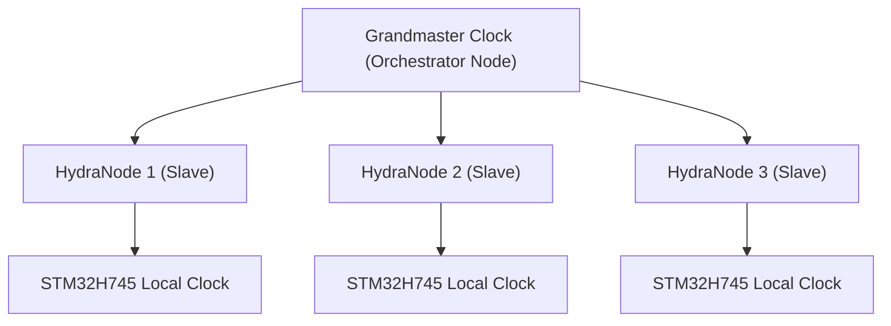

<p align="center">
  
</p>

# ⏱️ HYDRA-UMC-SWARM-SYNC

<p align="center">🇺🇸 <b>English</b> | <a href="README_spa.md">🇪🇸 Español</a> | <a href="README_fra.md">🇫🇷 Français</a> | <a href="README_ita.md">🇮🇹 Italiano</a> | <a href="README_deu.md">🇩🇪 Deutsch</a> | <a href="README_zho.md">🇨🇳 简体中文</a> | <a href="README_jpn.md">🇯🇵 日本語</a></p>

### 📡 Precision Time Protocol (PTP) & Multi-Node Synchronization

<p align="left">
  
  
  
</p>

---

## 1. 🛠️ TECHNICAL OVERVIEW

**HYDRA-UMC-SWARM-SYNC** is the heartbeat of the distributed factory. It implements a specialized version of PTP (Precision Time Protocol / IEEE 1588) to ensure that every controller in the network shares a perfectly synchronized global clock.

This synchronization is critical for multi-robot coordinated motion, where multiple arms must start and end trajectories at the exact same microsecond to avoid collisions or to perform joint assembly tasks.

### Key Features:
* ⏱️ **Ultra-Precise Sync:** Achieves sub-100ns jitter across the local network.
* 🔄 **Synchronized Start/Stop:** Ensures atomic execution of multi-robot trajectory commands.
* 📡 **Hardware Timestamping:** Leverages CM5 and STM32 hardware timers for maximum accuracy.
* 🛡️ **Network Resilient:** Handles packet jitter and temporary network delays.
* 🔍 **Real Conflict Visibility & Swarm-Scale Convergence Proof (v0):** `merge_report()` returns a real, per-key record of every genuine write conflict resolved during reconciliation - which cell beat which other cell, and by what stamp. A 4-cell simulated test proves convergence holds across multiple rounds of partition and partial reconnection, not just a single two-cell merge.

---

## 2. 🔄 SYNC HIERARCHY



---

## 3. 🧱 ARCHITECTURE & DESIGN DECISIONS

* **Why CRDT-based sync, not a single source of truth.** Multiple HYDRA-UMC cells can run semi-autonomously and reconnect later - a CRDT merge strategy converges without a central arbiter deciding whose state 'wins', which a naive last-write-wins approach can't guarantee across a real network partition.
* **Why this is a sibling, not a submodule, of HYDRA-UMC-ORCHESTRATOR.** State reconciliation is a continuous background concern independent of any single orchestration decision - keeping it a separate process means an orchestrator restart doesn't interrupt an in-flight merge.
* **Why the CRDT merge is real today but PTP hardware sync is not.** `src/crdt.rs` implements a real LWW-Element-Map (Last-Writer-Wins Map), a state-based CRDT whose `merge` is provably commutative, associative and idempotent - not just "seems to converge on one example", see that module's own property tests. `src/lamport.rs` backs it with a real Lamport logical clock. PTP (IEEE 1588, sub-100ns hardware timestamping) is a fundamentally different, hardware-dependent problem - it needs real NICs/hardware timers to mean anything, and stays deferred until there's real hardware to validate it against. A logical clock is what the CRDT merge actually needs to resolve conflicts deterministically, and that part is real and tested today.
* **How this fits the rest of the ecosystem.** A sibling service under HYDRA-UMC-ORCHESTRATOR, alongside HYDRA-UMC-PATH-PLANNER-3D, HYDRA-UMC-JOB-DISPATCHER and HYDRA-UMC-NODE-HEALING - keeps every cell's own view of swarm state consistent regardless of which one currently holds the orchestrator role.
* **Why `merge_report()` is a new method instead of changing what `merge()` returns.** `merge()` stays a pure, cheap, obviously-correct black box - that simplicity is what makes it easy to trust. `merge_report()` layers real conflict visibility on top for a caller (an operator, a debugging tool) that specifically wants to know what a reconciliation overwrote, without forcing every caller of the hot-path `merge()` to pay for or handle that bookkeeping.
* **Why conflict reports show stamp order, not causal "happened-before".** A Lamport clock guarantees that true causal happens-before implies an earlier stamp - but the converse doesn't hold: an earlier stamp does NOT prove two events were causally related rather than merely concurrent. `MergeConflict` is deliberately honest about reporting only what a Lamport clock can actually prove (a consistent total order), not a causality claim a vector clock would be needed to make.

---

## 📂 DIRECTORY STRUCTURE

```text
HYDRA-UMC-SWARM-SYNC/
├── src/
│   ├── main.rs       # CLI entry point: loads a scenario, reconciles, prints JSON
│   ├── lamport.rs    # LamportClock - the logical clock behind the CRDT's ordering
│   ├── crdt.rs       # LwwMap - the real CRDT: set/get/merge/snapshot
│   ├── reconcile.rs  # Real reconciliation, split out so server.rs can reach it too
│   └── server.rs     # Plain JSON/HTTP surface (tiny_http) - POST /reconcile over the network
├── scenarios/        # Example JSON scenarios (see BUILD & RUN below)
├── docs/
│   └── CLI_REFERENCE.md # Command reference
├── images/
│   └── HYDRA_UMC_BANNER.svg # README banner
├── systemd/
│   └── hydra-umc-swarm-sync.service # Local CM5 reconciliation API systemd unit
├── tools/
│   ├── build_test.py # Non-versioning build/compile check
│   └── ci_validate.py # Manifest/CHANGELOG/docs validation used by CI
├── build/            # Compiled binaries (build.sh/build.bat output)
├── Cargo.toml        # Rust package manifest (name, version, deps)
├── bump_version.py   # Odometer-style native version bump, run by build.sh/.bat
├── bump_manifest_version.py # Syncs hydra-umc.project.json's version to the native one (--sync)
├── build.sh/.bat     # Bumps version, then `cargo build --release`
├── run.sh/.bat       # Runs the compiled binary
└── README.md
```

Pruned from the original template: `hardware/`, `firmware/` and `os/` —
this is a pure software service (Rust binary) with no dedicated hardware
or firmware of its own and no operating system image to maintain.

---

## 🔧 BUILD & RUN GUIDE

A real, tested CRDT merge - not just a skeleton that compiles: it
reconciles a multi-cell JSON scenario and prints the converged state.

```bash
# Windows
build.bat
run.bat scenarios/example.json

# Linux / macOS
./build.sh
./run.sh scenarios/example.json
```

`build.sh`/`build.bat` bump the version in `Cargo.toml` (ecosystem-wide
odometer rule, see `bump_version.py`) and then run `cargo build --release`.
`run.sh`/`run.bat` execute the resulting binary directly, forwarding any
arguments (the scenario path) to it.

A scenario is a JSON file with a `cells` array - each cell has an `id`
(for readability), a `writer` ID, and a list of `writes`
(`{key, value, time}`, `time` being an explicit Lamport timestamp,
replayed rather than generated live - the same "explicit, deterministic
input" pattern HYDRA-UMC-PATH-PLANNER-3D's `seed` uses). Each cell's
writes are folded into its own map, then every cell's map is merged
twice - once left-to-right (via `merge_report()`, so every real conflict
along the way is recorded), once right-to-left (via plain `merge()`) -
and the result prints `converged: true` only if both orders produced the
identical final state, which is the actual CRDT property this service
depends on, not just an assumption.

Running it against `scenarios/example.json` (where `cell-a` and `cell-b`
both wrote to `cell-a-node-2`) shows the real conflict resolution, not
just the final opaque result:

```bash
./run.sh scenarios/example.json
```
```json
{
  "cells_merged": 2,
  "converged": true,
  "merged_state": { "...": "..." },
  "conflicts_resolved": 1,
  "conflicts": [
    { "key": "cell-a-node-2",
      "local_time": 2, "local_writer": 1, "local_value": "ok",
      "remote_time": 3, "remote_writer": 2, "remote_value": "unhealthy",
      "kept_remote": true }
  ],
  "next_local_time": 6
}
```

```bash
cargo test   # the Lamport clock, and the CRDT itself - including direct
             # checks that merge is commutative, associative and
             # idempotent (not just "looks right" on one example), a
             # deterministic-tie-break test for truly concurrent writes,
             # merge_report()'s own conflict-detection behavior, and a
             # 4-cell simulation proving convergence across multiple
             # rounds of partition and partial reconnection - 22 tests total
```

The same `reconcile()` call is also reachable over a real JSON/HTTP API
(`src/server.rs`, `tiny_http`, blocking, no async runtime) instead of a
local scenario file - `run.sh serve [--addr ADDR] [--port PORT]` starts
it (default `127.0.0.1:8112`), exposing `POST /reconcile` (scenario in
the request body, same JSON shape) and `GET /stats`. This is what
`systemd/hydra-umc-swarm-sync.service` runs unattended on the CM5. Full
usage, exit codes, and the complete route reference are in
[`docs/CLI_REFERENCE.md`](docs/CLI_REFERENCE.md).

---

## 🚀 ROADMAP
* **Phase 1:** Deterministic swarm synchronization over TSN and sub-ms jitter reduction.
* **Phase 2:** 3D Path planning with dynamic obstacle avoidance in multi-robot cells.
* **Phase 3:** Multi-robot job dispatching optimization using real-time resource availability.
* **Phase 4:** Support for wireless PTP sync over Wi-Fi 6 (High-Reliability Mode) and sub-100ns accuracy validation.

---

## 🔗 Related Projects

This project is part of the HYDRA-UMC robotics ecosystem by the same author (JuanenRac / Electro Hobby 3D). Worth knowing about, since a request might actually be about one of these rather than this repository.

**Parent Project**
- **[HYDRA-UMC-ORCHESTRATOR](https://github.com/JuanenRac/HYDRA-UMC-ORCHESTRATOR)** — integration hub with a real gRPC/Protobuf health-report contract and mission state machine; the parent this repo is one specific orchestration service of, within its own swarm-coordination layer.

**Sibling Projects** — the other orchestration services of HYDRA-UMC-ORCHESTRATOR's own swarm-coordination layer
- **[HYDRA-UMC-PATH-PLANNER-3D](https://github.com/JuanenRac/HYDRA-UMC-PATH-PLANNER-3D)** — real RRT-based 3D path planner with real obstacle/workspace collision validation.
- **[HYDRA-UMC-JOB-DISPATCHER](https://github.com/JuanenRac/HYDRA-UMC-JOB-DISPATCHER)** — real priority-based job queue with deduplication, over a real HTTP API.
- **[HYDRA-UMC-NODE-HEALING](https://github.com/JuanenRac/HYDRA-UMC-NODE-HEALING)** — real gRPC-based fleet health watchdog with retry/backoff and identity-mismatch detection.

**Also Part of the Ecosystem**

*Core Hardware & Platform*
- **[HYDRA-UMC](https://github.com/JuanenRac/HYDRA-UMC)** — the physical robot-arm motherboard: CM5 host + dual-core STM32H745, orchestrating up to 8 tool arms over CAN-OTA/SPI-OTA.
- **[HYDRA-UMC-OS](https://github.com/JuanenRac/HYDRA-UMC-OS)** — reproducible Raspberry Pi OS product layer for the CM5: read-only agent, validated config/profiles, WiFi first-contact provisioning.
- **[HYDRA-UMC-SDK](https://github.com/JuanenRac/HYDRA-UMC-SDK)** — the shared JSON-Schema contract and safety-gate boundary every bridge validates its commands against.

*Core Backend & Clients*
- **[HYDRA-UMC-SERVER](https://github.com/JuanenRac/HYDRA-UMC-SERVER)** — the real headless backend (REST/WebSocket) every control client actually talks to.
- **[HYDRA-UMC-STUDIO](https://github.com/JuanenRac/HYDRA-UMC-STUDIO)** — web control dashboard with real-time multi-robot 3D visualization.
- **[HYDRA-UMC-SUITE](https://github.com/JuanenRac/HYDRA-UMC-SUITE)** — desktop (PySide6) swarm command center for multiple servers at once, packaged as a standalone executable.
- **[HYDRA-UMC-ANDROID-CONTROL](https://github.com/JuanenRac/HYDRA-UMC-ANDROID-CONTROL)** — native Android control app with biometric login and a paired Wear OS companion.
- **[HYDRA-UMC-IOS-CONTROL](https://github.com/JuanenRac/HYDRA-UMC-IOS-CONTROL)** — iOS/iPadOS control app (Flutter) with real-time WebSocket sync.
- **[HYDRA-UMC-DSI](https://github.com/JuanenRac/HYDRA-UMC-DSI)** — native touch UI for the onboard 7" DSI touchscreen, embedded on the CM5 itself.
- **[HYDRA-UMC-EDITOR-URDF](https://github.com/JuanenRac/HYDRA-UMC-EDITOR-URDF)** — desktop graphical URDF creator/editor that pushes finished models into STUDIO's own catalog.
- **[HYDRA-UMC-BRIDGE-AMR](https://github.com/JuanenRac/HYDRA-UMC-BRIDGE-AMR)** — coordination boundary for AGV/AMR fleets via a real VDA 5050 MQTT publisher.
- **[HYDRA-UMC-BRIDGE-CNC](https://github.com/JuanenRac/HYDRA-UMC-BRIDGE-CNC)** — high-level CNC-cell coordinator with real GRBL status/control-byte access.
- **[HYDRA-UMC-BRIDGE-DROIDS](https://github.com/JuanenRac/HYDRA-UMC-BRIDGE-DROIDS)** — coordination boundary for legged/humanoid droids, with a real Boston Dynamics Spot command sender.
- **[HYDRA-UMC-BRIDGE-LASER](https://github.com/JuanenRac/HYDRA-UMC-BRIDGE-LASER)** — laser-cell safety coordinator reading 3 real key/enclosure/interlock GPIO safeguards.
- **[HYDRA-UMC-BRIDGE-OPENPNP](https://github.com/JuanenRac/HYDRA-UMC-BRIDGE-OPENPNP)** — safe high-level board-flow coordinator for OpenPnP pick-and-place.
- **[HYDRA-UMC-BRIDGE-PRINTER3D](https://github.com/JuanenRac/HYDRA-UMC-BRIDGE-PRINTER3D)** — safe coordination boundary for Moonraker/Klipper 3D printers, with real gated job commands.
- **[HYDRA-UMC-BRIDGE-ROS2](https://github.com/JuanenRac/HYDRA-UMC-BRIDGE-ROS2)** — safety coordinator with a real, lazily-imported rclpy ROS 2 transport.
- **[HYDRA-UMC-BRIDGE-UAV](https://github.com/JuanenRac/HYDRA-UMC-BRIDGE-UAV)** — coordination boundary for camera-equipped UAVs, with a real MAVLink command sender.

*URTC Tool Platform*
- **[URTC](https://github.com/JuanenRac/URTC)** — firmware for the physical Universal Robot Tool Controller PCB, 25+ tool profiles over CAN bus.
- **[URTC-FLASHER](https://github.com/JuanenRac/URTC-FLASHER)** — desktop GUI flashing tool for URTC boards, CAN-OTA plus full-chip SWD/JTAG.
- **[URTC-TESTER](https://github.com/JuanenRac/URTC-TESTER)** — desktop live CAN-bus diagnostic tool for URTC boards, one panel per tool profile.
- **[URTC-WEB-STUDIO](https://github.com/JuanenRac/URTC-WEB-STUDIO)** — browser-based alternative to URTC-TESTER via the Web Serial API, no local install needed.

*Vision AI Node (Hailo-8)*
- **[HYDRA-UMC-VISION-NODE](https://github.com/JuanenRac/HYDRA-UMC-VISION-NODE)** — integration hub for the Hailo-8 vision pipeline, with a real per-stage hardware-readiness check.
- **[HYDRA-UMC-DETECTION-HEF](https://github.com/JuanenRac/HYDRA-UMC-DETECTION-HEF)** — real compiled-model registry with Hailo-architecture/checksum safe-load verification.
- **[HYDRA-UMC-VISION-STREAMER](https://github.com/JuanenRac/HYDRA-UMC-VISION-STREAMER)** — real GStreamer pipeline + MediaMTX config generator with a real HailoRT integration boundary.
- **[HYDRA-UMC-VISUAL-SERVOING-API](https://github.com/JuanenRac/HYDRA-UMC-VISUAL-SERVOING-API)** — real Position-Based Visual Servoing correction law, safety-gated on upstream zone state.
- **[HYDRA-UMC-SAFETY-ZONES](https://github.com/JuanenRac/HYDRA-UMC-SAFETY-ZONES)** — real zone-breach checking and E-STOP requesting, with calibration-freshness enforcement.

*Cognitive AI Node (Hailo-10)*
- **[HYDRA-UMC-COGNITIVE-NODE](https://github.com/JuanenRac/HYDRA-UMC-COGNITIVE-NODE)** — integration hub for the Hailo-10 cognitive pipeline (LLM/VLA/voice orchestration).
- **[HYDRA-UMC-VLA-ENGINE](https://github.com/JuanenRac/HYDRA-UMC-VLA-ENGINE)** — real action-token encoding/decoding and trajectory generation for a Vision-Language-Action model.
- **[HYDRA-UMC-VOICE-UI](https://github.com/JuanenRac/HYDRA-UMC-VOICE-UI)** — real voice front-end (VAD + intent parser) with a bounded, confirmation-gated Watch relay.
- **[HYDRA-UMC-SEMANTIC-PLANNER](https://github.com/JuanenRac/HYDRA-UMC-SEMANTIC-PLANNER)** — real rule-based task decomposition and semantic error recovery over MCU error codes.
- **[HYDRA-UMC-DOCS-QA](https://github.com/JuanenRac/HYDRA-UMC-DOCS-QA)** — real stdlib-only TF-IDF document search over this ecosystem's own Markdown docs.

*Digital Twin & Simulation*
- **[HYDRA-UMC-TWIN](https://github.com/JuanenRac/HYDRA-UMC-TWIN)** — integration hub for the digital-twin engine, with a real version-compatibility sync contract.
- **[HYDRA-UMC-HIL-BRIDGE](https://github.com/JuanenRac/HYDRA-UMC-HIL-BRIDGE)** — real hardware-in-the-loop safety interlock routing commands between simulation and real hardware.
- **[HYDRA-UMC-PHYSICS-REPLICA](https://github.com/JuanenRac/HYDRA-UMC-PHYSICS-REPLICA)** — real forward kinematics and joint-limit validation over a real URDF subset.
- **[HYDRA-UMC-SYNTHETIC-DATA-GEN](https://github.com/JuanenRac/HYDRA-UMC-SYNTHETIC-DATA-GEN)** — real procedural 2D scene generator with YOLO/COCO annotation export.

*Data & Analytics*
- **[HYDRA-UMC-DATALAKE](https://github.com/JuanenRac/HYDRA-UMC-DATALAKE)** — real sqlite3-backed time-series store with a real ingest/query HTTP API.
- **[HYDRA-UMC-ANOMALY-DETECTOR](https://github.com/JuanenRac/HYDRA-UMC-ANOMALY-DETECTOR)** — real FFT + statistical baseline anomaly detector with drift monitoring.
- **[HYDRA-UMC-PRODUCTION-REPORTS](https://github.com/JuanenRac/HYDRA-UMC-PRODUCTION-REPORTS)** — real OEE/availability calculation over DATALAKE history, with reproducible CSV export.
- **[HYDRA-UMC-TELEMETRY-COLLECTOR](https://github.com/JuanenRac/HYDRA-UMC-TELEMETRY-COLLECTOR)** — real CAN/WebSocket ingestion pipeline into DATALAKE, with sequence deduplication.

*Industrial Gateway*
- **[HYDRA-UMC-GATEWAY-INDUSTRIAL](https://github.com/JuanenRac/HYDRA-UMC-GATEWAY-INDUSTRIAL)** — integration hub relaying to industrial protocols, with a real command allowlist/backpressure layer.
- **[HYDRA-UMC-OPCUA-SERVER](https://github.com/JuanenRac/HYDRA-UMC-OPCUA-SERVER)** — real OPC-UA address space, verified with a real binary-protocol client session.
- **[HYDRA-UMC-MQTT-BROKER](https://github.com/JuanenRac/HYDRA-UMC-MQTT-BROKER)** — real MQTT broker with optional per-client authentication and topic ACLs.
- **[HYDRA-UMC-MTCONNECT-ADAPTER](https://github.com/JuanenRac/HYDRA-UMC-MTCONNECT-ADAPTER)** — real MTConnect `/probe` and `/current` XML endpoints with degraded-mode output.

*Complementary Tools & Ecosystem Operations*
- **[HYDRA-UMC-DASHBOARD-AI](https://github.com/JuanenRac/HYDRA-UMC-DASHBOARD-AI)** — Smart Summaries and Anomaly Highlighting panels over DATALAKE/ANOMALY-DETECTOR, with an honest statistical fallback.
- **[HYDRA-UMC-TOOL-CLI](https://github.com/JuanenRac/HYDRA-UMC-TOOL-CLI)** — fleet CLI with a real, stable exit-code contract, a genuine live client of HYDRA-UMC-SERVER's own API.
- **[HYDRA-UMC-WATCH](https://github.com/JuanenRac/HYDRA-UMC-WATCH)** — WearOS companion app with real haptic alerts and a paired-phone voice relay.
- **[URTC-SMART-RACK](https://github.com/JuanenRac/URTC-SMART-RACK)** — firmware for a board-mounting rack with real tool-ID decoding and Smart Idle pre-heating logic.
- **[URTC-VISION-TOOL](https://github.com/JuanenRac/URTC-VISION-TOOL)** — firmware plus a real Python vision companion for a thermal/RGB inspection tool head.
- **[HYDRA-UMC-UPDATER](https://github.com/JuanenRac/HYDRA-UMC-UPDATER)** — administrative desktop tool that discovers, clones and updates every repo in this ecosystem.


---

## 📚 Documentation & Community

- **[CONTRIBUTING.md](CONTRIBUTING.md)** — tech stack and coding guidelines for a pull request.
- **[CODE_OF_CONDUCT.md](CODE_OF_CONDUCT.md)** — the standards of behavior expected in this community.
- **[SECURITY.md](SECURITY.md)** — how to report a vulnerability, and this project's own real security focus areas.
- **[SUPPORT.md](SUPPORT.md)** — where to ask questions and report bugs.
- **[LICENSE.md](LICENSE.md)** — this project's own license.

## 👤 AUTHOR
**JuanenRac** (Electro Hobby 3D)
📧 electrohobby3d@gmail.com
📺 [youtube.com/@electrohobby3d](https://youtube.com/@electrohobby3d)

## 📜 LICENSE
GPL-3.0 - See LICENSE for details.
