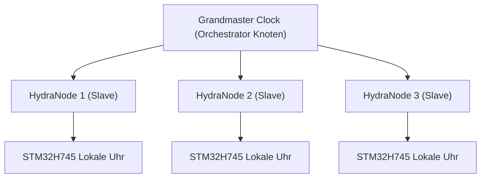

<p align="center">
  
</p>

# ⏱️ HYDRA-UMC-SWARM-SYNC

<p align="center"><a href="README.md">🇺🇸 English</a> | <a href="README_spa.md">🇪🇸 Español</a> | <a href="README_fra.md">🇫🇷 Français</a> | <a href="README_ita.md">🇮🇹 Italiano</a> | 🇩🇪 <b>Deutsch</b> | <a href="README_zho.md">🇨🇳 简体中文</a> | <a href="README_jpn.md">🇯🇵 日本語</a></p>

### 📡 Precision Time Protocol (PTP) & Multi-Knoten-Synchronisation

<p align="left">
  
  
  
</p>

---

## 1. 🛠️ TECHNISCHER ÜBERBLICK

**HYDRA-UMC-SWARM-SYNC** ist der Herzschlag der verteilten Fabrik. Es implementiert eine spezialisierte Version von PTP (Precision Time Protocol / IEEE 1588), um sicherzustellen, dass jeder Controller im Netzwerk eine perfekt synchronisierte globale Uhr teilt.

Diese Synchronisation ist entscheidend für koordinierte Multi-Roboter-Bewegungen, bei denen mehrere Arme Trajektorien in der exakt gleichen Mikrosekunde starten und beenden müssen, um Kollisionen zu vermeiden oder gemeinsame Montageaufgaben durchzuführen.

### Hauptmerkmale:
* ⏱️ **Ultrapräzise Synchronisation:** Erreicht einen Jitter von unter 100 ns im lokalen Netzwerk.
* 🔄 **Synchronisierter Start/Stopp:** Gewährleistet die atomare Ausführung von Multi-Roboter-Trajektorienbefehlen.
* 📡 **Hardware-Zeitstempelung:** Nutzt die Hardware-Timer von CM5 und STM32 für maximale Genauigkeit.
* 🛡️ **Netzwerkresilient:** Handhabt Paket-Jitter und vorübergehende Netzwerkverzögerungen.
* 🔍 **Echte Konfliktsichtbarkeit & Konvergenzbeweis auf Schwarmebene (v0):** `merge_report()` liefert einen echten, pro Schlüssel aufgeschlüsselten Datensatz jedes echten Schreibkonflikts, der während der Abstimmung aufgelöst wurde - welche Zelle welche andere geschlagen hat, und mit welchem Zeitstempel. Ein simulierter 4-Zellen-Test beweist, dass die Konvergenz über mehrere Runden von Partitionierung und teilweiser Wiederverbindung hinweg hält, nicht nur bei einem einzigen Merge zwischen zwei Zellen.

---

## 2. 🔄 SYNCHRONISATIONSHIERARCHIE



---

## 3. 🧱 ARCHITEKTUR & DESIGNENTSCHEIDUNGEN

* **Warum CRDT-basierte Synchronisation statt einer einzigen Quelle der Wahrheit.** Mehrere HYDRA-UMC-Zellen können halbautonom laufen und sich später wieder verbinden - eine CRDT-Merge-Strategie konvergiert ohne zentralen Schiedsrichter, der entscheidet, welcher Zustand 'gewinnt', was ein naiver Last-Write-Wins-Ansatz bei einer echten Netzwerkpartition nicht garantieren kann.
* **Warum es Geschwister, kein Submodul, von HYDRA-UMC-ORCHESTRATOR ist.** Zustandsabgleich ist ein fortlaufendes Hintergrundanliegen, unabhängig von jeder einzelnen Orchestrierungsentscheidung - es als separaten Prozess zu halten bedeutet, dass ein Neustart des Orchestrators einen laufenden Merge nicht unterbricht.
* **Warum der CRDT-Merge heute schon echt ist, die PTP-Hardware-Synchronisation aber nicht.** `src/crdt.rs` implementiert eine echte LWW-Element-Map (Last-Writer-Wins-Map), einen zustandsbasierten CRDT, dessen `merge` nachweislich kommutativ, assoziativ und idempotent ist - nicht nur "scheint an einem Beispiel zu konvergieren", siehe die eigenen Property-Tests dieses Moduls. `src/lamport.rs` untermauert das mit einer echten Lamport-Logikuhr. PTP (IEEE 1588, Hardware-Zeitstempelung mit Sub-100ns-Genauigkeit) ist ein grundlegend anderes, hardwareabhängiges Problem - es braucht echte NICs/Hardware-Timer, um überhaupt Sinn zu ergeben, und bleibt zurückgestellt, bis es echte Hardware gibt, gegen die man es validieren kann. Eine Logikuhr ist das, was der CRDT-Merge tatsächlich braucht, um Konflikte deterministisch aufzulösen, und dieser Teil ist heute echt und getestet.
* **Wie sich das ins restliche Ökosystem einfügt.** Ein Geschwisterdienst unter HYDRA-UMC-ORCHESTRATOR, neben HYDRA-UMC-PATH-PLANNER-3D, HYDRA-UMC-JOB-DISPATCHER und HYDRA-UMC-NODE-HEALING - hält die eigene Sicht jeder Zelle auf den Schwarmzustand konsistent, unabhängig davon, welche gerade die Orchestrator-Rolle innehat.
* **Warum `merge_report()` eine neue Methode ist, statt zu ändern, was `merge()` zurückgibt.** `merge()` bleibt eine reine, günstige, offensichtlich korrekte Blackbox - diese Einfachheit macht sie leicht vertrauenswürdig. `merge_report()` legt darüber echte Konfliktsichtbarkeit für einen Aufrufer (einen Operator, ein Debugging-Tool), der speziell wissen will, was eine Abstimmung überschrieben hat, ohne jeden Aufrufer des heißen Pfads `merge()` zu zwingen, diese Buchführung zu bezahlen oder zu handhaben.
* **Warum Konfliktberichte die Zeitstempel-Reihenfolge zeigen, nicht kausales "happened-before".** Eine Lamport-Uhr garantiert, dass ein echtes kausales happens-before einen früheren Zeitstempel impliziert - aber die Umkehrung gilt nicht: Ein früherer Zeitstempel beweist NICHT, dass zwei Ereignisse kausal zusammenhingen statt nur nebenläufig zu sein. `MergeConflict` ist absichtlich ehrlich und meldet nur, was eine Lamport-Uhr tatsächlich beweisen kann (eine konsistente Gesamtordnung), keine Kausalitätsaussage, für die eine Vektoruhr nötig wäre.

---

## 📂 VERZEICHNISSTRUKTUR

```text
HYDRA-UMC-SWARM-SYNC/
├── src/
│   ├── main.rs       # CLI-Einstiegspunkt: lädt ein Szenario, gleicht ab, gibt JSON aus
│   ├── lamport.rs    # LamportClock - die Logikuhr hinter der Ordnung des CRDT
│   ├── crdt.rs       # LwwMap - der echte CRDT: set/get/merge/snapshot
│   ├── reconcile.rs  # Echter Abgleich, ausgelagert damit server.rs ihn auch nutzen kann
│   └── server.rs     # Einfache JSON/HTTP-Oberfläche (tiny_http) - POST /reconcile übers Netz
├── scenarios/        # Beispiel-JSON-Szenarien (siehe BUILD UND AUSFÜHRUNG unten)
├── docs/
│   └── CLI_REFERENCE.md # Befehlsreferenz
├── images/
│   └── HYDRA_UMC_BANNER.svg # README-Banner
├── systemd/
│   └── hydra-umc-swarm-sync.service # systemd-Unit der lokalen CM5-Abgleich-API
├── tools/
│   ├── build_test.py # Nicht-versionierender Build-Check
│   └── ci_validate.py # Manifest/CHANGELOG/Docs-Validierung, von CI genutzt
├── build/            # Kompilierte Binärdateien (Ausgabe von build.sh/.bat)
├── Cargo.toml        # Rust-Paketmanifest (Name, Version, Abhängigkeiten)
├── bump_version.py   # Native Versions-Bump nach Kilometerzähler-Prinzip
├── bump_manifest_version.py # Synchronisiert die Version von hydra-umc.project.json mit der nativen (--sync)
├── build.sh/.bat     # Erhöht die Version, dann `cargo build --release`
├── run.sh/.bat       # Führt die kompilierte Binärdatei aus
└── README.md
```

Aus der ursprünglichen Vorlage entfernt: `hardware/`, `firmware/` und
`os/` — dies ist ein reiner Softwaredienst (Rust-Binärdatei) ohne eigene
Hardware oder Firmware und ohne zu pflegendes Betriebssystem-Image.

---

## 🔧 BUILD UND AUSFÜHRUNG

Ein echter, getesteter CRDT-Merge - nicht nur ein kompilierbares
Skelett: er gleicht ein JSON-Szenario mit mehreren Zellen ab und gibt den
konvergierten Zustand aus.

```bash
# Windows
build.bat
run.bat scenarios/example.json

# Linux / macOS
./build.sh
./run.sh scenarios/example.json
```

`build.sh`/`build.bat` erhöhen die Version in `Cargo.toml` (ökosystemweite
Kilometerzähler-Regel, siehe `bump_version.py`) und führen anschließend
`cargo build --release` aus. `run.sh`/`run.bat` führen die resultierende
Binärdatei direkt aus und reichen jedes Argument (den Szenariopfad)
weiter.

Ein Szenario ist eine JSON-Datei mit einem `cells`-Array - jede Zelle hat
eine `id` (zur Lesbarkeit), eine `writer`-ID und eine Liste von `writes`
(`{key, value, time}`, wobei `time` ein expliziter Lamport-Zeitstempel
ist, wiedergegeben statt live erzeugt - dasselbe Muster "expliziter,
deterministischer Input", das der `seed` von HYDRA-UMC-PATH-PLANNER-3D
verwendet). Die Schreibvorgänge jeder Zelle werden in ihre eigene Map
gefaltet, dann wird die Map jeder Zelle zweimal gemergt - einmal von
links nach rechts (über `merge_report()`, sodass jeder echte Konflikt
unterwegs erfasst wird), einmal von rechts nach links (über normales
`merge()`) - und das Ergebnis gibt `converged: true` nur aus, wenn beide
Reihenfolgen den identischen Endzustand ergeben haben, was die
tatsächliche CRDT-Eigenschaft ist, von der dieser Dienst abhängt, nicht
nur eine Annahme.

Beim Ausführen gegen `scenarios/example.json` (wo sowohl `cell-a` als
auch `cell-b` nach `cell-a-node-2` geschrieben haben) zeigt sich die
echte Konfliktauflösung, nicht nur das undurchsichtige Endergebnis:

```bash
./run.sh scenarios/example.json
```
```json
{
  "cells_merged": 2,
  "converged": true,
  "merged_state": { "...": "..." },
  "conflicts_resolved": 1,
  "conflicts": [
    { "key": "cell-a-node-2",
      "local_time": 2, "local_writer": 1, "local_value": "ok",
      "remote_time": 3, "remote_writer": 2, "remote_value": "unhealthy",
      "kept_remote": true }
  ],
  "next_local_time": 6
}
```

```bash
cargo test   # die Lamport-Uhr, und den CRDT selbst - einschließlich
             # direkter Prüfungen, dass merge kommutativ, assoziativ und
             # idempotent ist (nicht nur "sieht auf einem Beispiel richtig
             # aus"), eines deterministischen Tie-Break-Tests für wirklich
             # nebenläufige Schreibvorgänge, des eigenen
             # Konflikterkennungsverhaltens von merge_report(), und einer
             # 4-Zellen-Simulation, die Konvergenz über mehrere Runden von
             # Partitionierung und teilweiser Wiederverbindung beweist -
             # 22 Tests insgesamt
```

Derselbe Aufruf von `reconcile()` ist außerdem über eine echte JSON/HTTP-API
(`src/server.rs`, `tiny_http`, blockierend, ohne Async-Runtime) statt
über eine lokale Szenariodatei erreichbar - `run.sh serve [--addr ADDR] [--port PORT]`
startet sie (Standard `127.0.0.1:8112`) und stellt `POST /reconcile`
(Szenario im Request-Body, gleiche JSON-Form) sowie `GET /stats` bereit.
Genau das führt `systemd/hydra-umc-swarm-sync.service` unbeaufsichtigt
auf dem CM5 aus. Die vollständige Verwendung, die Exit-Codes und die
komplette Routenreferenz stehen in
[`docs/CLI_REFERENCE.md`](docs/CLI_REFERENCE.md).

---

## 🚀 FAHRPLAN
* **Phase 1:** Deterministische Schwarm-Synchronisation über TSN und Sub-ms-Jitter-Reduzierung.
* **Phase 2:** 3D-Pfadplanung mit dynamischer Hindernisvermeidung in Multi-Roboter-Zellen.
* **Phase 3:** Multi-Roboter-Job-Dispatching-Optimierung unter Berücksichtigung der Ressourcenverfügbarkeit in Echtzeit.
* **Phase 4:** Unterstützung für drahtlose PTP-Synchronisation über Wi-Fi 6 (High-Reliability-Modus) und Validierung der Genauigkeit unter 100 ns.

---

## 🔗 Verwandte Projekte

Dieses Projekt ist Teil des HYDRA-UMC-Robotik-Ökosystems desselben Autors (JuanenRac / Electro Hobby 3D). Gut zu wissen, da eine Anfrage eigentlich eines dieser Projekte betreffen könnte statt dieses Repositorys.

**Übergeordnetes Projekt**
- **[HYDRA-UMC-ORCHESTRATOR](https://github.com/JuanenRac/HYDRA-UMC-ORCHESTRATOR)** — Integrationsknoten mit einem echten gRPC/Protobuf-Health-Report-Vertrag und einer Missions-Zustandsmaschine; das übergeordnete Projekt, dessen spezifischer Orchestrierungsdienst dieses Repository innerhalb seiner eigenen Schwarmkoordinationsschicht ist.

**Geschwisterprojekte** — die übrigen Orchestrierungsdienste der eigenen Schwarmkoordinationsschicht von HYDRA-UMC-ORCHESTRATOR
- **[HYDRA-UMC-PATH-PLANNER-3D](https://github.com/JuanenRac/HYDRA-UMC-PATH-PLANNER-3D)** — echter RRT-basierter 3D-Pfadplaner mit echter Hindernis-/Arbeitsraum-Kollisionsvalidierung.
- **[HYDRA-UMC-JOB-DISPATCHER](https://github.com/JuanenRac/HYDRA-UMC-JOB-DISPATCHER)** — echte prioritätsbasierte Job-Queue mit Deduplizierung, über eine echte HTTP-API.
- **[HYDRA-UMC-NODE-HEALING](https://github.com/JuanenRac/HYDRA-UMC-NODE-HEALING)** — echter gRPC-basierter Flotten-Health-Watchdog mit Retry/Backoff und Identitäts-Mismatch-Erkennung.

**Ebenfalls Teil des Ökosystems**

*Kern-Hardware & Plattform*
- **[HYDRA-UMC](https://github.com/JuanenRac/HYDRA-UMC)** — das physische Motherboard des Roboterarms: CM5-Host + Dual-Core-STM32H745, koordiniert bis zu 8 Werkzeugarme über CAN-OTA/SPI-OTA.
- **[HYDRA-UMC-OS](https://github.com/JuanenRac/HYDRA-UMC-OS)** — reproduzierbare Raspberry-Pi-OS-Produktschicht für den CM5: schreibgeschützter Agent, validierte Konfiguration/Profile, WiFi-Ersteinrichtung.
- **[HYDRA-UMC-SDK](https://github.com/JuanenRac/HYDRA-UMC-SDK)** — der gemeinsame JSON-Schema-Vertrag und die Sicherheitsschranke, gegen die jede Bridge ihre Befehle validiert.

*Kern-Backend & Clients*
- **[HYDRA-UMC-SERVER](https://github.com/JuanenRac/HYDRA-UMC-SERVER)** — das reale Headless-Backend (REST/WebSocket), mit dem jeder Steuerungsclient tatsächlich spricht.
- **[HYDRA-UMC-STUDIO](https://github.com/JuanenRac/HYDRA-UMC-STUDIO)** — Web-Steuerungs-Dashboard mit Echtzeit-3D-Visualisierung mehrerer Roboter.
- **[HYDRA-UMC-SUITE](https://github.com/JuanenRac/HYDRA-UMC-SUITE)** — Desktop-Schwarmleitstand (PySide6) für mehrere Server gleichzeitig, verpackt als eigenständige ausführbare Datei.
- **[HYDRA-UMC-ANDROID-CONTROL](https://github.com/JuanenRac/HYDRA-UMC-ANDROID-CONTROL)** — native Android-Steuerungs-App mit biometrischem Login und einer gekoppelten Wear-OS-Begleit-App.
- **[HYDRA-UMC-IOS-CONTROL](https://github.com/JuanenRac/HYDRA-UMC-IOS-CONTROL)** — iOS/iPadOS-Steuerungs-App (Flutter) mit Echtzeit-WebSocket-Synchronisierung.
- **[HYDRA-UMC-DSI](https://github.com/JuanenRac/HYDRA-UMC-DSI)** — native Touch-UI für das eingebaute 7"-DSI-Touchscreen, direkt auf dem CM5 eingebettet.
- **[HYDRA-UMC-EDITOR-URDF](https://github.com/JuanenRac/HYDRA-UMC-EDITOR-URDF)** — grafischer Desktop-URDF-Ersteller/-Editor, der fertige Modelle in STUDIOs eigenen Katalog überträgt.
- **[HYDRA-UMC-BRIDGE-AMR](https://github.com/JuanenRac/HYDRA-UMC-BRIDGE-AMR)** — Koordinationsschranke für AGV-/AMR-Flotten über einen echten VDA-5050-MQTT-Publisher.
- **[HYDRA-UMC-BRIDGE-CNC](https://github.com/JuanenRac/HYDRA-UMC-BRIDGE-CNC)** — High-Level-Koordinator für CNC-Zellen mit echtem GRBL-Status-/Steuerbyte-Zugriff.
- **[HYDRA-UMC-BRIDGE-DROIDS](https://github.com/JuanenRac/HYDRA-UMC-BRIDGE-DROIDS)** — Koordinationsschranke für laufende/humanoide Droiden, mit einem echten Boston-Dynamics-Spot-Befehlssender.
- **[HYDRA-UMC-BRIDGE-LASER](https://github.com/JuanenRac/HYDRA-UMC-BRIDGE-LASER)** — Sicherheitskoordinator für Laserzellen, liest 3 echte Schlüssel-/Gehäuse-/Verriegelungs-GPIO-Sicherungen.
- **[HYDRA-UMC-BRIDGE-OPENPNP](https://github.com/JuanenRac/HYDRA-UMC-BRIDGE-OPENPNP)** — sicherer High-Level-Koordinator für den Leiterplattenfluss von OpenPnP Pick-and-Place.
- **[HYDRA-UMC-BRIDGE-PRINTER3D](https://github.com/JuanenRac/HYDRA-UMC-BRIDGE-PRINTER3D)** — sichere Koordinationsschranke für Moonraker/Klipper-3D-Drucker, mit echten gesicherten Job-Befehlen.
- **[HYDRA-UMC-BRIDGE-ROS2](https://github.com/JuanenRac/HYDRA-UMC-BRIDGE-ROS2)** — Sicherheitskoordinator mit einem echten, träge importierten rclpy-ROS-2-Transport.
- **[HYDRA-UMC-BRIDGE-UAV](https://github.com/JuanenRac/HYDRA-UMC-BRIDGE-UAV)** — Koordinationsschranke für kameraausgestattete UAVs, mit einem echten MAVLink-Befehlssender.

*URTC-Werkzeugplattform*
- **[URTC](https://github.com/JuanenRac/URTC)** — Firmware für die physische Universal-Robot-Tool-Controller-Platine, 25+ Werkzeugprofile über CAN-Bus.
- **[URTC-FLASHER](https://github.com/JuanenRac/URTC-FLASHER)** — Desktop-GUI-Flash-Tool für URTC-Platinen, CAN-OTA plus Full-Chip-SWD/JTAG.
- **[URTC-TESTER](https://github.com/JuanenRac/URTC-TESTER)** — Desktop-Live-CAN-Bus-Diagnosetool für URTC-Platinen, ein Panel pro Werkzeugprofil.
- **[URTC-WEB-STUDIO](https://github.com/JuanenRac/URTC-WEB-STUDIO)** — browserbasierte Alternative zu URTC-TESTER über die Web-Serial-API, ohne lokale Installation.

*Vision-KI-Knoten (Hailo-8)*
- **[HYDRA-UMC-VISION-NODE](https://github.com/JuanenRac/HYDRA-UMC-VISION-NODE)** — Integrationsknoten für die Hailo-8-Vision-Pipeline, mit einer echten stufenweisen Hardware-Bereitschaftsprüfung.
- **[HYDRA-UMC-DETECTION-HEF](https://github.com/JuanenRac/HYDRA-UMC-DETECTION-HEF)** — echte Registry für kompilierte Modelle mit Hailo-Architektur-/Prüfsummen-Safe-Load-Verifizierung.
- **[HYDRA-UMC-VISION-STREAMER](https://github.com/JuanenRac/HYDRA-UMC-VISION-STREAMER)** — echter GStreamer-Pipeline- + MediaMTX-Konfigurationsgenerator mit einer echten HailoRT-Integrationsschranke.
- **[HYDRA-UMC-VISUAL-SERVOING-API](https://github.com/JuanenRac/HYDRA-UMC-VISUAL-SERVOING-API)** — echtes Position-Based-Visual-Servoing-Korrekturgesetz, sicherheitsgesteuert nach vorgelagertem Zonenstatus.
- **[HYDRA-UMC-SAFETY-ZONES](https://github.com/JuanenRac/HYDRA-UMC-SAFETY-ZONES)** — echte Zonenverletzungsprüfung und E-STOP-Anforderung, mit erzwungener Kalibrierungsaktualität.

*Kognitiver KI-Knoten (Hailo-10)*
- **[HYDRA-UMC-COGNITIVE-NODE](https://github.com/JuanenRac/HYDRA-UMC-COGNITIVE-NODE)** — Integrationsknoten für die Hailo-10-Cognitive-Pipeline (LLM-/VLA-/Sprach-Orchestrierung).
- **[HYDRA-UMC-VLA-ENGINE](https://github.com/JuanenRac/HYDRA-UMC-VLA-ENGINE)** — echte Aktions-Token-Kodierung/-Dekodierung und Trajektoriengenerierung für ein Vision-Language-Action-Modell.
- **[HYDRA-UMC-VOICE-UI](https://github.com/JuanenRac/HYDRA-UMC-VOICE-UI)** — echtes Sprach-Frontend (VAD + Intent-Parser) mit einem begrenzten, bestätigungsgesicherten Watch-Relay.
- **[HYDRA-UMC-SEMANTIC-PLANNER](https://github.com/JuanenRac/HYDRA-UMC-SEMANTIC-PLANNER)** — echte regelbasierte Aufgabenzerlegung und semantische Fehlerbehebung über MCU-Fehlercodes.
- **[HYDRA-UMC-DOCS-QA](https://github.com/JuanenRac/HYDRA-UMC-DOCS-QA)** — echte, nur auf der Standardbibliothek basierende TF-IDF-Dokumentensuche über die eigenen Markdown-Dokumente dieses Ökosystems.

*Digitaler Zwilling & Simulation*
- **[HYDRA-UMC-TWIN](https://github.com/JuanenRac/HYDRA-UMC-TWIN)** — Integrationsknoten für die Digital-Twin-Engine, mit einem echten Versionskompatibilitäts-Sync-Vertrag.
- **[HYDRA-UMC-HIL-BRIDGE](https://github.com/JuanenRac/HYDRA-UMC-HIL-BRIDGE)** — echte Hardware-in-the-Loop-Sicherheitsverriegelung, die Befehle zwischen Simulation und echter Hardware routet.
- **[HYDRA-UMC-PHYSICS-REPLICA](https://github.com/JuanenRac/HYDRA-UMC-PHYSICS-REPLICA)** — echte Vorwärtskinematik und Gelenkgrenzenvalidierung über eine echte URDF-Teilmenge.
- **[HYDRA-UMC-SYNTHETIC-DATA-GEN](https://github.com/JuanenRac/HYDRA-UMC-SYNTHETIC-DATA-GEN)** — echter prozeduraler 2D-Szenengenerator mit YOLO/COCO-Annotationsexport.

*Daten & Analytik*
- **[HYDRA-UMC-DATALAKE](https://github.com/JuanenRac/HYDRA-UMC-DATALAKE)** — echter sqlite3-gestützter Zeitreihenspeicher mit einer echten Ingest-/Abfrage-HTTP-API.
- **[HYDRA-UMC-ANOMALY-DETECTOR](https://github.com/JuanenRac/HYDRA-UMC-ANOMALY-DETECTOR)** — echter FFT- + statistischer Basislinien-Anomaliedetektor mit Drift-Überwachung.
- **[HYDRA-UMC-PRODUCTION-REPORTS](https://github.com/JuanenRac/HYDRA-UMC-PRODUCTION-REPORTS)** — echte OEE-/Verfügbarkeitsberechnung über den DATALAKE-Verlauf, mit reproduzierbarem CSV-Export.
- **[HYDRA-UMC-TELEMETRY-COLLECTOR](https://github.com/JuanenRac/HYDRA-UMC-TELEMETRY-COLLECTOR)** — echte CAN/WebSocket-Ingestion-Pipeline in DATALAKE, mit Sequenz-Deduplizierung.

*Industrie-Gateway*
- **[HYDRA-UMC-GATEWAY-INDUSTRIAL](https://github.com/JuanenRac/HYDRA-UMC-GATEWAY-INDUSTRIAL)** — Integrationsknoten, der zu Industrieprotokollen weiterleitet, mit einer echten Befehls-Allowlist-/Backpressure-Schicht.
- **[HYDRA-UMC-OPCUA-SERVER](https://github.com/JuanenRac/HYDRA-UMC-OPCUA-SERVER)** — echter OPC-UA-Adressraum, verifiziert mit einer echten Binärprotokoll-Client-Session.
- **[HYDRA-UMC-MQTT-BROKER](https://github.com/JuanenRac/HYDRA-UMC-MQTT-BROKER)** — echter MQTT-Broker mit optionaler Pro-Client-Authentifizierung und Topic-ACLs.
- **[HYDRA-UMC-MTCONNECT-ADAPTER](https://github.com/JuanenRac/HYDRA-UMC-MTCONNECT-ADAPTER)** — echte MTConnect-`/probe`- und `/current`-XML-Endpunkte mit Degraded-Mode-Ausgabe.

*Ergänzende Tools & Ökosystembetrieb*
- **[HYDRA-UMC-DASHBOARD-AI](https://github.com/JuanenRac/HYDRA-UMC-DASHBOARD-AI)** — Smart-Summaries- und Anomaly-Highlighting-Panels über DATALAKE/ANOMALY-DETECTOR, mit einem ehrlichen statistischen Fallback.
- **[HYDRA-UMC-TOOL-CLI](https://github.com/JuanenRac/HYDRA-UMC-TOOL-CLI)** — Flotten-CLI mit einem echten, stabilen Exit-Code-Vertrag, ein echter Live-Client der eigenen API von HYDRA-UMC-SERVER.
- **[HYDRA-UMC-WATCH](https://github.com/JuanenRac/HYDRA-UMC-WATCH)** — WearOS-Begleit-App mit echten haptischen Alarmen und einem Sprach-Relay zum gekoppelten Telefon.
- **[URTC-SMART-RACK](https://github.com/JuanenRac/URTC-SMART-RACK)** — Firmware für ein Platinenmontagegestell mit echter Werkzeug-ID-Dekodierung und Smart-Idle-Vorheizlogik.
- **[URTC-VISION-TOOL](https://github.com/JuanenRac/URTC-VISION-TOOL)** — Firmware plus ein echter Python-Vision-Begleiter für einen Thermal-/RGB-Inspektionswerkzeugkopf.
- **[HYDRA-UMC-UPDATER](https://github.com/JuanenRac/HYDRA-UMC-UPDATER)** — administratives Desktop-Tool, das jedes Repository in diesem Ökosystem entdeckt, klont und aktualisiert.


---

## 📚 Dokumentation & Community

- **[CONTRIBUTING.md](CONTRIBUTING.md)** — Technologie-Stack und Coding-Richtlinien für einen Pull Request.
- **[CODE_OF_CONDUCT.md](CODE_OF_CONDUCT.md)** — die in dieser Community erwarteten Verhaltensstandards.
- **[SECURITY.md](SECURITY.md)** — wie man eine Schwachstelle meldet, und die echten Sicherheitsschwerpunkte dieses Projekts.
- **[SUPPORT.md](SUPPORT.md)** — wo man Fragen stellt und Fehler meldet.
- **[LICENSE.md](LICENSE.md)** — die eigene Lizenz dieses Projekts.

## 👤 AUTOR
**JuanenRac** (Electro Hobby 3D)
📧 electrohobby3d@gmail.com
📺 [youtube.com/@electrohobby3d](https://youtube.com/@electrohobby3d)

## 📜 LIZENZ
GPL-3.0 - Siehe LICENSE für Details.
