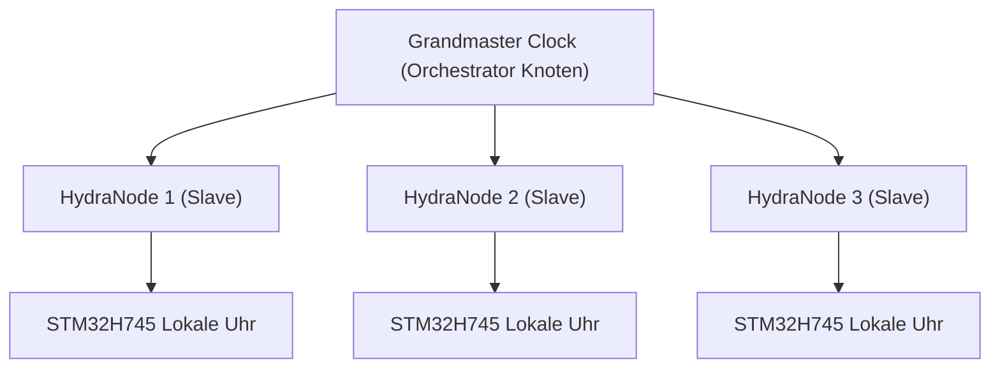

<p align="center">
  
</p>

# ⏱️ HYDRA-UMC-SWARM-SYNC

<p align="center"><a href="README.md">🇺🇸 English</a> | <a href="README_spa.md">🇪🇸 Español</a> | <a href="README_fra.md">🇫🇷 Français</a> | <a href="README_ita.md">🇮🇹 Italiano</a> | 🇩🇪 <b>Deutsch</b> | <a href="README_zho.md">🇨🇳 简体中文</a> | <a href="README_jpn.md">🇯🇵 日本語</a></p>

### 📡 Precision Time Protocol (PTP) & Multi-Knoten-Synchronisation

<p align="left">
  
  
  
</p>

---

## 1. 🛠️ TECHNISCHER ÜBERBLICK

**HYDRA-UMC-SWARM-SYNC** ist der Herzschlag der verteilten Fabrik. Es implementiert eine spezialisierte Version von PTP (Precision Time Protocol / IEEE 1588), um sicherzustellen, dass jeder Controller im Netzwerk eine perfekt synchronisierte globale Uhr teilt.

Diese Synchronisation ist entscheidend für koordinierte Multi-Roboter-Bewegungen, bei denen mehrere Arme Trajektorien in der exakt gleichen Mikrosekunde starten und beenden müssen, um Kollisionen zu vermeiden oder gemeinsame Montageaufgaben durchzuführen.

### Hauptmerkmale:
* ⏱️ **Ultrapräzise Synchronisation:** Erreicht einen Jitter von unter 100 ns im lokalen Netzwerk.
* 🔄 **Synchronisierter Start/Stopp:** Gewährleistet die atomare Ausführung von Multi-Roboter-Trajektorienbefehlen.
* 📡 **Hardware-Zeitstempelung:** Nutzt die Hardware-Timer von CM5 und STM32 für maximale Genauigkeit.
* 🛡️ **Netzwerkresilient:** Handhabt Paket-Jitter und vorübergehende Netzwerkverzögerungen.

---

## 2. 🔄 SYNCHRONISATIONSHIERARCHIE



---

## 3. 🧱 ARCHITEKTUR & DESIGNENTSCHEIDUNGEN

* **Warum CRDT-basierte Synchronisation statt einer einzigen Quelle der Wahrheit.** Mehrere HYDRA-UMC-Zellen können halbautonom laufen und sich später wieder verbinden - eine CRDT-Merge-Strategie konvergiert ohne zentralen Schiedsrichter, der entscheidet, welcher Zustand 'gewinnt', was ein naiver Last-Write-Wins-Ansatz bei einer echten Netzwerkpartition nicht garantieren kann.
* **Warum es Geschwister, kein Submodul, von HYDRA-UMC-ORCHESTRATOR ist.** Zustandsabgleich ist ein fortlaufendes Hintergrundanliegen, unabhängig von jeder einzelnen Orchestrierungsentscheidung - es als separaten Prozess zu halten bedeutet, dass ein Neustart des Orchestrators einen laufenden Merge nicht unterbricht.
* **Warum der CRDT-Merge heute schon echt ist, die PTP-Hardware-Synchronisation aber nicht.** `src/crdt.rs` implementiert eine echte LWW-Element-Map (Last-Writer-Wins-Map), einen zustandsbasierten CRDT, dessen `merge` nachweislich kommutativ, assoziativ und idempotent ist - nicht nur "scheint an einem Beispiel zu konvergieren", siehe die eigenen Property-Tests dieses Moduls. `src/lamport.rs` untermauert das mit einer echten Lamport-Logikuhr. PTP (IEEE 1588, Hardware-Zeitstempelung mit Sub-100ns-Genauigkeit) ist ein grundlegend anderes, hardwareabhängiges Problem - es braucht echte NICs/Hardware-Timer, um überhaupt Sinn zu ergeben, und bleibt zurückgestellt, bis es echte Hardware gibt, gegen die man es validieren kann. Eine Logikuhr ist das, was der CRDT-Merge tatsächlich braucht, um Konflikte deterministisch aufzulösen, und dieser Teil ist heute echt und getestet.
* **Wie sich das ins restliche Ökosystem einfügt.** Ein Geschwisterdienst unter HYDRA-UMC-ORCHESTRATOR, neben HYDRA-UMC-PATH-PLANNER-3D, HYDRA-UMC-JOB-DISPATCHER und HYDRA-UMC-NODE-HEALING - hält die eigene Sicht jeder Zelle auf den Schwarmzustand konsistent, unabhängig davon, welche gerade die Orchestrator-Rolle innehat.

---

## 📂 VERZEICHNISSTRUKTUR

```text
HYDRA-UMC-SWARM-SYNC/
├── src/
│   ├── main.rs       # CLI-Einstiegspunkt: lädt ein Szenario, gleicht ab, gibt JSON aus
│   ├── lamport.rs    # LamportClock - die Logikuhr hinter der Ordnung des CRDT
│   └── crdt.rs       # LwwMap - der echte CRDT: set/get/merge/snapshot
├── scenarios/        # Beispiel-JSON-Szenarien (siehe BUILD & RUN unten)
├── build/            # Kompilierte Binärdateien (Ausgabe von build.sh/.bat)
├── Cargo.toml        # Rust-Paketmanifest (Name, Version, Abhängigkeiten)
├── bump_version.py   # Versions-Bump nach Kilometerzähler-Prinzip
├── build.sh/.bat     # Erhöht die Version, dann `cargo build --release`
├── run.sh/.bat       # Führt die kompilierte Binärdatei aus
└── README.md
```

Aus der ursprünglichen Vorlage entfernt: `hardware/`, `firmware/`, `os/`,
`docs/`, `images/` und `scripts/` — dies ist ein reiner Softwaredienst
(Rust-Binärdatei) ohne eigene Hardware oder Firmware, ohne zu pflegendes
Betriebssystem-Image, und ohne Dokumentations-/Medien-/Utility-Skript-
Inhalt, der eigene Ordner bislang rechtfertigen würde.

---

## 🔧 BUILD & RUN

Ein echter, getesteter CRDT-Merge - nicht nur ein kompilierbares
Skelett: er gleicht ein JSON-Szenario mit mehreren Zellen ab und gibt den
konvergierten Zustand aus.

```bash
# Windows
build.bat
run.bat scenarios/example.json

# Linux / macOS
./build.sh
./run.sh scenarios/example.json
```

`build.sh`/`build.bat` erhöhen die Version in `Cargo.toml` (ökosystemweite
Kilometerzähler-Regel, siehe `bump_version.py`) und führen anschließend
`cargo build --release` aus. `run.sh`/`run.bat` führen die resultierende
Binärdatei direkt aus und reichen jedes Argument (den Szenariopfad)
weiter.

Ein Szenario ist eine JSON-Datei mit einem `cells`-Array - jede Zelle hat
eine `id` (zur Lesbarkeit), eine `writer`-ID und eine Liste von `writes`
(`{key, value, time}`, wobei `time` ein expliziter Lamport-Zeitstempel
ist, wiedergegeben statt live erzeugt - dasselbe Muster "expliziter,
deterministischer Input", das der `seed` von HYDRA-UMC-PATH-PLANNER-3D
verwendet). Die Schreibvorgänge jeder Zelle werden in ihre eigene Map
gefaltet, dann wird die Map jeder Zelle zweimal gemergt - einmal von
links nach rechts, einmal von rechts nach links - und das Ergebnis gibt
`converged: true` nur aus, wenn beide Reihenfolgen den identischen
Endzustand ergeben haben, was die tatsächliche CRDT-Eigenschaft ist, von
der dieser Dienst abhängt, nicht nur eine Annahme.

```bash
cargo test   # die Lamport-Uhr, und den CRDT selbst - einschließlich
             # direkter Prüfungen, dass merge kommutativ, assoziativ und
             # idempotent ist (nicht nur "sieht auf einem Beispiel richtig
             # aus"), eines deterministischen Tie-Break-Tests für wirklich
             # nebenläufige Schreibvorgänge, und eines Tests, der zwei
             # autonom laufende und sich später abgleichende Zellen
             # simuliert, gemäß der eigenen Begründung dieses READMEs
```

---

## 🚀 ROADMAP
* **Phase 1:** Deterministische Schwarm-Synchronisation über TSN und Sub-ms-Jitter-Reduzierung.
* **Phase 2:** 3D-Pfadplanung mit dynamischer Hindernisvermeidung in Multi-Roboter-Zellen.
* **Phase 3:** Multi-Roboter-Job-Dispatching-Optimierung unter Berücksichtigung der Ressourcenverfügbarkeit in Echtzeit.
* **Phase 4:** Unterstützung für drahtlose PTP-Synchronisation über Wi-Fi 6 (High-Reliability-Modus) und Validierung der Genauigkeit unter 100 ns.

---

## 🔗 Verwandte Projekte

Dieses Projekt ist Teil eines größeren Robotik-Ökosystems desselben Autors (JuanenRac / Electro Hobby 3D), das Firmware, Steuerungssoftware, KI-Knoten und Flotten-Tools umfasst. Gut zu wissen, denn eine Anfrage könnte tatsächlich eines dieser Projekte betreffen statt dieses Repository.

### Familie

**Elternteil:** **[HYDRA-UMC-ORCHESTRATOR](https://github.com/JuanenRac/HYDRA-UMC-ORCHESTRATOR)** — der Integrations-Elternteil, dessen Konsistenz diese Sync-Schicht wahrt.

**Geschwister:**
- **[HYDRA-UMC-PATH-PLANNER-3D](https://github.com/JuanenRac/HYDRA-UMC-PATH-PLANNER-3D)** — Geschwister-Orchestrierungsdienst, gleicher Elternteil.
- **[HYDRA-UMC-JOB-DISPATCHER](https://github.com/JuanenRac/HYDRA-UMC-JOB-DISPATCHER)** — Geschwister-Orchestrierungsdienst, gleicher Elternteil.
- **[HYDRA-UMC-NODE-HEALING](https://github.com/JuanenRac/HYDRA-UMC-NODE-HEALING)** — Geschwister-Orchestrierungsdienst, gleicher Elternteil.

### Direkte Beziehung (außerhalb der Familie)

Dieses Projekt hat keine direkte Beziehung außerhalb der Orchestration & Swarm-Familie (laut der eigenen Beziehungskarte des Ökosystems) - siehe "Restliches Ökosystem" unten für alles andere.

### Restliches Ökosystem

**HYDRA-UMC-Plattform** — die Multi-Roboter-Mikrofabrikzelle
- **[HYDRA-UMC](https://github.com/JuanenRac/HYDRA-UMC)** — das CM5 + STM32H745-Motherboard, das bis zu 8 Roboterarme orchestriert.
- **[HYDRA-UMC-SERVER](https://github.com/JuanenRac/HYDRA-UMC-SERVER)** — das Express/WebSocket-Backend, mit dem jeder Steuerungsclient spricht.
- **[HYDRA-UMC-STUDIO](https://github.com/JuanenRac/HYDRA-UMC-STUDIO)** — webbasiertes Steuerungs-Dashboard, Multi-Roboter-3D-Visualisierung.
- **[HYDRA-UMC-ANDROID-CONTROL](https://github.com/JuanenRac/HYDRA-UMC-ANDROID-CONTROL)** — Android-Steuerungs-App über Wi-Fi/Bluetooth.
- **[HYDRA-UMC-IOS-CONTROL](https://github.com/JuanenRac/HYDRA-UMC-IOS-CONTROL)** — iOS/iPadOS-Steuerungs-App, gebaut in Flutter.
- **[HYDRA-UMC-SUITE](https://github.com/JuanenRac/HYDRA-UMC-SUITE)** — Desktop-Schwarm-Kommandozentrale (Python/PySide6).
- **[HYDRA-UMC-EDITOR-URDF](https://github.com/JuanenRac/HYDRA-UMC-EDITOR-URDF)** — Desktop-URDF-Modelleditor für den Roboterkatalog.
- **[HYDRA-UMC-DSI](https://github.com/JuanenRac/HYDRA-UMC-DSI)** — native Touch-UI für den eingebauten DSI-Touchscreen.

**URTC-Plattform** — der Werkzeugkopf-Controller, den jeder HYDRA-UMC-Roboterarm trägt
- **[URTC](https://github.com/JuanenRac/URTC)** — CAN-Bus-Werkzeugkopf-Controller, 25 Werkzeugprofile.
- **[URTC-FLASHER](https://github.com/JuanenRac/URTC-FLASHER)** — Desktop-Tool für CAN-OTA + SWD/JTAG-Flashing.
- **[URTC-TESTER](https://github.com/JuanenRac/URTC-TESTER)** — Desktop-Tool für Live-CAN-Bus-Diagnose.
- **[URTC-WEB-STUDIO](https://github.com/JuanenRac/URTC-WEB-STUDIO)** — browserbasierte Alternative über die Web-Serial-API.

**🎥 Vision AI Node (Hailo-8)**
- [HYDRA-UMC-VISION-NODE](https://github.com/JuanenRac/HYDRA-UMC-VISION-NODE)
- [HYDRA-UMC-VISION-STREAMER](https://github.com/JuanenRac/HYDRA-UMC-VISION-STREAMER)
- [HYDRA-UMC-DETECTION-HEF](https://github.com/JuanenRac/HYDRA-UMC-DETECTION-HEF)
- [HYDRA-UMC-SAFETY-ZONES](https://github.com/JuanenRac/HYDRA-UMC-SAFETY-ZONES)
- [HYDRA-UMC-VISUAL-SERVOING-API](https://github.com/JuanenRac/HYDRA-UMC-VISUAL-SERVOING-API)

**🧠 Cognitive AI Node (Hailo-10)**
- [HYDRA-UMC-COGNITIVE-NODE](https://github.com/JuanenRac/HYDRA-UMC-COGNITIVE-NODE)
- [HYDRA-UMC-VLA-ENGINE](https://github.com/JuanenRac/HYDRA-UMC-VLA-ENGINE)
- [HYDRA-UMC-VOICE-UI](https://github.com/JuanenRac/HYDRA-UMC-VOICE-UI)
- [HYDRA-UMC-SEMANTIC-PLANNER](https://github.com/JuanenRac/HYDRA-UMC-SEMANTIC-PLANNER)
- [HYDRA-UMC-DOCS-QA](https://github.com/JuanenRac/HYDRA-UMC-DOCS-QA)

**🎮 Digital Twin & Simulation**
- [HYDRA-UMC-TWIN](https://github.com/JuanenRac/HYDRA-UMC-TWIN)
- [HYDRA-UMC-PHYSICS-REPLICA](https://github.com/JuanenRac/HYDRA-UMC-PHYSICS-REPLICA)
- [HYDRA-UMC-HIL-BRIDGE](https://github.com/JuanenRac/HYDRA-UMC-HIL-BRIDGE)
- [HYDRA-UMC-SYNTHETIC-DATA-GEN](https://github.com/JuanenRac/HYDRA-UMC-SYNTHETIC-DATA-GEN)

**📊 Data & Analytics**
- [HYDRA-UMC-DATALAKE](https://github.com/JuanenRac/HYDRA-UMC-DATALAKE)
- [HYDRA-UMC-TELEMETRY-COLLECTOR](https://github.com/JuanenRac/HYDRA-UMC-TELEMETRY-COLLECTOR)
- [HYDRA-UMC-ANOMALY-DETECTOR](https://github.com/JuanenRac/HYDRA-UMC-ANOMALY-DETECTOR)
- [HYDRA-UMC-PRODUCTION-REPORTS](https://github.com/JuanenRac/HYDRA-UMC-PRODUCTION-REPORTS)

**🏭 Industrial Gateway**
- [HYDRA-UMC-GATEWAY-INDUSTRIAL](https://github.com/JuanenRac/HYDRA-UMC-GATEWAY-INDUSTRIAL)
- [HYDRA-UMC-OPCUA-SERVER](https://github.com/JuanenRac/HYDRA-UMC-OPCUA-SERVER)
- [HYDRA-UMC-MQTT-BROKER](https://github.com/JuanenRac/HYDRA-UMC-MQTT-BROKER)
- [HYDRA-UMC-MTCONNECT-ADAPTER](https://github.com/JuanenRac/HYDRA-UMC-MTCONNECT-ADAPTER)

**🛠️ Complementary Tools**
- [URTC-SMART-RACK](https://github.com/JuanenRac/URTC-SMART-RACK)
- [URTC-VISION-TOOL](https://github.com/JuanenRac/URTC-VISION-TOOL)
- [HYDRA-UMC-WATCH](https://github.com/JuanenRac/HYDRA-UMC-WATCH)
- [HYDRA-UMC-TOOL-CLI](https://github.com/JuanenRac/HYDRA-UMC-TOOL-CLI)
- [HYDRA-UMC-DASHBOARD-AI](https://github.com/JuanenRac/HYDRA-UMC-DASHBOARD-AI)


## 👤 AUTOR
**JuanenRac** (Electro Hobby 3D)
📧 electrohobby3d@gmail.com

## 📜 LIZENZ
GPL-3.0 - Siehe LICENSE für Details.
