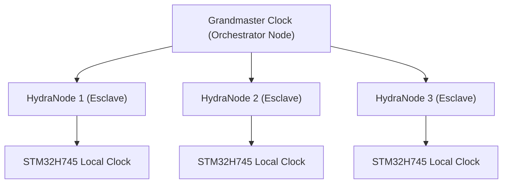

<p align="center">
  
</p>

# ⏱️ HYDRA-UMC-SWARM-SYNC

<p align="center"><a href="README.md">🇺🇸 English</a> | <a href="README_spa.md">🇪🇸 Español</a> | 🇫🇷 <b>Français</b> | <a href="README_ita.md">🇮🇹 Italiano</a> | <a href="README_deu.md">🇩🇪 Deutsch</a> | <a href="README_zho.md">🇨🇳 简体中文</a> | <a href="README_jpn.md">🇯🇵 日本語</a></p>

### 📡 Precision Time Protocol (PTP) & Synchronisation multi-nœuds

<p align="left">
  
  
  
</p>

---

## 1. 🛠️ APERÇU TECHNIQUE

**HYDRA-UMC-SWARM-SYNC** est le battement de cœur de l'usine distribuée. Il implémente une version spécialisée du PTP (Precision Time Protocol / IEEE 1588) pour s'assurer que chaque contrôleur du réseau partage une horloge globale parfaitement synchronisée.

Cette synchronisation est critique pour le mouvement coordonné multi-robots, où plusieurs bras doivent commencer et terminer leurs trajectoires exactement à la même microseconde pour éviter les collisions ou pour effectuer des tâches d'assemblage conjointes.

### Caractéristiques principales :
* ⏱️ **Synchronisation ultra-précise :** Atteint une gigue (jitter) inférieure à 100 ns sur le réseau local.
* 🔄 **Démarrage/Arrêt synchronisé :** Assure l'exécution atomique des commandes de trajectoire multi-robots.
* 📡 **Horodatage matériel :** Exploite les minuteries matérielles du CM5 et du STM32 pour une précision maximale.
* 🛡️ **Résilience réseau :** Gère la gigue des paquets et les délais réseau temporaires.
* 🔍 **Visibilité réelle des conflits & preuve de convergence à l'échelle de l'essaim (v0) :** `merge_report()` renvoie un enregistrement réel, par clé, de chaque conflit d'écriture réel résolu pendant la réconciliation - quelle cellule a battu quelle autre, et avec quel horodatage. Un test simulé à 4 cellules prouve que la convergence tient sur plusieurs cycles de partition et de reconnexion partielle, pas seulement une fusion unique entre deux cellules.

---

## 2. 🔄 HIÉRARCHIE DE SYNCHRONISATION



---

## 3. 🧱 ARCHITECTURE & DÉCISIONS DE CONCEPTION

* **Pourquoi une synchronisation basée CRDT, pas une source de vérité unique.** Plusieurs cellules HYDRA-UMC peuvent fonctionner de façon semi-autonome et se reconnecter plus tard - une stratégie de fusion CRDT converge sans arbitre central décidant quel état 'gagne', ce qu'une approche naïve du dernier écrivain gagnant ne peut garantir face à une vraie partition réseau.
* **Pourquoi c'est une sœur, pas un sous-module, de HYDRA-UMC-ORCHESTRATOR.** La réconciliation d'état est une préoccupation continue de fond, indépendante de toute décision d'orchestration ponctuelle - la garder comme processus séparé signifie qu'un redémarrage de l'orchestrateur n'interrompt pas une fusion en cours.
* **Pourquoi la fusion CRDT est déjà réelle aujourd'hui mais pas la synchronisation matérielle PTP.** `src/crdt.rs` implémente un vrai LWW-Element-Map (carte à dernier écrivain gagnant), un CRDT basé sur l'état dont le `merge` est démontrablement commutatif, associatif et idempotent - pas seulement « semble converger » sur un exemple, voir les tests de propriétés de ce module lui-même. `src/lamport.rs` le soutient avec une véritable horloge logique de Lamport. Le PTP (IEEE 1588, horodatage matériel sub-100ns) est un problème fondamentalement différent et dépendant du matériel - il a besoin de vraies cartes réseau/horloges matérielles pour avoir un sens, et reste différé jusqu'à ce qu'il y ait du vrai matériel contre lequel le valider. Une horloge logique est ce dont la fusion CRDT a réellement besoin pour résoudre les conflits de façon déterministe, et cette partie est réelle et testée aujourd'hui.
* **Comment cela s'intègre dans le reste de l'écosystème.** Un service frère sous HYDRA-UMC-ORCHESTRATOR, aux côtés de HYDRA-UMC-PATH-PLANNER-3D, HYDRA-UMC-JOB-DISPATCHER et HYDRA-UMC-NODE-HEALING - maintient cohérente la vue que chaque cellule a de l'état de l'essaim, quelle que soit celle qui détient le rôle d'orchestrateur à un instant donné.
* **Pourquoi `merge_report()` est une nouvelle méthode plutôt qu'un changement de ce que renvoie `merge()`.** `merge()` reste une boîte noire pure, bon marché et manifestement correcte - cette simplicité est ce qui la rend facile à faire confiance. `merge_report()` ajoute par-dessus une réelle visibilité des conflits pour un appelant (un opérateur, un outil de débogage) qui veut spécifiquement savoir ce qu'une réconciliation a écrasé, sans forcer chaque appelant du chemin critique `merge()` à payer pour cette comptabilité ou à la gérer.
* **Pourquoi les rapports de conflit montrent l'ordre des horodatages, pas un « happened-before » causal.** Une horloge de Lamport garantit qu'un véritable happens-before causal implique un horodatage antérieur - mais l'inverse n'est pas vrai : un horodatage antérieur ne prouve PAS que deux événements étaient causalement liés plutôt que simplement concurrents. `MergeConflict` est délibérément honnête et ne rapporte que ce qu'une horloge de Lamport peut réellement prouver (un ordre total cohérent), pas une affirmation de causalité qui nécessiterait une horloge vectorielle.

---

## 📂 STRUCTURE DES RÉPERTOIRES

```text
HYDRA-UMC-SWARM-SYNC/
├── src/
│   ├── main.rs       # Point d'entrée CLI : charge un scénario, réconcilie, imprime le JSON
│   ├── lamport.rs    # LamportClock - l'horloge logique derrière l'ordre du CRDT
│   └── crdt.rs       # LwwMap - le véritable CRDT : set/get/merge/snapshot
├── scenarios/        # Scénarios JSON d'exemple (voir BUILD & RUN ci-dessous)
├── build/            # Binaires compilés (sortie de build.sh/build.bat)
├── Cargo.toml        # Manifeste du paquet Rust (nom, version, dépendances)
├── bump_version.py   # Incrément de version type compteur kilométrique
├── build.sh/.bat     # Incrémente la version puis `cargo build --release`
├── run.sh/.bat       # Exécute le binaire compilé
└── README.md
```

Élagué du modèle original : `hardware/`, `firmware/`, `os/`, `docs/`,
`images/` et `scripts/` — il s'agit d'un service purement logiciel
(binaire Rust) sans matériel ni firmware propres, sans image de système
d'exploitation à maintenir, et sans contenu de documentation/médias/
scripts utilitaires encore suffisant pour justifier leurs propres
dossiers.

---

## 🔧 BUILD ET EXÉCUTION

Une véritable fusion CRDT testée, pas seulement un squelette qui
compile : elle réconcilie un scénario JSON multi-cellules et affiche
l'état convergé.

```bash
# Windows
build.bat
run.bat scenarios/example.json

# Linux / macOS
./build.sh
./run.sh scenarios/example.json
```

`build.sh`/`build.bat` incrémentent la version dans `Cargo.toml` (règle du
compteur kilométrique de l'écosystème, voir `bump_version.py`) puis exécutent
`cargo build --release`. `run.sh`/`run.bat` exécutent directement le binaire
résultant, en transmettant tout argument (le chemin du scénario).

Un scénario est un fichier JSON avec un tableau `cells` - chaque cellule
a un `id` (pour la lisibilité), un `writer` (ID d'écrivain), et une liste
de `writes` (`{key, value, time}`, `time` étant un horodatage Lamport
explicite, rejoué plutôt que généré en direct - le même motif « entrée
explicite et déterministe » que le `seed` de
HYDRA-UMC-PATH-PLANNER-3D). Les écritures de chaque cellule sont pliées
dans sa propre carte, puis la carte de chaque cellule est fusionnée deux
fois - une fois de gauche à droite (via `merge_report()`, pour que chaque
conflit réel en chemin soit enregistré), une fois de droite à gauche (via
`merge()` classique) - et le résultat n'affiche `converged: true` que si
les deux ordres ont produit le même état final, ce qui est la véritable
propriété du CRDT dont ce service dépend, pas seulement une hypothèse.

En l'exécutant sur `scenarios/example.json` (où `cell-a` et `cell-b` ont
toutes deux écrit sur `cell-a-node-2`), on voit la véritable résolution
du conflit, pas seulement le résultat final opaque :

```bash
./run.sh scenarios/example.json
```
```json
{
  "cells_merged": 2,
  "converged": true,
  "conflicts_resolved": 1,
  "conflicts": [
    { "key": "cell-a-node-2",
      "local_time": 2, "local_writer": 1, "local_value": "ok",
      "remote_time": 3, "remote_writer": 2, "remote_value": "unhealthy",
      "kept_remote": true }
  ],
  "merged_state": { "...": "..." }
}
```

```bash
cargo test   # l'horloge de Lamport, et le CRDT lui-meme - avec des
             # verifications directes que merge est commutatif, associatif
             # et idempotent (pas seulement « semble correct » sur un
             # exemple), un test de depart de match deterministe pour des
             # ecritures veritablement concurrentes, le comportement
             # propre de detection de conflits de merge_report(), et une
             # simulation a 4 cellules prouvant la convergence sur
             # plusieurs cycles de partition et reconnexion partielle -
             # 16 tests au total
```

---

## 🚀 FEUILLE DE ROUTE
* **Phase 1 :** Synchronisation déterministe d'essaim sur TSN et réduction de la gigue sub-ms.
* **Phase 2 :** Planification de trajectoires 3D avec évitement dynamique d'obstacles dans les cellules multi-robots.
* **Phase 3 :** Optimisation de la répartition des tâches multi-robots à l'aide de la disponibilité des ressources en temps réel.
* **Phase 4 :** Prise en charge de la synchronisation PTP sans fil sur Wi-Fi 6 (mode haute fiabilité) et validation de la précision inférieure à 100 ns.

---

## 🔗 Projets Liés

Ce projet fait partie d'un écosystème robotique plus large du même auteur (JuanenRac / Electro Hobby 3D), couvrant firmware, logiciel de contrôle, nœuds IA et outillage de flotte. Bon à savoir, car une demande pourrait en réalité concerner l'un de ces projets plutôt que ce dépôt.

### Famille

**Parent :** **[HYDRA-UMC-ORCHESTRATOR](https://github.com/JuanenRac/HYDRA-UMC-ORCHESTRATOR)** — le parent d'intégration dont cette couche de synchronisation maintient la cohérence.

**Frères et sœurs :**
- **[HYDRA-UMC-PATH-PLANNER-3D](https://github.com/JuanenRac/HYDRA-UMC-PATH-PLANNER-3D)** — service d'orchestration frère, même parent.
- **[HYDRA-UMC-JOB-DISPATCHER](https://github.com/JuanenRac/HYDRA-UMC-JOB-DISPATCHER)** — service d'orchestration frère, même parent.
- **[HYDRA-UMC-NODE-HEALING](https://github.com/JuanenRac/HYDRA-UMC-NODE-HEALING)** — service d'orchestration frère, même parent.

### Relation Directe (hors de la famille)

Ce projet n'a pas de relation directe hors de la famille Orchestration et Essaim (selon la carte de relations de l'écosystème) - voir « Reste de l'Écosystème » ci-dessous pour tout le reste.

### Reste de l'Écosystème

**Plateforme HYDRA-UMC** — la cellule de micro-usine multi-robot
- **[HYDRA-UMC](https://github.com/JuanenRac/HYDRA-UMC)** — la carte mère CM5 + STM32H745 orchestrant jusqu'à 8 bras robotiques.
- **[HYDRA-UMC-SERVER](https://github.com/JuanenRac/HYDRA-UMC-SERVER)** — le backend Express/WebSocket auquel parle chaque client de contrôle.
- **[HYDRA-UMC-STUDIO](https://github.com/JuanenRac/HYDRA-UMC-STUDIO)** — tableau de bord de contrôle web, visualisation 3D multi-robot.
- **[HYDRA-UMC-ANDROID-CONTROL](https://github.com/JuanenRac/HYDRA-UMC-ANDROID-CONTROL)** — application de contrôle Android via Wi-Fi/Bluetooth.
- **[HYDRA-UMC-IOS-CONTROL](https://github.com/JuanenRac/HYDRA-UMC-IOS-CONTROL)** — application de contrôle iOS/iPadOS construite en Flutter.
- **[HYDRA-UMC-SUITE](https://github.com/JuanenRac/HYDRA-UMC-SUITE)** — centre de commande d'essaim de bureau (Python/PySide6).
- **[HYDRA-UMC-EDITOR-URDF](https://github.com/JuanenRac/HYDRA-UMC-EDITOR-URDF)** — éditeur de modèles URDF de bureau pour le catalogue de robots.
- **[HYDRA-UMC-DSI](https://github.com/JuanenRac/HYDRA-UMC-DSI)** — interface tactile native pour l'écran DSI embarqué.

**Plateforme URTC** — le contrôleur de tête d'outil que porte chaque bras HYDRA-UMC
- **[URTC](https://github.com/JuanenRac/URTC)** — contrôleur de tête d'outil sur bus CAN, 25 profils d'outil.
- **[URTC-FLASHER](https://github.com/JuanenRac/URTC-FLASHER)** — outil de bureau de flashage CAN-OTA + SWD/JTAG.
- **[URTC-TESTER](https://github.com/JuanenRac/URTC-TESTER)** — outil de bureau de diagnostic CAN en direct.
- **[URTC-WEB-STUDIO](https://github.com/JuanenRac/URTC-WEB-STUDIO)** — alternative basée navigateur via l'API Web Serial.

**🎥 Nœud de Vision IA (Hailo-8)**
- [HYDRA-UMC-VISION-NODE](https://github.com/JuanenRac/HYDRA-UMC-VISION-NODE)
- [HYDRA-UMC-VISION-STREAMER](https://github.com/JuanenRac/HYDRA-UMC-VISION-STREAMER)
- [HYDRA-UMC-DETECTION-HEF](https://github.com/JuanenRac/HYDRA-UMC-DETECTION-HEF)
- [HYDRA-UMC-SAFETY-ZONES](https://github.com/JuanenRac/HYDRA-UMC-SAFETY-ZONES)
- [HYDRA-UMC-VISUAL-SERVOING-API](https://github.com/JuanenRac/HYDRA-UMC-VISUAL-SERVOING-API)

**🧠 Nœud Cognitif IA (Hailo-10)**
- [HYDRA-UMC-COGNITIVE-NODE](https://github.com/JuanenRac/HYDRA-UMC-COGNITIVE-NODE)
- [HYDRA-UMC-VLA-ENGINE](https://github.com/JuanenRac/HYDRA-UMC-VLA-ENGINE)
- [HYDRA-UMC-VOICE-UI](https://github.com/JuanenRac/HYDRA-UMC-VOICE-UI)
- [HYDRA-UMC-SEMANTIC-PLANNER](https://github.com/JuanenRac/HYDRA-UMC-SEMANTIC-PLANNER)
- [HYDRA-UMC-DOCS-QA](https://github.com/JuanenRac/HYDRA-UMC-DOCS-QA)

**🎮 Jumeau Numérique et Simulation**
- [HYDRA-UMC-TWIN](https://github.com/JuanenRac/HYDRA-UMC-TWIN)
- [HYDRA-UMC-PHYSICS-REPLICA](https://github.com/JuanenRac/HYDRA-UMC-PHYSICS-REPLICA)
- [HYDRA-UMC-HIL-BRIDGE](https://github.com/JuanenRac/HYDRA-UMC-HIL-BRIDGE)
- [HYDRA-UMC-SYNTHETIC-DATA-GEN](https://github.com/JuanenRac/HYDRA-UMC-SYNTHETIC-DATA-GEN)

**📊 Données et Analytique**
- [HYDRA-UMC-DATALAKE](https://github.com/JuanenRac/HYDRA-UMC-DATALAKE)
- [HYDRA-UMC-TELEMETRY-COLLECTOR](https://github.com/JuanenRac/HYDRA-UMC-TELEMETRY-COLLECTOR)
- [HYDRA-UMC-ANOMALY-DETECTOR](https://github.com/JuanenRac/HYDRA-UMC-ANOMALY-DETECTOR)
- [HYDRA-UMC-PRODUCTION-REPORTS](https://github.com/JuanenRac/HYDRA-UMC-PRODUCTION-REPORTS)

**🏭 Passerelle Industrielle**
- [HYDRA-UMC-GATEWAY-INDUSTRIAL](https://github.com/JuanenRac/HYDRA-UMC-GATEWAY-INDUSTRIAL)
- [HYDRA-UMC-OPCUA-SERVER](https://github.com/JuanenRac/HYDRA-UMC-OPCUA-SERVER)
- [HYDRA-UMC-MQTT-BROKER](https://github.com/JuanenRac/HYDRA-UMC-MQTT-BROKER)
- [HYDRA-UMC-MTCONNECT-ADAPTER](https://github.com/JuanenRac/HYDRA-UMC-MTCONNECT-ADAPTER)

**🛠️ Outils Complémentaires**
- [URTC-SMART-RACK](https://github.com/JuanenRac/URTC-SMART-RACK)
- [URTC-VISION-TOOL](https://github.com/JuanenRac/URTC-VISION-TOOL)
- [HYDRA-UMC-WATCH](https://github.com/JuanenRac/HYDRA-UMC-WATCH)
- [HYDRA-UMC-TOOL-CLI](https://github.com/JuanenRac/HYDRA-UMC-TOOL-CLI)
- [HYDRA-UMC-DASHBOARD-AI](https://github.com/JuanenRac/HYDRA-UMC-DASHBOARD-AI)


## 👤 AUTEUR
**JuanenRac** (Electro Hobby 3D)
📧 electrohobby3d@gmail.com

## 📜 LICENCE
GPL-3.0 - Voir le fichier LICENSE pour plus de détails.
