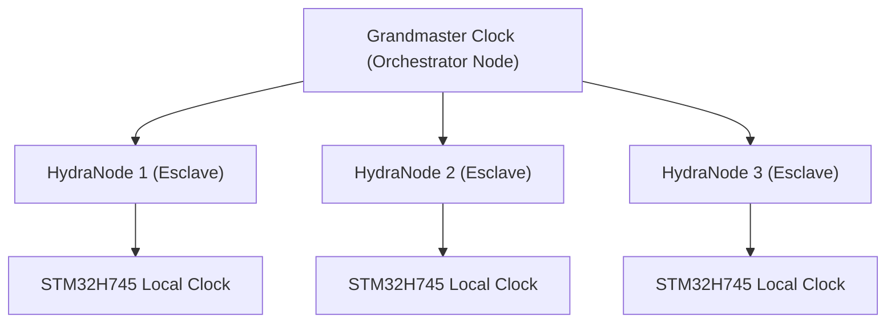

<p align="center">
  
</p>

# ⏱️ HYDRA-UMC-SWARM-SYNC

<p align="center"><a href="README.md">🇺🇸 English</a> | <a href="README_spa.md">🇪🇸 Español</a> | 🇫🇷 <b>Français</b> | <a href="README_ita.md">🇮🇹 Italiano</a> | <a href="README_deu.md">🇩🇪 Deutsch</a> | <a href="README_zho.md">🇨🇳 简体中文</a> | <a href="README_jpn.md">🇯🇵 日本語</a></p>

### 📡 Precision Time Protocol (PTP) & Synchronisation multi-nœuds

<p align="left">
  
  
  
</p>

---

## 1. 🛠️ APERÇU TECHNIQUE

**HYDRA-UMC-SWARM-SYNC** est le battement de cœur de l'usine distribuée. Il implémente une version spécialisée du PTP (Precision Time Protocol / IEEE 1588) pour s'assurer que chaque contrôleur du réseau partage une horloge globale parfaitement synchronisée.

Cette synchronisation est critique pour le mouvement coordonné multi-robots, où plusieurs bras doivent commencer et terminer leurs trajectoires exactement à la même microseconde pour éviter les collisions ou pour effectuer des tâches d'assemblage conjointes.

### Caractéristiques principales :
* ⏱️ **Synchronisation ultra-précise :** Atteint une gigue (jitter) inférieure à 100 ns sur le réseau local.
* 🔄 **Démarrage/Arrêt synchronisé :** Assure l'exécution atomique des commandes de trajectoire multi-robots.
* 📡 **Horodatage matériel :** Exploite les minuteries matérielles du CM5 et du STM32 pour une précision maximale.
* 🛡️ **Résilience réseau :** Gère la gigue des paquets et les délais réseau temporaires.
* 🔍 **Visibilité réelle des conflits & preuve de convergence à l'échelle de l'essaim (v0) :** `merge_report()` renvoie un enregistrement réel, par clé, de chaque conflit d'écriture réel résolu pendant la réconciliation - quelle cellule a battu quelle autre, et avec quel horodatage. Un test simulé à 4 cellules prouve que la convergence tient sur plusieurs cycles de partition et de reconnexion partielle, pas seulement une fusion unique entre deux cellules.

---

## 2. 🔄 HIÉRARCHIE DE SYNCHRONISATION



---

## 3. 🧱 ARCHITECTURE & DÉCISIONS DE CONCEPTION

* **Pourquoi une synchronisation basée CRDT, pas une source de vérité unique.** Plusieurs cellules HYDRA-UMC peuvent fonctionner de façon semi-autonome et se reconnecter plus tard - une stratégie de fusion CRDT converge sans arbitre central décidant quel état 'gagne', ce qu'une approche naïve du dernier écrivain gagnant ne peut garantir face à une vraie partition réseau.
* **Pourquoi c'est une sœur, pas un sous-module, de HYDRA-UMC-ORCHESTRATOR.** La réconciliation d'état est une préoccupation continue de fond, indépendante de toute décision d'orchestration ponctuelle - la garder comme processus séparé signifie qu'un redémarrage de l'orchestrateur n'interrompt pas une fusion en cours.
* **Pourquoi la fusion CRDT est déjà réelle aujourd'hui mais pas la synchronisation matérielle PTP.** `src/crdt.rs` implémente un vrai LWW-Element-Map (carte à dernier écrivain gagnant), un CRDT basé sur l'état dont le `merge` est démontrablement commutatif, associatif et idempotent - pas seulement « semble converger » sur un exemple, voir les tests de propriétés de ce module lui-même. `src/lamport.rs` le soutient avec une véritable horloge logique de Lamport. Le PTP (IEEE 1588, horodatage matériel sub-100ns) est un problème fondamentalement différent et dépendant du matériel - il a besoin de vraies cartes réseau/horloges matérielles pour avoir un sens, et reste différé jusqu'à ce qu'il y ait du vrai matériel contre lequel le valider. Une horloge logique est ce dont la fusion CRDT a réellement besoin pour résoudre les conflits de façon déterministe, et cette partie est réelle et testée aujourd'hui.
* **Comment cela s'intègre dans le reste de l'écosystème.** Un service frère sous HYDRA-UMC-ORCHESTRATOR, aux côtés de HYDRA-UMC-PATH-PLANNER-3D, HYDRA-UMC-JOB-DISPATCHER et HYDRA-UMC-NODE-HEALING - maintient cohérente la vue que chaque cellule a de l'état de l'essaim, quelle que soit celle qui détient le rôle d'orchestrateur à un instant donné.
* **Pourquoi `merge_report()` est une nouvelle méthode plutôt qu'un changement de ce que renvoie `merge()`.** `merge()` reste une boîte noire pure, bon marché et manifestement correcte - cette simplicité est ce qui la rend facile à faire confiance. `merge_report()` ajoute par-dessus une réelle visibilité des conflits pour un appelant (un opérateur, un outil de débogage) qui veut spécifiquement savoir ce qu'une réconciliation a écrasé, sans forcer chaque appelant du chemin critique `merge()` à payer pour cette comptabilité ou à la gérer.
* **Pourquoi les rapports de conflit montrent l'ordre des horodatages, pas un « happened-before » causal.** Une horloge de Lamport garantit qu'un véritable happens-before causal implique un horodatage antérieur - mais l'inverse n'est pas vrai : un horodatage antérieur ne prouve PAS que deux événements étaient causalement liés plutôt que simplement concurrents. `MergeConflict` est délibérément honnête et ne rapporte que ce qu'une horloge de Lamport peut réellement prouver (un ordre total cohérent), pas une affirmation de causalité qui nécessiterait une horloge vectorielle.

---

## 📂 STRUCTURE DES RÉPERTOIRES

```text
HYDRA-UMC-SWARM-SYNC/
├── src/
│   ├── main.rs       # Point d'entrée CLI : charge un scénario, réconcilie, imprime le JSON
│   ├── lamport.rs    # LamportClock - l'horloge logique derrière l'ordre du CRDT
│   ├── crdt.rs       # LwwMap - le véritable CRDT : set/get/merge/snapshot
│   ├── reconcile.rs  # Réconciliation réelle, extraite pour que server.rs puisse aussi l'utiliser
│   └── server.rs     # Surface JSON/HTTP simple (tiny_http) - POST /reconcile sur le réseau
├── scenarios/        # Scénarios JSON d'exemple (voir BUILD ET EXÉCUTION ci-dessous)
├── docs/
│   └── CLI_REFERENCE.md # Référence des commandes
├── images/
│   └── HYDRA_UMC_BANNER.svg # Bannière du README
├── systemd/
│   └── hydra-umc-swarm-sync.service # Unité systemd de l'API locale de réconciliation sur la CM5
├── tools/
│   ├── build_test.py # Vérification de build sans versionnage
│   └── ci_validate.py # Validation manifeste/CHANGELOG/docs utilisée par CI
├── build/            # Binaires compilés (sortie de build.sh/build.bat)
├── Cargo.toml        # Manifeste du paquet Rust (nom, version, dépendances)
├── bump_version.py   # Incrément de version native type compteur kilométrique
├── bump_manifest_version.py # Synchronise la version de hydra-umc.project.json avec la version native (--sync)
├── build.sh/.bat     # Incrémente la version puis `cargo build --release`
├── run.sh/.bat       # Exécute le binaire compilé
└── README.md
```

Élagué du modèle original : `hardware/`, `firmware/` et `os/` — il s'agit
d'un service purement logiciel (binaire Rust) sans matériel ni firmware
propres et sans image de système d'exploitation à maintenir.

---

## 🔧 BUILD ET EXÉCUTION

Une véritable fusion CRDT testée, pas seulement un squelette qui
compile : elle réconcilie un scénario JSON multi-cellules et affiche
l'état convergé.

```bash
# Windows
build.bat
run.bat scenarios/example.json

# Linux / macOS
./build.sh
./run.sh scenarios/example.json
```

`build.sh`/`build.bat` incrémentent la version dans `Cargo.toml` (règle du
compteur kilométrique de l'écosystème, voir `bump_version.py`) puis exécutent
`cargo build --release`. `run.sh`/`run.bat` exécutent directement le binaire
résultant, en transmettant tout argument (le chemin du scénario).

Un scénario est un fichier JSON avec un tableau `cells` - chaque cellule
a un `id` (pour la lisibilité), un `writer` (ID d'écrivain), et une liste
de `writes` (`{key, value, time}`, `time` étant un horodatage Lamport
explicite, rejoué plutôt que généré en direct - le même motif « entrée
explicite et déterministe » que le `seed` de
HYDRA-UMC-PATH-PLANNER-3D). Les écritures de chaque cellule sont pliées
dans sa propre carte, puis la carte de chaque cellule est fusionnée deux
fois - une fois de gauche à droite (via `merge_report()`, pour que chaque
conflit réel en chemin soit enregistré), une fois de droite à gauche (via
`merge()` classique) - et le résultat n'affiche `converged: true` que si
les deux ordres ont produit le même état final, ce qui est la véritable
propriété du CRDT dont ce service dépend, pas seulement une hypothèse.

En l'exécutant sur `scenarios/example.json` (où `cell-a` et `cell-b` ont
toutes deux écrit sur `cell-a-node-2`), on voit la véritable résolution
du conflit, pas seulement le résultat final opaque :

```bash
./run.sh scenarios/example.json
```
```json
{
  "cells_merged": 2,
  "converged": true,
  "conflicts_resolved": 1,
  "conflicts": [
    { "key": "cell-a-node-2",
      "local_time": 2, "local_writer": 1, "local_value": "ok",
      "remote_time": 3, "remote_writer": 2, "remote_value": "unhealthy",
      "kept_remote": true }
  ],
  "merged_state": { "...": "..." }
}
```

```bash
cargo test   # l'horloge de Lamport, et le CRDT lui-meme - avec des
             # verifications directes que merge est commutatif, associatif
             # et idempotent (pas seulement « semble correct » sur un
             # exemple), un test de depart de match deterministe pour des
             # ecritures veritablement concurrentes, le comportement
             # propre de detection de conflits de merge_report(), et une
             # simulation a 4 cellules prouvant la convergence sur
             # plusieurs cycles de partition et reconnexion partielle -
             # 22 tests au total
```

---

## 🚀 FEUILLE DE ROUTE
* **Phase 1 :** Synchronisation déterministe d'essaim sur TSN et réduction de la gigue sub-ms.
* **Phase 2 :** Planification de trajectoires 3D avec évitement dynamique d'obstacles dans les cellules multi-robots.
* **Phase 3 :** Optimisation de la répartition des tâches multi-robots à l'aide de la disponibilité des ressources en temps réel.
* **Phase 4 :** Prise en charge de la synchronisation PTP sans fil sur Wi-Fi 6 (mode haute fiabilité) et validation de la précision inférieure à 100 ns.

---

## 🔗 Projets Liés

Ce projet fait partie de l'écosystème robotique HYDRA-UMC du même auteur (JuanenRac / Electro Hobby 3D). Bon à savoir, car une demande pourrait en réalité concerner l'un de ceux-ci plutôt que ce dépôt.

**Projet Parent**
- **[HYDRA-UMC-ORCHESTRATOR](https://github.com/JuanenRac/HYDRA-UMC-ORCHESTRATOR)** — hub d'intégration avec un vrai contrat de rapport de santé gRPC/Protobuf et une machine à états de mission ; le parent dont ce dépôt est un service d'orchestration spécifique, au sein de sa propre couche de coordination d'essaim.

**Projets Frères** — les autres services d'orchestration de la propre couche de coordination d'essaim de HYDRA-UMC-ORCHESTRATOR
- **[HYDRA-UMC-PATH-PLANNER-3D](https://github.com/JuanenRac/HYDRA-UMC-PATH-PLANNER-3D)** — vrai planificateur de trajectoire 3D basé sur RRT, avec vraie validation des collisions obstacle/espace de travail.
- **[HYDRA-UMC-JOB-DISPATCHER](https://github.com/JuanenRac/HYDRA-UMC-JOB-DISPATCHER)** — vraie file de tâches basée sur la priorité avec déduplication, via une vraie API HTTP.
- **[HYDRA-UMC-NODE-HEALING](https://github.com/JuanenRac/HYDRA-UMC-NODE-HEALING)** — vrai chien de garde de santé de flotte basé sur gRPC, avec retry/backoff et détection d'incohérence d'identité.

**Fait Également Partie de l'Écosystème**

*Matériel & Plateforme de Base*
- **[HYDRA-UMC](https://github.com/JuanenRac/HYDRA-UMC)** — la carte mère physique du bras robotique : hôte CM5 + coprocesseur STM32H745 double cœur, coordonnant jusqu'à 8 bras-outils via CAN-OTA/SPI-OTA.
- **[HYDRA-UMC-OS](https://github.com/JuanenRac/HYDRA-UMC-OS)** — couche produit reproductible sur Raspberry Pi OS pour le CM5 : agent en lecture seule, config/profils validés, provisionnement WiFi de premier contact.
- **[HYDRA-UMC-SDK](https://github.com/JuanenRac/HYDRA-UMC-SDK)** — le contrat JSON-Schema partagé et la barrière de sécurité contre laquelle chaque bridge valide ses commandes.

*Backend Central & Clients*
- **[HYDRA-UMC-SERVER](https://github.com/JuanenRac/HYDRA-UMC-SERVER)** — le vrai backend headless (REST/WebSocket) auquel parle réellement chaque client de contrôle.
- **[HYDRA-UMC-STUDIO](https://github.com/JuanenRac/HYDRA-UMC-STUDIO)** — tableau de bord de contrôle web avec visualisation 3D multi-robot en temps réel.
- **[HYDRA-UMC-SUITE](https://github.com/JuanenRac/HYDRA-UMC-SUITE)** — centre de commande d'essaim de bureau (PySide6) pour plusieurs serveurs à la fois, empaqueté en exécutable autonome.
- **[HYDRA-UMC-ANDROID-CONTROL](https://github.com/JuanenRac/HYDRA-UMC-ANDROID-CONTROL)** — application de contrôle Android native avec connexion biométrique et un compagnon Wear OS jumelé.
- **[HYDRA-UMC-IOS-CONTROL](https://github.com/JuanenRac/HYDRA-UMC-IOS-CONTROL)** — application de contrôle iOS/iPadOS (Flutter) avec synchronisation WebSocket en temps réel.
- **[HYDRA-UMC-DSI](https://github.com/JuanenRac/HYDRA-UMC-DSI)** — interface tactile native pour l'écran tactile DSI 7" embarqué, intégrée directement sur le CM5.
- **[HYDRA-UMC-EDITOR-URDF](https://github.com/JuanenRac/HYDRA-UMC-EDITOR-URDF)** — créateur/éditeur graphique de bureau pour URDF qui envoie les modèles terminés vers le propre catalogue de STUDIO.
- **[HYDRA-UMC-BRIDGE-AMR](https://github.com/JuanenRac/HYDRA-UMC-BRIDGE-AMR)** — frontière de coordination pour les flottes AGV/AMR via un éditeur MQTT VDA 5050 réel.
- **[HYDRA-UMC-BRIDGE-CNC](https://github.com/JuanenRac/HYDRA-UMC-BRIDGE-CNC)** — coordinateur haut niveau pour cellules CNC avec accès réel au statut/octets de contrôle GRBL.
- **[HYDRA-UMC-BRIDGE-DROIDS](https://github.com/JuanenRac/HYDRA-UMC-BRIDGE-DROIDS)** — frontière de coordination pour droïdes à pattes/humanoïdes, avec un véritable émetteur de commandes Boston Dynamics Spot.
- **[HYDRA-UMC-BRIDGE-LASER](https://github.com/JuanenRac/HYDRA-UMC-BRIDGE-LASER)** — coordinateur de sécurité pour cellules laser lisant 3 vraies sécurités GPIO de clé/enceinte/verrouillage.
- **[HYDRA-UMC-BRIDGE-OPENPNP](https://github.com/JuanenRac/HYDRA-UMC-BRIDGE-OPENPNP)** — coordinateur haut niveau sûr pour le flux de cartes du pick-and-place OpenPnP.
- **[HYDRA-UMC-BRIDGE-PRINTER3D](https://github.com/JuanenRac/HYDRA-UMC-BRIDGE-PRINTER3D)** — frontière de coordination sûre pour imprimantes 3D Moonraker/Klipper, avec de vraies commandes de tâche contrôlées.
- **[HYDRA-UMC-BRIDGE-ROS2](https://github.com/JuanenRac/HYDRA-UMC-BRIDGE-ROS2)** — coordinateur de sécurité avec un vrai transport ROS 2 rclpy à importation paresseuse.
- **[HYDRA-UMC-BRIDGE-UAV](https://github.com/JuanenRac/HYDRA-UMC-BRIDGE-UAV)** — frontière de coordination pour UAV équipés de caméra, avec un véritable émetteur de commandes MAVLink.

*Plateforme d'Outils URTC*
- **[URTC](https://github.com/JuanenRac/URTC)** — firmware pour la carte physique Universal Robot Tool Controller, plus de 25 profils d'outil sur bus CAN.
- **[URTC-FLASHER](https://github.com/JuanenRac/URTC-FLASHER)** — outil de bureau à interface graphique pour flasher les cartes URTC, CAN-OTA plus SWD/JTAG puce complète.
- **[URTC-TESTER](https://github.com/JuanenRac/URTC-TESTER)** — outil de bureau de diagnostic CAN-bus en direct pour cartes URTC, un panneau par profil d'outil.
- **[URTC-WEB-STUDIO](https://github.com/JuanenRac/URTC-WEB-STUDIO)** — alternative basée navigateur à URTC-TESTER via la Web Serial API, sans installation locale.

*Nœud IA de Vision (Hailo-8)*
- **[HYDRA-UMC-VISION-NODE](https://github.com/JuanenRac/HYDRA-UMC-VISION-NODE)** — hub d'intégration pour le pipeline de vision Hailo-8, avec une vraie vérification de disponibilité matérielle par étape.
- **[HYDRA-UMC-DETECTION-HEF](https://github.com/JuanenRac/HYDRA-UMC-DETECTION-HEF)** — registre réel de modèles compilés avec vérification de chargement sécurisé par architecture Hailo/checksum.
- **[HYDRA-UMC-VISION-STREAMER](https://github.com/JuanenRac/HYDRA-UMC-VISION-STREAMER)** — générateur réel de pipeline GStreamer + config MediaMTX, avec une vraie frontière d'intégration HailoRT.
- **[HYDRA-UMC-VISUAL-SERVOING-API](https://github.com/JuanenRac/HYDRA-UMC-VISUAL-SERVOING-API)** — vraie loi de correction Position-Based Visual Servoing, verrouillée sur l'état de zone en amont.
- **[HYDRA-UMC-SAFETY-ZONES](https://github.com/JuanenRac/HYDRA-UMC-SAFETY-ZONES)** — vraie vérification de violation de zone et demande d'E-STOP, avec application de la fraîcheur de calibration.

*Nœud IA Cognitif (Hailo-10)*
- **[HYDRA-UMC-COGNITIVE-NODE](https://github.com/JuanenRac/HYDRA-UMC-COGNITIVE-NODE)** — hub d'intégration pour le pipeline cognitif Hailo-10 (orchestration LLM/VLA/voix).
- **[HYDRA-UMC-VLA-ENGINE](https://github.com/JuanenRac/HYDRA-UMC-VLA-ENGINE)** — vrai encodage/décodage de jetons d'action et génération de trajectoire pour un modèle Vision-Language-Action.
- **[HYDRA-UMC-VOICE-UI](https://github.com/JuanenRac/HYDRA-UMC-VOICE-UI)** — vrai front-end vocal (VAD + analyseur d'intention) avec un relais Watch borné et soumis à confirmation.
- **[HYDRA-UMC-SEMANTIC-PLANNER](https://github.com/JuanenRac/HYDRA-UMC-SEMANTIC-PLANNER)** — vraie décomposition de tâches basée sur des règles et récupération sémantique d'erreurs sur les codes d'erreur MCU.
- **[HYDRA-UMC-DOCS-QA](https://github.com/JuanenRac/HYDRA-UMC-DOCS-QA)** — vraie recherche documentaire TF-IDF (bibliothèque standard uniquement) sur les propres documents Markdown de cet écosystème.

*Jumeau Numérique & Simulation*
- **[HYDRA-UMC-TWIN](https://github.com/JuanenRac/HYDRA-UMC-TWIN)** — hub d'intégration pour le moteur de jumeau numérique, avec un vrai contrat de synchronisation par compatibilité de version.
- **[HYDRA-UMC-HIL-BRIDGE](https://github.com/JuanenRac/HYDRA-UMC-HIL-BRIDGE)** — vrai verrouillage de sécurité hardware-in-the-loop routant les commandes entre simulation et matériel réel.
- **[HYDRA-UMC-PHYSICS-REPLICA](https://github.com/JuanenRac/HYDRA-UMC-PHYSICS-REPLICA)** — vraie cinématique directe et validation des limites articulaires sur un vrai sous-ensemble URDF.
- **[HYDRA-UMC-SYNTHETIC-DATA-GEN](https://github.com/JuanenRac/HYDRA-UMC-SYNTHETIC-DATA-GEN)** — vrai générateur procédural de scènes 2D avec export d'annotations YOLO/COCO.

*Données & Analytique*
- **[HYDRA-UMC-DATALAKE](https://github.com/JuanenRac/HYDRA-UMC-DATALAKE)** — vrai magasin de séries temporelles basé sur sqlite3, avec une vraie API HTTP d'ingestion/requête.
- **[HYDRA-UMC-ANOMALY-DETECTOR](https://github.com/JuanenRac/HYDRA-UMC-ANOMALY-DETECTOR)** — vrai détecteur d'anomalies FFT + ligne de base statistique, avec surveillance de dérive.
- **[HYDRA-UMC-PRODUCTION-REPORTS](https://github.com/JuanenRac/HYDRA-UMC-PRODUCTION-REPORTS)** — vrai calcul OEE/disponibilité sur l'historique de DATALAKE, avec export CSV reproductible.
- **[HYDRA-UMC-TELEMETRY-COLLECTOR](https://github.com/JuanenRac/HYDRA-UMC-TELEMETRY-COLLECTOR)** — vrai pipeline d'ingestion CAN/WebSocket vers DATALAKE, avec déduplication par séquence.

*Passerelle Industrielle*
- **[HYDRA-UMC-GATEWAY-INDUSTRIAL](https://github.com/JuanenRac/HYDRA-UMC-GATEWAY-INDUSTRIAL)** — hub d'intégration relayant vers les protocoles industriels, avec une vraie couche de liste blanche de commandes/contre-pression.
- **[HYDRA-UMC-OPCUA-SERVER](https://github.com/JuanenRac/HYDRA-UMC-OPCUA-SERVER)** — vrai espace d'adressage OPC-UA, vérifié avec une vraie session client du protocole binaire.
- **[HYDRA-UMC-MQTT-BROKER](https://github.com/JuanenRac/HYDRA-UMC-MQTT-BROKER)** — vrai broker MQTT avec authentification par client optionnelle et ACL de sujets.
- **[HYDRA-UMC-MTCONNECT-ADAPTER](https://github.com/JuanenRac/HYDRA-UMC-MTCONNECT-ADAPTER)** — vrais points de terminaison XML MTConnect `/probe` et `/current`, avec sortie en mode dégradé.

*Outils Complémentaires & Opérations de l'Écosystème*
- **[HYDRA-UMC-DASHBOARD-AI](https://github.com/JuanenRac/HYDRA-UMC-DASHBOARD-AI)** — panneaux Smart Summaries et Anomaly Highlighting sur DATALAKE/ANOMALY-DETECTOR, avec un repli statistique honnête.
- **[HYDRA-UMC-TOOL-CLI](https://github.com/JuanenRac/HYDRA-UMC-TOOL-CLI)** — CLI de flotte avec un vrai contrat de codes de sortie stable, un vrai client en direct de la propre API de HYDRA-UMC-SERVER.
- **[HYDRA-UMC-WATCH](https://github.com/JuanenRac/HYDRA-UMC-WATCH)** — application compagnon WearOS avec de vraies alertes haptiques et un relais vocal vers le téléphone jumelé.
- **[URTC-SMART-RACK](https://github.com/JuanenRac/URTC-SMART-RACK)** — firmware pour un rack de montage de cartes avec décodage réel d'ID d'outil et logique de préchauffage Smart Idle.
- **[URTC-VISION-TOOL](https://github.com/JuanenRac/URTC-VISION-TOOL)** — firmware plus un vrai compagnon de vision Python pour une tête d'outil d'inspection thermique/RGB.
- **[HYDRA-UMC-UPDATER](https://github.com/JuanenRac/HYDRA-UMC-UPDATER)** — outil administratif de bureau qui découvre, clone et met à jour chaque dépôt de cet écosystème.


## 👤 AUTEUR
**JuanenRac** (Electro Hobby 3D)
📧 electrohobby3d@gmail.com
📺 [youtube.com/@electrohobby3d](https://youtube.com/@electrohobby3d)

## 📜 LICENCE
GPL-3.0 - Voir le fichier LICENSE pour plus de détails.
