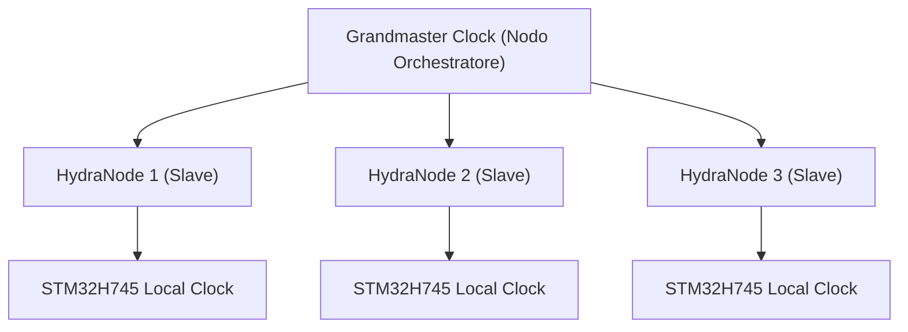

<p align="center">
  
</p>

# ⏱️ HYDRA-UMC-SWARM-SYNC

<p align="center"><a href="README.md">🇺🇸 English</a> | <a href="README_spa.md">🇪🇸 Español</a> | <a href="README_fra.md">🇫🇷 Français</a> | 🇮🇹 <b>Italiano</b> | <a href="README_deu.md">🇩🇪 Deutsch</a> | <a href="README_zho.md">🇨🇳 简体中文</a> | <a href="README_jpn.md">🇯🇵 日本語</a></p>

### 📡 Precision Time Protocol (PTP) & Sincronizzazione Multi-Nodo

<p align="left">
  
  
  
</p>

---

## 1. 🛠️ PANORAMICA TECNICA

**HYDRA-UMC-SWARM-SYNC** è il battito cardiaco della fabbrica distribuita. Implementa una versione specializzata di PTP (Precision Time Protocol / IEEE 1588) per garantire che ogni controller nella rete condivida un orologio globale perfettamente sincronizzato.

Questa sincronizzazione è fondamentale per il movimento coordinato multi-robot, in cui più bracci devono iniziare e terminare le traiettorie nello stesso microsecondo esatto per evitare collisioni o per eseguire compiti di assemblaggio congiunti.

### Caratteristiche principali:
* ⏱️ **Sincronizzazione ultra-precisa:** Ottiene un jitter inferiore a 100 ns nella rete locale.
* 🔄 **Avvio/arresto sincronizzato:** Garantisce l'esecuzione atomica dei comandi di traiettoria multi-robot.
* 📡 **Timestamp hardware:** Sfrutta i timer hardware di CM5 e STM32 per la massima precisione.
* 🛡️ **Resiliente alla rete:** Gestisce il jitter dei pacchetti e i ritardi temporanei della rete.

---

## 2. 🔄 GERARCHIA DI SINCRONIZZAZIONE



---

## 3. 🧱 ARCHITETTURA E DECISIONI DI PROGETTAZIONE

* **Perché sincronizzazione basata su CRDT, non un'unica fonte di verità.** Più celle HYDRA-UMC possono operare in modo semi-autonomo e riconnettersi più tardi - una strategia di fusione CRDT converge senza un arbitro centrale che decida quale stato 'vince', cosa che un approccio ingenuo dell'ultima scrittura vincente non può garantire di fronte a una vera partizione di rete.
* **Perché è sorella, non un sottomodulo, di HYDRA-UMC-ORCHESTRATOR.** La riconciliazione dello stato è una preoccupazione continua di sfondo, indipendente da qualsiasi decisione di orchestrazione puntuale - tenerla come processo separato significa che un riavvio dell'orchestratore non interrompe una fusione in corso.
* **Perché la fusione CRDT è già reale oggi ma la sincronizzazione hardware PTP no.** `src/crdt.rs` implementa un vero LWW-Element-Map (mappa a ultima scrittura vincente), un CRDT basato su stato il cui `merge` è dimostrabilmente commutativo, associativo e idempotente - non solo "sembra convergere" su un esempio, vedi i test di proprietà di quello stesso modulo. `src/lamport.rs` lo sostiene con un vero orologio logico di Lamport. Il PTP (IEEE 1588, marcatura temporale hardware sub-100ns) è un problema fondamentalmente diverso e dipendente dall'hardware - ha bisogno di NIC/timer hardware reali per avere senso, e resta rimandato finché non ci sarà hardware reale contro cui validarlo. Un orologio logico è ciò di cui la fusione CRDT ha realmente bisogno per risolvere i conflitti in modo deterministico, e quella parte è reale e testata oggi.
* **Come si inserisce nel resto dell'ecosistema.** Un servizio fratello sotto HYDRA-UMC-ORCHESTRATOR, insieme a HYDRA-UMC-PATH-PLANNER-3D, HYDRA-UMC-JOB-DISPATCHER e HYDRA-UMC-NODE-HEALING - mantiene coerente la visione che ogni cella ha dello stato dello sciame, indipendentemente da quale detenga il ruolo di orchestratore in un dato momento.

---

## 📂 STRUTTURA DELLE CARTELLE

```text
HYDRA-UMC-SWARM-SYNC/
├── src/
│   ├── main.rs       # Punto di ingresso CLI: carica uno scenario, riconcilia, stampa JSON
│   ├── lamport.rs    # LamportClock - l'orologio logico dietro l'ordine del CRDT
│   └── crdt.rs       # LwwMap - il vero CRDT: set/get/merge/snapshot
├── scenarios/        # Scenari JSON di esempio (vedi BUILD & RUN sotto)
├── build/            # Binari compilati (output di build.sh/build.bat)
├── Cargo.toml        # Manifesto del pacchetto Rust (nome, versione, dep)
├── bump_version.py   # Bump di versione stile contachilometri
├── build.sh/.bat     # Aggiorna la versione, poi `cargo build --release`
├── run.sh/.bat       # Esegue il binario compilato
└── README.md
```

Rimossi dal template originale: `hardware/`, `firmware/`, `os/`, `docs/`,
`images/` e `scripts/` — è un servizio puramente software (binario Rust)
senza hardware o firmware propri, senza un'immagine del sistema operativo
da mantenere, e senza contenuto di documentazione/media/script di utilità
ancora sufficiente da giustificare cartelle proprie.

---

## 🔧 BUILD & RUN

Una vera fusione CRDT testata, non solo uno scheletro che compila:
riconcilia uno scenario JSON multi-cella e stampa lo stato convergente.

```bash
# Windows
build.bat
run.bat scenarios/example.json

# Linux / macOS
./build.sh
./run.sh scenarios/example.json
```

`build.sh`/`build.bat` aggiornano la versione in `Cargo.toml` (regola
contachilometri dell'ecosistema, vedi `bump_version.py`) e poi eseguono
`cargo build --release`. `run.sh`/`run.bat` eseguono direttamente il binario
risultante, inoltrando qualsiasi argomento (il percorso dello scenario).

Uno scenario è un file JSON con un array `cells` - ogni cella ha un `id`
(per leggibilità), un `writer` (ID scrittore), e una lista di `writes`
(`{key, value, time}`, con `time` come timestamp Lamport esplicito,
riprodotto anziché generato dal vivo - lo stesso schema di "input
esplicito e deterministico" che usa il `seed` di
HYDRA-UMC-PATH-PLANNER-3D). Le scritture di ogni cella vengono ripiegate
nella propria mappa, poi la mappa di ogni cella viene fusa due volte -
una da sinistra a destra, una da destra a sinistra - e il risultato
stampa `converged: true` solo se entrambi gli ordini hanno prodotto lo
stesso stato finale, che è la vera proprietà del CRDT da cui dipende
questo servizio, non solo un'assunzione.

```bash
cargo test   # l'orologio di Lamport, e il CRDT stesso - incluse verifiche
             # dirette che merge sia commutativo, associativo e
             # idempotente (non solo "sembra corretto" su un esempio), un
             # test di spareggio deterministico per scritture veramente
             # concorrenti, e un test che simula 2 celle che operano in
             # modo autonomo e si riconciliano dopo, secondo lo stesso
             # ragionamento di questo README
```

---

## 🚀 ROADMAP
* **Fase 1:** Sincronizzazione deterministica dello sciame su TSN e riduzione del jitter sub-ms.
* **Fase 2:** Pianificazione dei percorsi 3D con evitamento dinamico degli ostacoli in celle multi-robot.
* **Fase 3:** Ottimizzazione del dispacciamento dei lavori multi-robot utilizzando la disponibilità delle risorse in tempo reale.
* **Fase 4:** Supporto per la sincronizzazione PTP wireless su Wi-Fi 6 (modalità ad alta affidabilità) e convalida della precisione sub-100ns.

---

## 🔗 Progetti Correlati

Questo progetto fa parte di un ecosistema robotico più ampio dello stesso autore (JuanenRac / Electro Hobby 3D), che copre firmware, software di controllo, nodi IA e strumenti di flotta. Utile saperlo, perché una richiesta potrebbe in realtà riguardare uno di questi progetti anziché questo repository.

### Famiglia

**Genitore:** **[HYDRA-UMC-ORCHESTRATOR](https://github.com/JuanenRac/HYDRA-UMC-ORCHESTRATOR)** — il genitore di integrazione la cui coerenza mantiene questo livello di sincronizzazione.

**Fratelli:**
- **[HYDRA-UMC-PATH-PLANNER-3D](https://github.com/JuanenRac/HYDRA-UMC-PATH-PLANNER-3D)** — servizio di orchestrazione fratello, stesso genitore.
- **[HYDRA-UMC-JOB-DISPATCHER](https://github.com/JuanenRac/HYDRA-UMC-JOB-DISPATCHER)** — servizio di orchestrazione fratello, stesso genitore.
- **[HYDRA-UMC-NODE-HEALING](https://github.com/JuanenRac/HYDRA-UMC-NODE-HEALING)** — servizio di orchestrazione fratello, stesso genitore.

### Relazione Diretta (fuori dalla famiglia)

Questo progetto non ha relazioni dirette fuori dalla famiglia Orchestration & Swarm (secondo la mappa delle relazioni dell'ecosistema) - vedi "Resto dell'Ecosistema" sotto per tutto il resto.

### Resto dell'Ecosistema

**Piattaforma HYDRA-UMC** — la cella di micro-fabbrica multi-robot
- **[HYDRA-UMC](https://github.com/JuanenRac/HYDRA-UMC)** — la scheda madre CM5 + STM32H745 che orchestra fino a 8 bracci robotici.
- **[HYDRA-UMC-SERVER](https://github.com/JuanenRac/HYDRA-UMC-SERVER)** — il backend Express/WebSocket con cui parla ogni client di controllo.
- **[HYDRA-UMC-STUDIO](https://github.com/JuanenRac/HYDRA-UMC-STUDIO)** — dashboard di controllo web, visualizzazione 3D multi-robot.
- **[HYDRA-UMC-ANDROID-CONTROL](https://github.com/JuanenRac/HYDRA-UMC-ANDROID-CONTROL)** — app di controllo Android via Wi-Fi/Bluetooth.
- **[HYDRA-UMC-IOS-CONTROL](https://github.com/JuanenRac/HYDRA-UMC-IOS-CONTROL)** — app di controllo iOS/iPadOS costruita in Flutter.
- **[HYDRA-UMC-SUITE](https://github.com/JuanenRac/HYDRA-UMC-SUITE)** — centro di comando sciame desktop (Python/PySide6).
- **[HYDRA-UMC-EDITOR-URDF](https://github.com/JuanenRac/HYDRA-UMC-EDITOR-URDF)** — editor desktop di modelli URDF per il catalogo robot.
- **[HYDRA-UMC-DSI](https://github.com/JuanenRac/HYDRA-UMC-DSI)** — interfaccia touch nativa per lo schermo DSI a bordo.

**Piattaforma URTC** — il controller della testa utensile che ogni braccio HYDRA-UMC porta con sé
- **[URTC](https://github.com/JuanenRac/URTC)** — controller testa utensile su bus CAN, 25 profili utensile.
- **[URTC-FLASHER](https://github.com/JuanenRac/URTC-FLASHER)** — strumento desktop di flashing CAN-OTA + SWD/JTAG.
- **[URTC-TESTER](https://github.com/JuanenRac/URTC-TESTER)** — strumento desktop di diagnostica CAN live.
- **[URTC-WEB-STUDIO](https://github.com/JuanenRac/URTC-WEB-STUDIO)** — alternativa basata su browser via Web Serial API.

**🎥 Vision AI Node (Hailo-8)**
- [HYDRA-UMC-VISION-NODE](https://github.com/JuanenRac/HYDRA-UMC-VISION-NODE)
- [HYDRA-UMC-VISION-STREAMER](https://github.com/JuanenRac/HYDRA-UMC-VISION-STREAMER)
- [HYDRA-UMC-DETECTION-HEF](https://github.com/JuanenRac/HYDRA-UMC-DETECTION-HEF)
- [HYDRA-UMC-SAFETY-ZONES](https://github.com/JuanenRac/HYDRA-UMC-SAFETY-ZONES)
- [HYDRA-UMC-VISUAL-SERVOING-API](https://github.com/JuanenRac/HYDRA-UMC-VISUAL-SERVOING-API)

**🧠 Cognitive AI Node (Hailo-10)**
- [HYDRA-UMC-COGNITIVE-NODE](https://github.com/JuanenRac/HYDRA-UMC-COGNITIVE-NODE)
- [HYDRA-UMC-VLA-ENGINE](https://github.com/JuanenRac/HYDRA-UMC-VLA-ENGINE)
- [HYDRA-UMC-VOICE-UI](https://github.com/JuanenRac/HYDRA-UMC-VOICE-UI)
- [HYDRA-UMC-SEMANTIC-PLANNER](https://github.com/JuanenRac/HYDRA-UMC-SEMANTIC-PLANNER)
- [HYDRA-UMC-DOCS-QA](https://github.com/JuanenRac/HYDRA-UMC-DOCS-QA)

**🎮 Digital Twin & Simulation**
- [HYDRA-UMC-TWIN](https://github.com/JuanenRac/HYDRA-UMC-TWIN)
- [HYDRA-UMC-PHYSICS-REPLICA](https://github.com/JuanenRac/HYDRA-UMC-PHYSICS-REPLICA)
- [HYDRA-UMC-HIL-BRIDGE](https://github.com/JuanenRac/HYDRA-UMC-HIL-BRIDGE)
- [HYDRA-UMC-SYNTHETIC-DATA-GEN](https://github.com/JuanenRac/HYDRA-UMC-SYNTHETIC-DATA-GEN)

**📊 Data & Analytics**
- [HYDRA-UMC-DATALAKE](https://github.com/JuanenRac/HYDRA-UMC-DATALAKE)
- [HYDRA-UMC-TELEMETRY-COLLECTOR](https://github.com/JuanenRac/HYDRA-UMC-TELEMETRY-COLLECTOR)
- [HYDRA-UMC-ANOMALY-DETECTOR](https://github.com/JuanenRac/HYDRA-UMC-ANOMALY-DETECTOR)
- [HYDRA-UMC-PRODUCTION-REPORTS](https://github.com/JuanenRac/HYDRA-UMC-PRODUCTION-REPORTS)

**🏭 Industrial Gateway**
- [HYDRA-UMC-GATEWAY-INDUSTRIAL](https://github.com/JuanenRac/HYDRA-UMC-GATEWAY-INDUSTRIAL)
- [HYDRA-UMC-OPCUA-SERVER](https://github.com/JuanenRac/HYDRA-UMC-OPCUA-SERVER)
- [HYDRA-UMC-MQTT-BROKER](https://github.com/JuanenRac/HYDRA-UMC-MQTT-BROKER)
- [HYDRA-UMC-MTCONNECT-ADAPTER](https://github.com/JuanenRac/HYDRA-UMC-MTCONNECT-ADAPTER)

**🛠️ Complementary Tools**
- [URTC-SMART-RACK](https://github.com/JuanenRac/URTC-SMART-RACK)
- [URTC-VISION-TOOL](https://github.com/JuanenRac/URTC-VISION-TOOL)
- [HYDRA-UMC-WATCH](https://github.com/JuanenRac/HYDRA-UMC-WATCH)
- [HYDRA-UMC-TOOL-CLI](https://github.com/JuanenRac/HYDRA-UMC-TOOL-CLI)
- [HYDRA-UMC-DASHBOARD-AI](https://github.com/JuanenRac/HYDRA-UMC-DASHBOARD-AI)


## 👤 AUTORE
**JuanenRac** (Electro Hobby 3D)
📧 electrohobby3d@gmail.com

## 📜 LICENZA
GPL-3.0 - Vedere LICENSE per i dettagli.

## Progetti correlati

> Canonical public ecosystem relationship map.

**Direct integrations:**
[HYDRA-UMC-OS](https://github.com/JuanenRac/HYDRA-UMC-OS) · [HYDRA-UMC-SDK](https://github.com/JuanenRac/HYDRA-UMC-SDK) · [HYDRA-UMC-SERVER](https://github.com/JuanenRac/HYDRA-UMC-SERVER) · [URTC](https://github.com/JuanenRac/URTC) · [HYDRA-UMC-ORCHESTRATOR](https://github.com/JuanenRac/HYDRA-UMC-ORCHESTRATOR) · [HYDRA-UMC-JOB-DISPATCHER](https://github.com/JuanenRac/HYDRA-UMC-JOB-DISPATCHER) · [HYDRA-UMC-NODE-HEALING](https://github.com/JuanenRac/HYDRA-UMC-NODE-HEALING) · [HYDRA-UMC-UPDATER](https://github.com/JuanenRac/HYDRA-UMC-UPDATER)

**Platform and contracts:**
[HYDRA-UMC-OS](https://github.com/JuanenRac/HYDRA-UMC-OS) · [HYDRA-UMC-SDK](https://github.com/JuanenRac/HYDRA-UMC-SDK)

**Rest of the ecosystem:**
All remaining public repositories are grouped by the seven ecosystem layers in the [JuanenRac ecosystem dashboard](https://juanenrac.github.io/JuanenRac/).
