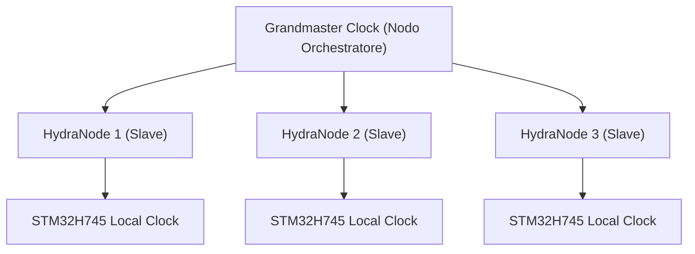

<p align="center">
  
</p>

# ⏱️ HYDRA-UMC-SWARM-SYNC

<p align="center"><a href="README.md">🇺🇸 English</a> | <a href="README_spa.md">🇪🇸 Español</a> | <a href="README_fra.md">🇫🇷 Français</a> | 🇮🇹 <b>Italiano</b> | <a href="README_deu.md">🇩🇪 Deutsch</a> | <a href="README_zho.md">🇨🇳 简体中文</a> | <a href="README_jpn.md">🇯🇵 日本語</a></p>

### 📡 Precision Time Protocol (PTP) & Sincronizzazione Multi-Nodo

<p align="left">
  
  
  
</p>

---

## 1. 🛠️ PANORAMICA TECNICA

**HYDRA-UMC-SWARM-SYNC** è il battito cardiaco della fabbrica distribuita. Implementa una versione specializzata di PTP (Precision Time Protocol / IEEE 1588) per garantire che ogni controller nella rete condivida un orologio globale perfettamente sincronizzato.

Questa sincronizzazione è fondamentale per il movimento coordinato multi-robot, in cui più bracci devono iniziare e terminare le traiettorie nello stesso microsecondo esatto per evitare collisioni o per eseguire compiti di assemblaggio congiunti.

### Caratteristiche principali:
* ⏱️ **Sincronizzazione ultra-precisa:** Ottiene un jitter inferiore a 100 ns nella rete locale.
* 🔄 **Avvio/arresto sincronizzato:** Garantisce l'esecuzione atomica dei comandi di traiettoria multi-robot.
* 📡 **Timestamp hardware:** Sfrutta i timer hardware di CM5 e STM32 per la massima precisione.
* 🛡️ **Resiliente alla rete:** Gestisce il jitter dei pacchetti e i ritardi temporanei della rete.
* 🔍 **Visibilità Reale dei Conflitti e Prova di Convergenza su Scala Sciame (v0):** `merge_report()` restituisce un registro reale, per chiave, di ogni conflitto di scrittura genuino risolto durante la riconciliazione - quale cella ha battuto quale altra, e con quale timestamp. Un test simulato a 4 celle dimostra che la convergenza regge attraverso più cicli di partizione e riconnessione parziale, non solo un singolo merge tra due celle.

---

## 2. 🔄 GERARCHIA DI SINCRONIZZAZIONE



---

## 3. 🧱 ARCHITETTURA E DECISIONI DI PROGETTAZIONE

* **Perché sincronizzazione basata su CRDT, non un'unica fonte di verità.** Più celle HYDRA-UMC possono operare in modo semi-autonomo e riconnettersi più tardi - una strategia di fusione CRDT converge senza un arbitro centrale che decida quale stato 'vince', cosa che un approccio ingenuo dell'ultima scrittura vincente non può garantire di fronte a una vera partizione di rete.
* **Perché è sorella, non un sottomodulo, di HYDRA-UMC-ORCHESTRATOR.** La riconciliazione dello stato è una preoccupazione continua di sfondo, indipendente da qualsiasi decisione di orchestrazione puntuale - tenerla come processo separato significa che un riavvio dell'orchestratore non interrompe una fusione in corso.
* **Perché la fusione CRDT è già reale oggi ma la sincronizzazione hardware PTP no.** `src/crdt.rs` implementa un vero LWW-Element-Map (mappa a ultima scrittura vincente), un CRDT basato su stato il cui `merge` è dimostrabilmente commutativo, associativo e idempotente - non solo "sembra convergere" su un esempio, vedi i test di proprietà di quello stesso modulo. `src/lamport.rs` lo sostiene con un vero orologio logico di Lamport. Il PTP (IEEE 1588, marcatura temporale hardware sub-100ns) è un problema fondamentalmente diverso e dipendente dall'hardware - ha bisogno di NIC/timer hardware reali per avere senso, e resta rimandato finché non ci sarà hardware reale contro cui validarlo. Un orologio logico è ciò di cui la fusione CRDT ha realmente bisogno per risolvere i conflitti in modo deterministico, e quella parte è reale e testata oggi.
* **Come si inserisce nel resto dell'ecosistema.** Un servizio fratello sotto HYDRA-UMC-ORCHESTRATOR, insieme a HYDRA-UMC-PATH-PLANNER-3D, HYDRA-UMC-JOB-DISPATCHER e HYDRA-UMC-NODE-HEALING - mantiene coerente la visione che ogni cella ha dello stato dello sciame, indipendentemente da quale detenga il ruolo di orchestratore in un dato momento.
* **Perché `merge_report()` è un nuovo metodo invece di cambiare cosa restituisce `merge()`.** `merge()` resta una scatola nera pura, economica e ovviamente corretta - questa semplicità è ciò che la rende facile da fidarsi. `merge_report()` aggiunge sopra una reale visibilità dei conflitti per un chiamante (un operatore, uno strumento di debug) che vuole specificamente sapere cosa ha sovrascritto una riconciliazione, senza costringere ogni chiamante del percorso critico `merge()` a pagare per quella contabilità o a gestirla.
* **Perché i report di conflitto mostrano l'ordine dei timestamp, non un "happened-before" causale.** Un orologio di Lamport garantisce che un vero happens-before causale implichi un timestamp precedente - ma il contrario non è vero: un timestamp precedente NON dimostra che due eventi fossero causalmente correlati anziché semplicemente concorrenti. `MergeConflict` è deliberatamente onesto e riporta solo ciò che un orologio di Lamport può realmente dimostrare (un ordine totale coerente), non un'affermazione di causalità che richiederebbe un orologio vettoriale.

---

## 📂 STRUTTURA DELLE CARTELLE

```text
HYDRA-UMC-SWARM-SYNC/
├── src/
│   ├── main.rs       # Punto di ingresso CLI: carica uno scenario, riconcilia, stampa JSON
│   ├── lamport.rs    # LamportClock - l'orologio logico dietro l'ordine del CRDT
│   ├── crdt.rs       # LwwMap - il vero CRDT: set/get/merge/snapshot
│   ├── reconcile.rs  # Riconciliazione reale, separata così server.rs può usarla anch'esso
│   └── server.rs     # Superficie JSON/HTTP semplice (tiny_http) - POST /reconcile in rete
├── scenarios/        # Scenari JSON di esempio (vedi BUILD ED ESECUZIONE sotto)
├── docs/
│   └── CLI_REFERENCE.md # Riferimento comandi
├── images/
│   └── HYDRA_UMC_BANNER.svg # Banner del README
├── systemd/
│   └── hydra-umc-swarm-sync.service # Unità systemd della API locale di riconciliazione sulla CM5
├── tools/
│   ├── build_test.py # Controllo build senza versionamento
│   └── ci_validate.py # Validazione manifest/CHANGELOG/docs usata dalla CI
├── build/            # Binari compilati (output di build.sh/build.bat)
├── Cargo.toml        # Manifesto del pacchetto Rust (nome, versione, dep)
├── bump_version.py   # Bump di versione nativa stile contachilometri
├── bump_manifest_version.py # Sincronizza la versione di hydra-umc.project.json con quella nativa (--sync)
├── build.sh/.bat     # Aggiorna la versione, poi `cargo build --release`
├── run.sh/.bat       # Esegue il binario compilato
└── README.md
```

Rimossi dal template originale: `hardware/`, `firmware/` e `os/` — è un
servizio puramente software (binario Rust) senza hardware o firmware
propri e senza un'immagine del sistema operativo da mantenere.

---

## 🔧 BUILD ED ESECUZIONE

Una vera fusione CRDT testata, non solo uno scheletro che compila:
riconcilia uno scenario JSON multi-cella e stampa lo stato convergente.

```bash
# Windows
build.bat
run.bat scenarios/example.json

# Linux / macOS
./build.sh
./run.sh scenarios/example.json
```

`build.sh`/`build.bat` aggiornano la versione in `Cargo.toml` (regola
contachilometri dell'ecosistema, vedi `bump_version.py`) e poi eseguono
`cargo build --release`. `run.sh`/`run.bat` eseguono direttamente il binario
risultante, inoltrando qualsiasi argomento (il percorso dello scenario).

Uno scenario è un file JSON con un array `cells` - ogni cella ha un `id`
(per leggibilità), un `writer` (ID scrittore), e una lista di `writes`
(`{key, value, time}`, con `time` come timestamp Lamport esplicito,
riprodotto anziché generato dal vivo - lo stesso schema di "input
esplicito e deterministico" che usa il `seed` di
HYDRA-UMC-PATH-PLANNER-3D). Le scritture di ogni cella vengono ripiegate
nella propria mappa, poi la mappa di ogni cella viene fusa due volte -
una da sinistra a destra (tramite `merge_report()`, così ogni conflitto
reale lungo il percorso viene registrato), una da destra a sinistra
(tramite `merge()` normale) - e il risultato stampa `converged: true`
solo se entrambi gli ordini hanno prodotto lo stesso stato finale, che è
la vera proprietà del CRDT da cui dipende questo servizio, non solo
un'assunzione.

Eseguendolo contro `scenarios/example.json` (dove `cell-a` e `cell-b`
hanno entrambe scritto su `cell-a-node-2`) si vede la vera risoluzione
del conflitto, non solo il risultato finale opaco:

```bash
./run.sh scenarios/example.json
```
```json
{
  "cells_merged": 2,
  "converged": true,
  "merged_state": { "...": "..." },
  "conflicts_resolved": 1,
  "conflicts": [
    { "key": "cell-a-node-2",
      "local_time": 2, "local_writer": 1, "local_value": "ok",
      "remote_time": 3, "remote_writer": 2, "remote_value": "unhealthy",
      "kept_remote": true }
  ],
  "next_local_time": 6
}
```

```bash
cargo test   # l'orologio di Lamport, e il CRDT stesso - incluse verifiche
             # dirette che merge sia commutativo, associativo e
             # idempotente (non solo "sembra corretto" su un esempio), un
             # test di spareggio deterministico per scritture veramente
             # concorrenti, il comportamento proprio di rilevamento
             # conflitti di merge_report(), e una simulazione a 4 celle
             # che dimostra la convergenza attraverso più cicli di
             # partizione e riconnessione parziale - 22 test in totale
```

La stessa chiamata a `reconcile()` è raggiungibile anche tramite una vera
API JSON/HTTP (`src/server.rs`, `tiny_http`, bloccante, senza runtime
asincrono) invece di un file di scenario locale - `run.sh serve [--addr ADDR] [--port PORT]`
la avvia (default `127.0.0.1:8112`), esponendo `POST /reconcile` (lo
scenario nel corpo della richiesta, stessa forma JSON) e `GET /stats`.
Questo è ciò che `systemd/hydra-umc-swarm-sync.service` esegue senza
supervisione sulla CM5. L'uso completo, i codici di uscita e il
riferimento completo delle rotte sono in
[`docs/CLI_REFERENCE.md`](docs/CLI_REFERENCE.md).

---

## 🚀 TABELLA DI MARCIA
* **Fase 1:** Sincronizzazione deterministica dello sciame su TSN e riduzione del jitter sub-ms.
* **Fase 2:** Pianificazione dei percorsi 3D con evitamento dinamico degli ostacoli in celle multi-robot.
* **Fase 3:** Ottimizzazione del dispacciamento dei lavori multi-robot utilizzando la disponibilità delle risorse in tempo reale.
* **Fase 4:** Supporto per la sincronizzazione PTP wireless su Wi-Fi 6 (modalità ad alta affidabilità) e convalida della precisione sub-100ns.

---

## 🔗 Progetti Correlati

Questo progetto fa parte dell'ecosistema robotico HYDRA-UMC dello stesso autore (JuanenRac / Electro Hobby 3D). Vale la pena conoscerlo, poiché una richiesta potrebbe in realtà riguardare uno di questi invece di questo repository.

**Progetto Padre**
- **[HYDRA-UMC-ORCHESTRATOR](https://github.com/JuanenRac/HYDRA-UMC-ORCHESTRATOR)** — hub di integrazione con un vero contratto di health-report gRPC/Protobuf e una macchina a stati di missione; il genitore di cui questo repository è un servizio di orchestrazione specifico, all'interno del proprio livello di coordinamento dello sciame.

**Progetti Fratelli** — gli altri servizi di orchestrazione del livello di coordinamento dello sciame proprio di HYDRA-UMC-ORCHESTRATOR
- **[HYDRA-UMC-PATH-PLANNER-3D](https://github.com/JuanenRac/HYDRA-UMC-PATH-PLANNER-3D)** — vero pianificatore di percorsi 3D basato su RRT, con vera validazione delle collisioni ostacolo/spazio di lavoro.
- **[HYDRA-UMC-JOB-DISPATCHER](https://github.com/JuanenRac/HYDRA-UMC-JOB-DISPATCHER)** — vera coda di lavori basata su priorità con deduplicazione, su una vera API HTTP.
- **[HYDRA-UMC-NODE-HEALING](https://github.com/JuanenRac/HYDRA-UMC-NODE-HEALING)** — vero watchdog di salute della flotta basato su gRPC, con retry/backoff e rilevamento di discrepanza d'identità.

**Fa Anche Parte dell'Ecosistema**

*Hardware e Piattaforma di Base*
- **[HYDRA-UMC](https://github.com/JuanenRac/HYDRA-UMC)** — la scheda madre fisica del braccio robotico: host CM5 + coprocessore STM32H745 dual-core, che coordina fino a 8 bracci utensile via CAN-OTA/SPI-OTA.
- **[HYDRA-UMC-OS](https://github.com/JuanenRac/HYDRA-UMC-OS)** — livello prodotto riproducibile su Raspberry Pi OS per il CM5: agente in sola lettura, config/profili validati, provisioning WiFi al primo contatto.
- **[HYDRA-UMC-SDK](https://github.com/JuanenRac/HYDRA-UMC-SDK)** — il contratto JSON-Schema condiviso e la barriera di sicurezza contro cui ogni bridge valida i propri comandi.

*Backend Centrale e Client*
- **[HYDRA-UMC-SERVER](https://github.com/JuanenRac/HYDRA-UMC-SERVER)** — il vero backend headless (REST/WebSocket) con cui parla davvero ogni client di controllo.
- **[HYDRA-UMC-STUDIO](https://github.com/JuanenRac/HYDRA-UMC-STUDIO)** — dashboard di controllo web con visualizzazione 3D multi-robot in tempo reale.
- **[HYDRA-UMC-SUITE](https://github.com/JuanenRac/HYDRA-UMC-SUITE)** — centro di comando sciame desktop (PySide6) per più server contemporaneamente, pacchettizzato come eseguibile standalone.
- **[HYDRA-UMC-ANDROID-CONTROL](https://github.com/JuanenRac/HYDRA-UMC-ANDROID-CONTROL)** — app di controllo nativa per Android con login biometrico e un companion Wear OS abbinato.
- **[HYDRA-UMC-IOS-CONTROL](https://github.com/JuanenRac/HYDRA-UMC-IOS-CONTROL)** — app di controllo per iOS/iPadOS (Flutter) con sincronizzazione WebSocket in tempo reale.
- **[HYDRA-UMC-DSI](https://github.com/JuanenRac/HYDRA-UMC-DSI)** — interfaccia touch nativa per il touchscreen DSI da 7" a bordo, incorporata direttamente nel CM5.
- **[HYDRA-UMC-EDITOR-URDF](https://github.com/JuanenRac/HYDRA-UMC-EDITOR-URDF)** — creatore/editor grafico desktop di URDF che invia i modelli finiti al catalogo di STUDIO.
- **[HYDRA-UMC-BRIDGE-AMR](https://github.com/JuanenRac/HYDRA-UMC-BRIDGE-AMR)** — barriera di coordinamento per flotte AGV/AMR tramite un publisher MQTT VDA 5050 reale.
- **[HYDRA-UMC-BRIDGE-CNC](https://github.com/JuanenRac/HYDRA-UMC-BRIDGE-CNC)** — coordinatore ad alto livello per celle CNC con accesso reale a stato/byte di controllo GRBL.
- **[HYDRA-UMC-BRIDGE-DROIDS](https://github.com/JuanenRac/HYDRA-UMC-BRIDGE-DROIDS)** — barriera di coordinamento per droidi con zampe/umanoidi, con un vero mittente di comandi per Boston Dynamics Spot.
- **[HYDRA-UMC-BRIDGE-LASER](https://github.com/JuanenRac/HYDRA-UMC-BRIDGE-LASER)** — coordinatore di sicurezza per celle laser che legge 3 salvaguardie GPIO reali di chiave/involucro/interblocco.
- **[HYDRA-UMC-BRIDGE-OPENPNP](https://github.com/JuanenRac/HYDRA-UMC-BRIDGE-OPENPNP)** — coordinatore ad alto livello sicuro per il flusso schede del pick-and-place OpenPnP.
- **[HYDRA-UMC-BRIDGE-PRINTER3D](https://github.com/JuanenRac/HYDRA-UMC-BRIDGE-PRINTER3D)** — barriera di coordinamento sicura per stampanti 3D Moonraker/Klipper, con comandi di lavoro reali e controllati.
- **[HYDRA-UMC-BRIDGE-ROS2](https://github.com/JuanenRac/HYDRA-UMC-BRIDGE-ROS2)** — coordinatore di sicurezza con un vero trasporto ROS 2 rclpy, importato in modo lazy.
- **[HYDRA-UMC-BRIDGE-UAV](https://github.com/JuanenRac/HYDRA-UMC-BRIDGE-UAV)** — barriera di coordinamento per UAV dotati di fotocamera, con un vero mittente di comandi MAVLink.

*Piattaforma Strumenti URTC*
- **[URTC](https://github.com/JuanenRac/URTC)** — firmware per la scheda fisica dell'Universal Robot Tool Controller, oltre 25 profili utensile su bus CAN.
- **[URTC-FLASHER](https://github.com/JuanenRac/URTC-FLASHER)** — strumento desktop con GUI per il flashing delle schede URTC, CAN-OTA più SWD/JTAG a chip intero.
- **[URTC-TESTER](https://github.com/JuanenRac/URTC-TESTER)** — strumento desktop di diagnostica CAN-bus dal vivo per schede URTC, un pannello per profilo utensile.
- **[URTC-WEB-STUDIO](https://github.com/JuanenRac/URTC-WEB-STUDIO)** — alternativa basata su browser a URTC-TESTER tramite la Web Serial API, senza installazione locale.

*Nodo IA Visione (Hailo-8)*
- **[HYDRA-UMC-VISION-NODE](https://github.com/JuanenRac/HYDRA-UMC-VISION-NODE)** — hub di integrazione per la pipeline di visione Hailo-8, con un vero controllo di prontezza hardware per fase.
- **[HYDRA-UMC-DETECTION-HEF](https://github.com/JuanenRac/HYDRA-UMC-DETECTION-HEF)** — registro reale di modelli compilati con verifica di caricamento sicuro per architettura Hailo/checksum.
- **[HYDRA-UMC-VISION-STREAMER](https://github.com/JuanenRac/HYDRA-UMC-VISION-STREAMER)** — generatore reale di pipeline GStreamer + config MediaMTX, con una vera barriera di integrazione HailoRT.
- **[HYDRA-UMC-VISUAL-SERVOING-API](https://github.com/JuanenRac/HYDRA-UMC-VISUAL-SERVOING-API)** — vera legge di correzione Position-Based Visual Servoing, con cancello di sicurezza sullo stato di zona a monte.
- **[HYDRA-UMC-SAFETY-ZONES](https://github.com/JuanenRac/HYDRA-UMC-SAFETY-ZONES)** — vero controllo di violazione zona e richiesta E-STOP, con imposizione della freschezza di calibrazione.

*Nodo IA Cognitivo (Hailo-10)*
- **[HYDRA-UMC-COGNITIVE-NODE](https://github.com/JuanenRac/HYDRA-UMC-COGNITIVE-NODE)** — hub di integrazione per la pipeline cognitiva Hailo-10 (orchestrazione LLM/VLA/voce).
- **[HYDRA-UMC-VLA-ENGINE](https://github.com/JuanenRac/HYDRA-UMC-VLA-ENGINE)** — vera codifica/decodifica di token d'azione e generazione di traiettoria per un modello Vision-Language-Action.
- **[HYDRA-UMC-VOICE-UI](https://github.com/JuanenRac/HYDRA-UMC-VOICE-UI)** — vero front-end vocale (VAD + parser di intenti) con un relay verso Watch limitato e soggetto a conferma.
- **[HYDRA-UMC-SEMANTIC-PLANNER](https://github.com/JuanenRac/HYDRA-UMC-SEMANTIC-PLANNER)** — vera scomposizione dei task basata su regole e recupero semantico degli errori sui codici errore MCU.
- **[HYDRA-UMC-DOCS-QA](https://github.com/JuanenRac/HYDRA-UMC-DOCS-QA)** — vera ricerca documentale TF-IDF (solo libreria standard) sui documenti Markdown di questo ecosistema.

*Gemello Digitale e Simulazione*
- **[HYDRA-UMC-TWIN](https://github.com/JuanenRac/HYDRA-UMC-TWIN)** — hub di integrazione per il motore di gemello digitale, con un vero contratto di sincronizzazione per compatibilità di versione.
- **[HYDRA-UMC-HIL-BRIDGE](https://github.com/JuanenRac/HYDRA-UMC-HIL-BRIDGE)** — vero interblocco di sicurezza hardware-in-the-loop che instrada i comandi tra simulazione e hardware reale.
- **[HYDRA-UMC-PHYSICS-REPLICA](https://github.com/JuanenRac/HYDRA-UMC-PHYSICS-REPLICA)** — vera cinematica diretta e validazione dei limiti articolari su un vero sottoinsieme URDF.
- **[HYDRA-UMC-SYNTHETIC-DATA-GEN](https://github.com/JuanenRac/HYDRA-UMC-SYNTHETIC-DATA-GEN)** — vero generatore procedurale di scene 2D con esportazione di annotazioni YOLO/COCO.

*Dati e Analisi*
- **[HYDRA-UMC-DATALAKE](https://github.com/JuanenRac/HYDRA-UMC-DATALAKE)** — vero archivio di serie temporali basato su sqlite3, con una vera API HTTP di ingestione/query.
- **[HYDRA-UMC-ANOMALY-DETECTOR](https://github.com/JuanenRac/HYDRA-UMC-ANOMALY-DETECTOR)** — vero rilevatore di anomalie FFT + baseline statistica, con monitoraggio della deriva.
- **[HYDRA-UMC-PRODUCTION-REPORTS](https://github.com/JuanenRac/HYDRA-UMC-PRODUCTION-REPORTS)** — vero calcolo OEE/disponibilità sullo storico di DATALAKE, con esportazione CSV riproducibile.
- **[HYDRA-UMC-TELEMETRY-COLLECTOR](https://github.com/JuanenRac/HYDRA-UMC-TELEMETRY-COLLECTOR)** — vera pipeline di ingestione CAN/WebSocket verso DATALAKE, con deduplicazione per sequenza.

*Gateway Industriale*
- **[HYDRA-UMC-GATEWAY-INDUSTRIAL](https://github.com/JuanenRac/HYDRA-UMC-GATEWAY-INDUSTRIAL)** — hub di integrazione che inoltra ai protocolli industriali, con un vero livello di allowlist dei comandi/backpressure.
- **[HYDRA-UMC-OPCUA-SERVER](https://github.com/JuanenRac/HYDRA-UMC-OPCUA-SERVER)** — vero spazio di indirizzi OPC-UA, verificato con una vera sessione client del protocollo binario.
- **[HYDRA-UMC-MQTT-BROKER](https://github.com/JuanenRac/HYDRA-UMC-MQTT-BROKER)** — vero broker MQTT con autenticazione opzionale per client e ACL sui topic.
- **[HYDRA-UMC-MTCONNECT-ADAPTER](https://github.com/JuanenRac/HYDRA-UMC-MTCONNECT-ADAPTER)** — veri endpoint XML `/probe` e `/current` di MTConnect, con output in modalità degradata.

*Strumenti Complementari e Operazioni dell'Ecosistema*
- **[HYDRA-UMC-DASHBOARD-AI](https://github.com/JuanenRac/HYDRA-UMC-DASHBOARD-AI)** — pannelli Smart Summaries e Anomaly Highlighting su DATALAKE/ANOMALY-DETECTOR, con un fallback statistico onesto.
- **[HYDRA-UMC-TOOL-CLI](https://github.com/JuanenRac/HYDRA-UMC-TOOL-CLI)** — CLI di flotta con un vero e stabile contratto di exit-code, un client live reale della stessa API di HYDRA-UMC-SERVER.
- **[HYDRA-UMC-WATCH](https://github.com/JuanenRac/HYDRA-UMC-WATCH)** — app companion WearOS con avvisi aptici reali e un relay vocale verso il telefono abbinato.
- **[URTC-SMART-RACK](https://github.com/JuanenRac/URTC-SMART-RACK)** — firmware per un rack di montaggio schede con decodifica reale dell'ID utensile e logica di preriscaldamento Smart Idle.
- **[URTC-VISION-TOOL](https://github.com/JuanenRac/URTC-VISION-TOOL)** — firmware più un vero companion di visione Python per una testa utensile di ispezione termica/RGB.
- **[HYDRA-UMC-UPDATER](https://github.com/JuanenRac/HYDRA-UMC-UPDATER)** — strumento amministrativo desktop che scopre, clona e aggiorna ogni repository di questo ecosistema.


---

## 📚 Documentazione e Comunità

- **[CONTRIBUTING.md](CONTRIBUTING.md)** — stack tecnologico e linee guida di codifica per una pull request.
- **[CODE_OF_CONDUCT.md](CODE_OF_CONDUCT.md)** — gli standard di comportamento attesi in questa comunità.
- **[SECURITY.md](SECURITY.md)** — come segnalare una vulnerabilità, e le reali aree di attenzione sulla sicurezza di questo progetto.
- **[SUPPORT.md](SUPPORT.md)** — dove porre domande e segnalare bug.
- **[LICENSE.md](LICENSE.md)** — la licenza propria di questo progetto.

## 👤 AUTORE
**JuanenRac** (Electro Hobby 3D)
📧 electrohobby3d@gmail.com
📺 [youtube.com/@electrohobby3d](https://youtube.com/@electrohobby3d)

## 📜 LICENZA
GPL-3.0 - Vedere LICENSE per i dettagli.
