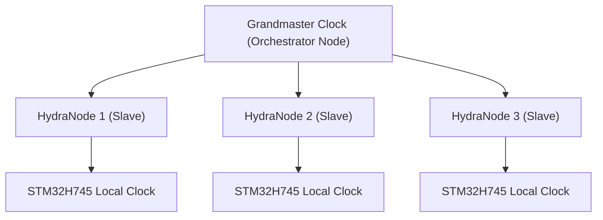

<p align="center">
  
</p>

# ⏱️ HYDRA-UMC-SWARM-SYNC

<p align="center"><a href="README.md">🇺🇸 English</a> | <a href="README_spa.md">🇪🇸 Español</a> | <a href="README_fra.md">🇫🇷 Français</a> | <a href="README_ita.md">🇮🇹 Italiano</a> | <a href="README_deu.md">🇩🇪 Deutsch</a> | <a href="README_zho.md">🇨🇳 简体中文</a> | 🇯🇵 <b>日本語</b></p>

### 📡 精密時刻プロトコル（PTP）とマルチノード同期

<p align="left">
  
  
  
</p>

---

## 1. 🛠️ 技術概要

**HYDRA-UMC-SWARM-SYNC** は、分散型工場の心臓部です。PTP（精密時刻
プロトコル / IEEE 1588）の専用バージョンを実装し、ネットワーク内の
すべてのコントローラーが完全に同期したグローバルクロックを共有できる
ようにします。

この同期は、マルチロボットの協調動作にとって極めて重要です。複数の
アームは、衝突を避けたり、共同組立タスクを実行したりするために、完全に
同一のマイクロ秒単位で軌道を開始・終了する必要があります。

### 主な機能：
* ⏱️ **超精密同期：** ローカルネットワーク全体でサブ 100ns のジッタを実現。
* 🔄 **同期された開始/停止：** マルチロボット軌道コマンドのアトミックな実行を保証。
* 📡 **ハードウェアタイムスタンプ：** 最大精度のために CM5 と STM32 のハードウェアタイマーを活用。
* 🛡️ **ネットワーク耐障害性：** パケットジッタや一時的なネットワーク遅延に対応。

---

## 2. 🔄 同期階層



---

## 3. 🧱 アーキテクチャと設計上の決定

* **単一の信頼できる情報源ではなく、CRDT ベースの同期を採用した理由。** 複数の HYDRA-UMC セルは半自律的に動作し、後で再接続することがあります——CRDT マージ戦略は、中央の仲裁者が「どの状態が勝つか」を決定することなく収束します。これは、素朴な「最後に書き込んだ者が勝つ」方式では実際のネットワーク分断において保証できないことです。
* **HYDRA-UMC-ORCHESTRATOR のサブモジュールではなく兄弟プロジェクトである理由。** 状態の調整は、いかなる単一のオーケストレーション決定からも独立した継続的なバックグラウンド上の関心事です——独立したプロセスとして保つことで、オーケストレーターの再起動が進行中のマージを中断することはありません。
* **CRDT マージは今日すでに本物だが、PTP ハードウェア同期はまだ本物ではない理由。** `src/crdt.rs` は実際の LWW-Element-Map（最終書き込み優先マップ）を実装しています——状態ベースの CRDT であり、その `merge` は可換・結合的・冪等であることが証明されています(単に「ある例で収束するように見える」だけではなく、そのモジュール自身のプロパティテストを参照)。`src/lamport.rs` は実際の Lamport 論理クロックでこれを支えています。PTP(IEEE 1588、サブ 100ns のハードウェアタイムスタンプ)は根本的に異なる、ハードウェア依存の問題です——意味を持つには実際の NIC/ハードウェアタイマーが必要であり、検証できる実機が手に入るまでは先送りされたままです。論理クロックこそ、CRDT マージが競合を決定論的に解決するために実際に必要とするものであり、その部分は今日すでに本物でテスト済みです。
* **エコシステムの他の部分との関係。** HYDRA-UMC-ORCHESTRATOR の下の兄弟サービスであり、HYDRA-UMC-PATH-PLANNER-3D、HYDRA-UMC-JOB-DISPATCHER、HYDRA-UMC-NODE-HEALING と並んでいます——現在どのセルがオーケストレーターの役割を担っているかにかかわらず、各セル自身のスウォーム状態のビューを一貫させます。

---

## 📂 リポジトリ構成

```text
HYDRA-UMC-SWARM-SYNC/
├── src/
│   ├── main.rs       # CLI エントリポイント：シナリオを読み込み、調整し、JSON を出力
│   ├── lamport.rs    # LamportClock - CRDT の順序付けを支える論理クロック
│   └── crdt.rs       # LwwMap - 本物の CRDT：set/get/merge/snapshot
├── scenarios/        # サンプル JSON シナリオ(下記「ビルドと実行」参照)
├── build/            # コンパイル済みバイナリ（build.sh/build.bat の出力）
├── Cargo.toml        # Rust パッケージマニフェスト（名前、バージョン、依存関係）
├── bump_version.py   # オドメーター式バージョンインクリメント、build.sh/.bat が実行
├── build.sh/.bat     # バージョンを増加させ、その後 `cargo build --release` を実行
├── run.sh/.bat       # コンパイル済みバイナリを実行
└── README.md
```

元のテンプレートから省略：`hardware/`、`firmware/`、`os/`、`docs/`、
`images/`、`scripts/` —— これは純粋なソフトウェアサービス(Rust バイナリ)
であり、専用のハードウェアやファームウェア、維持すべき
オペレーティングシステムイメージもなく、専用フォルダを正当化する
ほどのドキュメント/メディア/ユーティリティスクリプトの内容もまだ
ありません。

---

## 🔧 ビルドと実行

コンパイルできるだけの骨組みではなく、本物の、テスト済みの CRDT
マージです：複数セルの JSON シナリオを調整し、収束した状態を
出力します。

```bash
# Windows
build.bat
run.bat scenarios/example.json

# Linux / macOS
./build.sh
./run.sh scenarios/example.json
```

`build.sh`/`build.bat` は `Cargo.toml` のバージョンを増加させ（エコ
システム全体で統一されたオドメーター規則、`bump_version.py` を参照）、
その後 `cargo build --release` を実行します。`run.sh`/`run.bat` は
生成されたバイナリを直接実行し、引数（シナリオのパス）をそのまま
渡します。

シナリオは `cells` 配列を持つ JSON ファイルです——各セルには `id`
(可読性のため)、`writer`(書き込み者 ID)、そして `writes` のリスト
(`{key, value, time}`、`time` はライブ生成ではなく再生される明示的な
Lamport タイムスタンプ - HYDRA-UMC-PATH-PLANNER-3D の `seed` が使う
のと同じ「明示的で決定論的な入力」パターン)があります。各セルの
書き込みはそれぞれ自身のマップに畳み込まれ、その後各セルのマップは
2 回マージされます——一度は左から右へ、もう一度は右から左へ——
両方の順序が同一の最終状態を生成した場合にのみ、結果は
`converged: true` を出力します。これはこのサービスが依存する実際の
CRDT の性質であり、単なる仮定ではありません。

```bash
cargo test   # Lamport クロックと CRDT 自体 - merge が可換・結合的・
             # 冪等であることの直接的な検証(単に「ある例で正しく見える」
             # だけではない)、真に並行する書き込みに対する決定論的な
             # タイブレークのテスト、そして 2 つのセルが自律的に動作した
             # 後で調整することをシミュレートするテストを含む。これは
             # まさにこの README 自身の設計理由に対応している
```

---

## 🚀 ロードマップ
* **フェーズ 1：** TSN による決定論的スウォーム同期とサブミリ秒ジッタの低減。
* **フェーズ 2：** マルチロボットセルにおける動的障害物回避を伴う 3D パスプランニング。
* **フェーズ 3：** リアルタイムのリソース可用性を用いたマルチロボットジョブディスパッチの最適化。
* **フェーズ 4：** Wi-Fi 6（高信頼性モード）経由の無線 PTP 同期のサポートと、サブ 100ns 精度の検証。

---

## 🔗 関連プロジェクト

本プロジェクトは、同一著者（JuanenRac / Electro Hobby 3D）による、
ファームウェア、制御ソフトウェア、AI ノード、フリート管理ツールにまたがる、
より大きなロボティクスエコシステムの一部です。ご要望が実際にはこれらの
プロジェクトのいずれかに関するものであり、本リポジトリのものではない
可能性もあるため、知っておく価値があります。

### プロジェクトファミリー

**親プロジェクト：** **[HYDRA-UMC-ORCHESTRATOR](https://github.com/JuanenRac/HYDRA-UMC-ORCHESTRATOR)** —— 本同期層が一貫性を維持する統合親プロジェクト。

**兄弟プロジェクト：**
- **[HYDRA-UMC-PATH-PLANNER-3D](https://github.com/JuanenRac/HYDRA-UMC-PATH-PLANNER-3D)** —— 同じ親プロジェクトを持つ兄弟オーケストレーションサービス。
- **[HYDRA-UMC-JOB-DISPATCHER](https://github.com/JuanenRac/HYDRA-UMC-JOB-DISPATCHER)** —— 同じ親プロジェクトを持つ兄弟オーケストレーションサービス。
- **[HYDRA-UMC-NODE-HEALING](https://github.com/JuanenRac/HYDRA-UMC-NODE-HEALING)** —— 同じ親プロジェクトを持つ兄弟オーケストレーションサービス。

### 直接関連（ファミリー外）

本プロジェクトは、Orchestration & Swarm ファミリー外に直接関連するプロ
ジェクトを持ちません（エコシステム自身の関係図に基づく）——その他すべて
は下記の「エコシステムのその他のプロジェクト」を参照してください。

### エコシステムのその他のプロジェクト

**HYDRA-UMC プラットフォーム** — マルチロボット・マイクロファクトリーセル
- **[HYDRA-UMC](https://github.com/JuanenRac/HYDRA-UMC)** — 最大 8 台のロボットアームを統括する CM5 + STM32H745 マザーボード。
- **[HYDRA-UMC-SERVER](https://github.com/JuanenRac/HYDRA-UMC-SERVER)** — すべての制御クライアントが接続する Express/WebSocket バックエンド。
- **[HYDRA-UMC-STUDIO](https://github.com/JuanenRac/HYDRA-UMC-STUDIO)** — Web ベースの制御ダッシュボード、マルチロボット 3D 可視化。
- **[HYDRA-UMC-ANDROID-CONTROL](https://github.com/JuanenRac/HYDRA-UMC-ANDROID-CONTROL)** — Wi-Fi/Bluetooth 経由の Android 制御アプリ。
- **[HYDRA-UMC-IOS-CONTROL](https://github.com/JuanenRac/HYDRA-UMC-IOS-CONTROL)** — Flutter で構築された iOS/iPadOS 制御アプリ。
- **[HYDRA-UMC-SUITE](https://github.com/JuanenRac/HYDRA-UMC-SUITE)** — デスクトップ版群制御コマンドセンター（Python/PySide6）。
- **[HYDRA-UMC-EDITOR-URDF](https://github.com/JuanenRac/HYDRA-UMC-EDITOR-URDF)** — ロボットカタログ向けのデスクトップ版 URDF モデルエディター。
- **[HYDRA-UMC-DSI](https://github.com/JuanenRac/HYDRA-UMC-DSI)** — 機載 DSI タッチスクリーン用のネイティブタッチ UI。

**URTC プラットフォーム** — すべての HYDRA-UMC ロボットアームが搭載するツールヘッドコントローラー
- **[URTC](https://github.com/JuanenRac/URTC)** — CAN バスツールヘッドコントローラー、25 種類のツールプロファイル。
- **[URTC-FLASHER](https://github.com/JuanenRac/URTC-FLASHER)** — デスクトップ版 CAN-OTA + SWD/JTAG フラッシュツール。
- **[URTC-TESTER](https://github.com/JuanenRac/URTC-TESTER)** — デスクトップ版ライブ CAN バス診断ツール。
- **[URTC-WEB-STUDIO](https://github.com/JuanenRac/URTC-WEB-STUDIO)** — Web Serial API によるブラウザベースの代替版。

**🎥 ビジョン AI ノード（Hailo-8）**
- [HYDRA-UMC-VISION-NODE](https://github.com/JuanenRac/HYDRA-UMC-VISION-NODE)
- [HYDRA-UMC-VISION-STREAMER](https://github.com/JuanenRac/HYDRA-UMC-VISION-STREAMER)
- [HYDRA-UMC-DETECTION-HEF](https://github.com/JuanenRac/HYDRA-UMC-DETECTION-HEF)
- [HYDRA-UMC-SAFETY-ZONES](https://github.com/JuanenRac/HYDRA-UMC-SAFETY-ZONES)
- [HYDRA-UMC-VISUAL-SERVOING-API](https://github.com/JuanenRac/HYDRA-UMC-VISUAL-SERVOING-API)

**🧠 認知 AI ノード（Hailo-10）**
- [HYDRA-UMC-COGNITIVE-NODE](https://github.com/JuanenRac/HYDRA-UMC-COGNITIVE-NODE)
- [HYDRA-UMC-VLA-ENGINE](https://github.com/JuanenRac/HYDRA-UMC-VLA-ENGINE)
- [HYDRA-UMC-VOICE-UI](https://github.com/JuanenRac/HYDRA-UMC-VOICE-UI)
- [HYDRA-UMC-SEMANTIC-PLANNER](https://github.com/JuanenRac/HYDRA-UMC-SEMANTIC-PLANNER)
- [HYDRA-UMC-DOCS-QA](https://github.com/JuanenRac/HYDRA-UMC-DOCS-QA)

**🎮 デジタルツインとシミュレーション**
- [HYDRA-UMC-TWIN](https://github.com/JuanenRac/HYDRA-UMC-TWIN)
- [HYDRA-UMC-PHYSICS-REPLICA](https://github.com/JuanenRac/HYDRA-UMC-PHYSICS-REPLICA)
- [HYDRA-UMC-HIL-BRIDGE](https://github.com/JuanenRac/HYDRA-UMC-HIL-BRIDGE)
- [HYDRA-UMC-SYNTHETIC-DATA-GEN](https://github.com/JuanenRac/HYDRA-UMC-SYNTHETIC-DATA-GEN)

**📊 データと分析**
- [HYDRA-UMC-DATALAKE](https://github.com/JuanenRac/HYDRA-UMC-DATALAKE)
- [HYDRA-UMC-TELEMETRY-COLLECTOR](https://github.com/JuanenRac/HYDRA-UMC-TELEMETRY-COLLECTOR)
- [HYDRA-UMC-ANOMALY-DETECTOR](https://github.com/JuanenRac/HYDRA-UMC-ANOMALY-DETECTOR)
- [HYDRA-UMC-PRODUCTION-REPORTS](https://github.com/JuanenRac/HYDRA-UMC-PRODUCTION-REPORTS)

**🏭 産業用ゲートウェイ**
- [HYDRA-UMC-GATEWAY-INDUSTRIAL](https://github.com/JuanenRac/HYDRA-UMC-GATEWAY-INDUSTRIAL)
- [HYDRA-UMC-OPCUA-SERVER](https://github.com/JuanenRac/HYDRA-UMC-OPCUA-SERVER)
- [HYDRA-UMC-MQTT-BROKER](https://github.com/JuanenRac/HYDRA-UMC-MQTT-BROKER)
- [HYDRA-UMC-MTCONNECT-ADAPTER](https://github.com/JuanenRac/HYDRA-UMC-MTCONNECT-ADAPTER)

**🛠️ 補完ツール**
- [URTC-SMART-RACK](https://github.com/JuanenRac/URTC-SMART-RACK)
- [URTC-VISION-TOOL](https://github.com/JuanenRac/URTC-VISION-TOOL)
- [HYDRA-UMC-WATCH](https://github.com/JuanenRac/HYDRA-UMC-WATCH)
- [HYDRA-UMC-TOOL-CLI](https://github.com/JuanenRac/HYDRA-UMC-TOOL-CLI)
- [HYDRA-UMC-DASHBOARD-AI](https://github.com/JuanenRac/HYDRA-UMC-DASHBOARD-AI)


## 👤 作者
**JuanenRac**（Electro Hobby 3D）
📧 electrohobby3d@gmail.com

## 📜 ライセンス
GPL-3.0 —— 詳細は LICENSE を参照してください。
