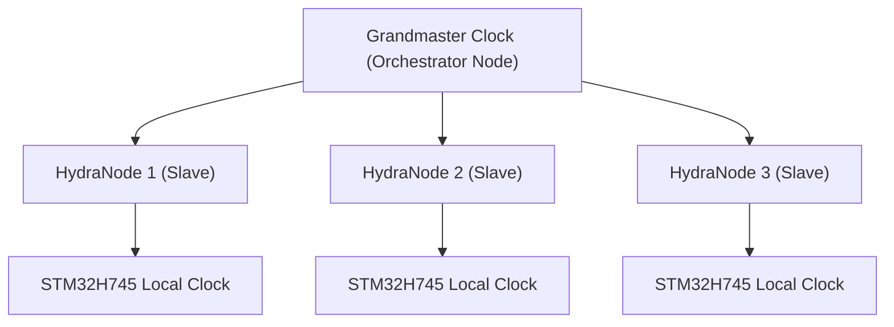

<p align="center">
  
</p>

# ⏱️ HYDRA-UMC-SWARM-SYNC

<p align="center"><a href="README.md">🇺🇸 English</a> | <a href="README_spa.md">🇪🇸 Español</a> | <a href="README_fra.md">🇫🇷 Français</a> | <a href="README_ita.md">🇮🇹 Italiano</a> | <a href="README_deu.md">🇩🇪 Deutsch</a> | <a href="README_zho.md">🇨🇳 简体中文</a> | 🇯🇵 <b>日本語</b></p>

### 📡 精密時刻プロトコル（PTP）とマルチノード同期

<p align="left">
  
  
  
</p>

---

## 1. 🛠️ 技術概要

**HYDRA-UMC-SWARM-SYNC** は、分散型工場の心臓部です。PTP（精密時刻
プロトコル / IEEE 1588）の専用バージョンを実装し、ネットワーク内の
すべてのコントローラーが完全に同期したグローバルクロックを共有できる
ようにします。

この同期は、マルチロボットの協調動作にとって極めて重要です。複数の
アームは、衝突を避けたり、共同組立タスクを実行したりするために、完全に
同一のマイクロ秒単位で軌道を開始・終了する必要があります。

### 主な機能：
* ⏱️ **超精密同期：** ローカルネットワーク全体でサブ 100ns のジッタを実現。
* 🔄 **同期された開始/停止：** マルチロボット軌道コマンドのアトミックな実行を保証。
* 📡 **ハードウェアタイムスタンプ：** 最大精度のために CM5 と STM32 のハードウェアタイマーを活用。
* 🛡️ **ネットワーク耐障害性：** パケットジッタや一時的なネットワーク遅延に対応。
* 🔍 **実際の競合可視化とスウォーム規模での収束の証明（v0）：** `merge_report()` は、調整中に解決された実際の書き込み競合それぞれについて、どのセルがどの別のセルに勝ったか、どのタイムスタンプでかを示す、キーごとの実際の記録を返します。4 セルのシミュレーションテストは、単一の 2 セル間マージだけでなく、複数回のパーティション化と部分的な再接続を通じて収束が保たれることを証明します。

---

## 2. 🔄 同期階層



---

## 3. 🧱 アーキテクチャと設計上の決定

* **単一の信頼できる情報源ではなく、CRDT ベースの同期を採用した理由。** 複数の HYDRA-UMC セルは半自律的に動作し、後で再接続することがあります——CRDT マージ戦略は、中央の仲裁者が「どの状態が勝つか」を決定することなく収束します。これは、素朴な「最後に書き込んだ者が勝つ」方式では実際のネットワーク分断において保証できないことです。
* **HYDRA-UMC-ORCHESTRATOR のサブモジュールではなく兄弟プロジェクトである理由。** 状態の調整は、いかなる単一のオーケストレーション決定からも独立した継続的なバックグラウンド上の関心事です——独立したプロセスとして保つことで、オーケストレーターの再起動が進行中のマージを中断することはありません。
* **CRDT マージは今日すでに本物だが、PTP ハードウェア同期はまだ本物ではない理由。** `src/crdt.rs` は実際の LWW-Element-Map（最終書き込み優先マップ）を実装しています——状態ベースの CRDT であり、その `merge` は可換・結合的・冪等であることが証明されています(単に「ある例で収束するように見える」だけではなく、そのモジュール自身のプロパティテストを参照)。`src/lamport.rs` は実際の Lamport 論理クロックでこれを支えています。PTP(IEEE 1588、サブ 100ns のハードウェアタイムスタンプ)は根本的に異なる、ハードウェア依存の問題です——意味を持つには実際の NIC/ハードウェアタイマーが必要であり、検証できる実機が手に入るまでは先送りされたままです。論理クロックこそ、CRDT マージが競合を決定論的に解決するために実際に必要とするものであり、その部分は今日すでに本物でテスト済みです。
* **エコシステムの他の部分との関係。** HYDRA-UMC-ORCHESTRATOR の下の兄弟サービスであり、HYDRA-UMC-PATH-PLANNER-3D、HYDRA-UMC-JOB-DISPATCHER、HYDRA-UMC-NODE-HEALING と並んでいます——現在どのセルがオーケストレーターの役割を担っているかにかかわらず、各セル自身のスウォーム状態のビューを一貫させます。
* **`merge_report()` が `merge()` の戻り値を変更するのではなく新しいメソッドである理由。** `merge()` は純粋で、コストが低く、明らかに正しいブラックボックスのままです——その単純さが信頼しやすさの理由です。`merge_report()` は、調整が実際に何を上書きしたかを具体的に知りたい呼び出し側(オペレーター、デバッグツール)のために、その上に実際の競合可視化を積み重ねます。ホットパスである `merge()` のすべての呼び出し側にその記帳のコストを負わせたり処理させたりすることはありません。
* **競合レポートが因果的な「happened-before」ではなくタイムスタンプの順序を示す理由。** Lamport クロックは、真の因果的 happens-before が成り立てばより早いタイムスタンプになることを保証します——しかし逆は成り立ちません。より早いタイムスタンプは、2 つのイベントが単に並行していたのではなく因果的に関連していたことを証明するものではありません。`MergeConflict` は意図的に正直であり、Lamport クロックが実際に証明できること(一貫した全順序)のみを報告し、ベクタークロックが必要になるような因果性の主張はしません。

---

## 📂 リポジトリ構成

```text
HYDRA-UMC-SWARM-SYNC/
├── src/
│   ├── main.rs       # CLI エントリポイント：シナリオを読み込み、調整し、JSON を出力
│   ├── lamport.rs    # LamportClock - CRDT の順序付けを支える論理クロック
│   ├── crdt.rs       # LwwMap - 本物の CRDT：set/get/merge/snapshot
│   ├── reconcile.rs  # 実際の調整ロジック。server.rs からも使えるよう分離
│   └── server.rs     # シンプルなJSON/HTTPサーフェス(tiny_http) - ネットワーク経由のPOST /reconcile
├── scenarios/        # サンプル JSON シナリオ(下記「ビルドと実行」参照)
├── docs/
│   └── CLI_REFERENCE.md # コマンドリファレンス
├── images/
│   └── HYDRA_UMC_BANNER.svg # README バナー
├── systemd/
│   └── hydra-umc-swarm-sync.service # ローカルCM5調整APIのsystemdユニット
├── tools/
│   ├── build_test.py # バージョンを増やさないビルドチェック
│   └── ci_validate.py # CI が使用するマニフェスト/CHANGELOG/ドキュメント検証
├── build/            # コンパイル済みバイナリ（build.sh/build.bat の出力）
├── Cargo.toml        # Rust パッケージマニフェスト（名前、バージョン、依存関係）
├── bump_version.py   # ネイティブバージョンのオドメーター式インクリメント、build.sh/.bat が実行
├── bump_manifest_version.py # hydra-umc.project.json のバージョンをネイティブ版と同期(--sync)
├── build.sh/.bat     # バージョンを増加させ、その後 `cargo build --release` を実行
├── run.sh/.bat       # コンパイル済みバイナリを実行
└── README.md
```

元のテンプレートから省略：`hardware/`、`firmware/`、`os/` —— これは純粋な
ソフトウェアサービス(Rust バイナリ)であり、専用のハードウェアや
ファームウェア、維持すべきオペレーティングシステムイメージもありません。

---

## 🔧 ビルドと実行

コンパイルできるだけの骨組みではなく、本物の、テスト済みの CRDT
マージです：複数セルの JSON シナリオを調整し、収束した状態を
出力します。

```bash
# Windows
build.bat
run.bat scenarios/example.json

# Linux / macOS
./build.sh
./run.sh scenarios/example.json
```

`build.sh`/`build.bat` は `Cargo.toml` のバージョンを増加させ（エコ
システム全体で統一されたオドメーター規則、`bump_version.py` を参照）、
その後 `cargo build --release` を実行します。`run.sh`/`run.bat` は
生成されたバイナリを直接実行し、引数（シナリオのパス）をそのまま
渡します。

シナリオは `cells` 配列を持つ JSON ファイルです——各セルには `id`
(可読性のため)、`writer`(書き込み者 ID)、そして `writes` のリスト
(`{key, value, time}`、`time` はライブ生成ではなく再生される明示的な
Lamport タイムスタンプ - HYDRA-UMC-PATH-PLANNER-3D の `seed` が使う
のと同じ「明示的で決定論的な入力」パターン)があります。各セルの
書き込みはそれぞれ自身のマップに畳み込まれ、その後各セルのマップは
2 回マージされます——一度は左から右へ(`merge_report()` 経由なので、
途中の実際の競合がすべて記録されます)、もう一度は右から左へ(通常の
`merge()` 経由)——両方の順序が同一の最終状態を生成した場合にのみ、
結果は `converged: true` を出力します。これはこのサービスが依存する
実際の CRDT の性質であり、単なる仮定ではありません。

`scenarios/example.json`(`cell-a` と `cell-b` の両方が `cell-a-node-2`
に書き込んだシナリオ)に対して実行すると、単なる不透明な最終結果では
なく、実際の競合解決が見えます:

```bash
./run.sh scenarios/example.json
```
```json
{
  "cells_merged": 2,
  "converged": true,
  "merged_state": { "...": "..." },
  "conflicts_resolved": 1,
  "conflicts": [
    { "key": "cell-a-node-2",
      "local_time": 2, "local_writer": 1, "local_value": "ok",
      "remote_time": 3, "remote_writer": 2, "remote_value": "unhealthy",
      "kept_remote": true }
  ],
  "next_local_time": 6
}
```

```bash
cargo test   # Lamport クロックと CRDT 自体 - merge が可換・結合的・
             # 冪等であることの直接的な検証(単に「ある例で正しく見える」
             # だけではない)、真に並行する書き込みに対する決定論的な
             # タイブレークのテスト、merge_report() 自体の競合検出の
             # 振る舞い、そして複数回のパーティション化と部分的な
             # 再接続を経ても収束することを証明する 4 セルのシミュレー
             # ション - 合計 22 個のテスト
```

同じ `reconcile()` 呼び出しは、ローカルのシナリオファイルの代わりに
本物の JSON/HTTP API(`src/server.rs`、`tiny_http`、ブロッキング、
非同期ランタイムなし)経由でも到達できます - `run.sh serve [--addr ADDR] [--port PORT]`
で起動し(デフォルト `127.0.0.1:8112`)、`POST /reconcile`(リクエスト
ボディに同じ JSON 形式のシナリオ)と `GET /stats` を公開します。これは
`systemd/hydra-umc-swarm-sync.service` が CM5 上で無人実行している
のと同じものです。完全な使用方法、終了コード、ルートの完全な
リファレンスは [`docs/CLI_REFERENCE.md`](docs/CLI_REFERENCE.md) に
あります。

---

## 🚀 ロードマップ
* **フェーズ 1：** TSN による決定論的スウォーム同期とサブミリ秒ジッタの低減。
* **フェーズ 2：** マルチロボットセルにおける動的障害物回避を伴う 3D パスプランニング。
* **フェーズ 3：** リアルタイムのリソース可用性を用いたマルチロボットジョブディスパッチの最適化。
* **フェーズ 4：** Wi-Fi 6（高信頼性モード）経由の無線 PTP 同期のサポートと、サブ 100ns 精度の検証。

---

## 🔗 関連プロジェクト

本プロジェクトは、同じ作者(JuanenRac / Electro Hobby 3D)による HYDRA-UMC ロボティクスエコシステムの一部です。リクエストが実はこの中のどれかについてのものである可能性があるため、知っておく価値があります。

**親プロジェクト**
- **[HYDRA-UMC-ORCHESTRATOR](https://github.com/JuanenRac/HYDRA-UMC-ORCHESTRATOR)** — 実際の gRPC/Protobuf ヘルスレポート契約とミッションステートマシンを持つ統合ハブ。本リポジトリは、その自身のスウォーム調整レイヤー内における特定のオーケストレーションサービスとして、この親の一部を成す。

**兄弟プロジェクト** —— HYDRA-UMC-ORCHESTRATOR 自身のスウォーム調整レイヤーにおける他のオーケストレーションサービス
- **[HYDRA-UMC-PATH-PLANNER-3D](https://github.com/JuanenRac/HYDRA-UMC-PATH-PLANNER-3D)** — 実際の障害物/ワークスペース衝突検証を備えた、実際の RRT ベースの 3D 経路プランナー。
- **[HYDRA-UMC-JOB-DISPATCHER](https://github.com/JuanenRac/HYDRA-UMC-JOB-DISPATCHER)** — 実際の HTTP API 上に構築された、優先度ベースの実際のジョブキュー(重複排除付き)。
- **[HYDRA-UMC-NODE-HEALING](https://github.com/JuanenRac/HYDRA-UMC-NODE-HEALING)** — リトライ/バックオフとアイデンティティ不一致検出を備えた、実際の gRPC ベースのフリートヘルスウォッチドッグ。

**エコシステムの他のプロジェクト**

*コアハードウェア&プラットフォーム*
- **[HYDRA-UMC](https://github.com/JuanenRac/HYDRA-UMC)** — 実際のロボットアームのマザーボード——CM5 ホスト + デュアルコア STM32H745、CAN-OTA/SPI-OTA 経由で最大 8 本のツールアームを統括。
- **[HYDRA-UMC-OS](https://github.com/JuanenRac/HYDRA-UMC-OS)** — CM5 向けの再現可能な Raspberry Pi OS プロダクト層——読み取り専用エージェント、検証済み設定/プロファイル、WiFi 初回接続プロビジョニング。
- **[HYDRA-UMC-SDK](https://github.com/JuanenRac/HYDRA-UMC-SDK)** — すべてのブリッジが自身のコマンドを検証する共有 JSON-Schema 契約と安全ゲートの境界。

*コアバックエンド&クライアント*
- **[HYDRA-UMC-SERVER](https://github.com/JuanenRac/HYDRA-UMC-SERVER)** — すべての制御クライアントが実際に通信する、本物のヘッドレスバックエンド(REST/WebSocket)。
- **[HYDRA-UMC-STUDIO](https://github.com/JuanenRac/HYDRA-UMC-STUDIO)** — リアルタイムのマルチロボット 3D 可視化を備えたウェブ制御ダッシュボード。
- **[HYDRA-UMC-SUITE](https://github.com/JuanenRac/HYDRA-UMC-SUITE)** — 複数のサーバーを同時に扱えるデスクトップ(PySide6)スウォームコマンドセンター、スタンドアロン実行ファイルとしてパッケージ化。
- **[HYDRA-UMC-ANDROID-CONTROL](https://github.com/JuanenRac/HYDRA-UMC-ANDROID-CONTROL)** — 生体認証ログインとペアリングされた Wear OS コンパニオンを備えたネイティブ Android 制御アプリ。
- **[HYDRA-UMC-IOS-CONTROL](https://github.com/JuanenRac/HYDRA-UMC-IOS-CONTROL)** — リアルタイム WebSocket 同期を備えた iOS/iPadOS 制御アプリ(Flutter)。
- **[HYDRA-UMC-DSI](https://github.com/JuanenRac/HYDRA-UMC-DSI)** — 本体搭載の 7 インチ DSI タッチスクリーン向けネイティブタッチ UI、CM5 自体に組み込み。
- **[HYDRA-UMC-EDITOR-URDF](https://github.com/JuanenRac/HYDRA-UMC-EDITOR-URDF)** — 完成したモデルを STUDIO 自身のカタログへ送信するデスクトップ用グラフィカル URDF 作成/編集ツール。
- **[HYDRA-UMC-BRIDGE-AMR](https://github.com/JuanenRac/HYDRA-UMC-BRIDGE-AMR)** — 実際の VDA 5050 MQTT パブリッシャーによる AGV/AMR フリートの調整境界。
- **[HYDRA-UMC-BRIDGE-CNC](https://github.com/JuanenRac/HYDRA-UMC-BRIDGE-CNC)** — 実際の GRBL ステータス/制御バイトへのアクセスを持つ、CNC セルの高レベルコーディネーター。
- **[HYDRA-UMC-BRIDGE-DROIDS](https://github.com/JuanenRac/HYDRA-UMC-BRIDGE-DROIDS)** — 実際の Boston Dynamics Spot コマンド送信機能を持つ、脚型/ヒューマノイドドロイドの調整境界。
- **[HYDRA-UMC-BRIDGE-LASER](https://github.com/JuanenRac/HYDRA-UMC-BRIDGE-LASER)** — 実際のキー/筐体/インターロック GPIO セーフガード 3 系統を読み取る、レーザーセルの安全コーディネーター。
- **[HYDRA-UMC-BRIDGE-OPENPNP](https://github.com/JuanenRac/HYDRA-UMC-BRIDGE-OPENPNP)** — OpenPnP ピックアンドプレースの基板フローを安全に統括する高レベルコーディネーター。
- **[HYDRA-UMC-BRIDGE-PRINTER3D](https://github.com/JuanenRac/HYDRA-UMC-BRIDGE-PRINTER3D)** — 実際にゲート制御されたジョブコマンドを持つ、Moonraker/Klipper 3D プリンター向けの安全な調整境界。
- **[HYDRA-UMC-BRIDGE-ROS2](https://github.com/JuanenRac/HYDRA-UMC-BRIDGE-ROS2)** — 実際の遅延インポート rclpy ROS 2 トランスポートを持つ安全コーディネーター。
- **[HYDRA-UMC-BRIDGE-UAV](https://github.com/JuanenRac/HYDRA-UMC-BRIDGE-UAV)** — 実際の MAVLink コマンド送信機能を持つ、カメラ搭載 UAV の調整境界。

*URTC ツールプラットフォーム*
- **[URTC](https://github.com/JuanenRac/URTC)** — 物理的な Universal Robot Tool Controller 基板向けファームウェア、CAN バス経由の 25 以上のツールプロファイル。
- **[URTC-FLASHER](https://github.com/JuanenRac/URTC-FLASHER)** — URTC 基板用のデスクトップ GUI 書き込みツール、CAN-OTA およびフルチップ SWD/JTAG。
- **[URTC-TESTER](https://github.com/JuanenRac/URTC-TESTER)** — URTC 基板向けのデスクトップ CAN バスライブ診断ツール、ツールプロファイルごとに 1 パネル。
- **[URTC-WEB-STUDIO](https://github.com/JuanenRac/URTC-WEB-STUDIO)** — Web Serial API を使ったブラウザベースの URTC-TESTER の代替、ローカルインストール不要。

*ビジョン AI ノード(Hailo-8)*
- **[HYDRA-UMC-VISION-NODE](https://github.com/JuanenRac/HYDRA-UMC-VISION-NODE)** — Hailo-8 ビジョンパイプラインの統合ハブ、段階ごとの実際のハードウェア準備状況チェック付き。
- **[HYDRA-UMC-DETECTION-HEF](https://github.com/JuanenRac/HYDRA-UMC-DETECTION-HEF)** — Hailo アーキテクチャ/チェックサムによる安全読み込み検証を備えた、実際のコンパイル済みモデルレジストリ。
- **[HYDRA-UMC-VISION-STREAMER](https://github.com/JuanenRac/HYDRA-UMC-VISION-STREAMER)** — 実際の HailoRT 統合境界を持つ、実際の GStreamer パイプライン + MediaMTX 設定生成器。
- **[HYDRA-UMC-VISUAL-SERVOING-API](https://github.com/JuanenRac/HYDRA-UMC-VISUAL-SERVOING-API)** — 上流のゾーン状態に応じて安全ゲート制御される、実際の Position-Based Visual Servoing 補正則。
- **[HYDRA-UMC-SAFETY-ZONES](https://github.com/JuanenRac/HYDRA-UMC-SAFETY-ZONES)** — キャリブレーションの鮮度を強制する、実際のゾーン侵入チェックと E-STOP 要求。

*コグニティブ AI ノード(Hailo-10)*
- **[HYDRA-UMC-COGNITIVE-NODE](https://github.com/JuanenRac/HYDRA-UMC-COGNITIVE-NODE)** — Hailo-10 コグニティブパイプライン(LLM/VLA/音声オーケストレーション)の統合ハブ。
- **[HYDRA-UMC-VLA-ENGINE](https://github.com/JuanenRac/HYDRA-UMC-VLA-ENGINE)** — Vision-Language-Action モデル向けの、実際のアクショントークンのエンコード/デコードと軌道生成。
- **[HYDRA-UMC-VOICE-UI](https://github.com/JuanenRac/HYDRA-UMC-VOICE-UI)** — 確認ゲート付きの限定的な Watch リレーを備えた、実際の音声フロントエンド(VAD + 意図解析)。
- **[HYDRA-UMC-SEMANTIC-PLANNER](https://github.com/JuanenRac/HYDRA-UMC-SEMANTIC-PLANNER)** — MCU エラーコードに対する、実際のルールベースのタスク分解と意味的エラー復旧。
- **[HYDRA-UMC-DOCS-QA](https://github.com/JuanenRac/HYDRA-UMC-DOCS-QA)** — このエコシステム自身の Markdown ドキュメントに対する、標準ライブラリのみの実際の TF-IDF 文書検索。

*デジタルツイン&シミュレーション*
- **[HYDRA-UMC-TWIN](https://github.com/JuanenRac/HYDRA-UMC-TWIN)** — 実際のバージョン互換性同期契約を持つ、デジタルツインエンジンの統合ハブ。
- **[HYDRA-UMC-HIL-BRIDGE](https://github.com/JuanenRac/HYDRA-UMC-HIL-BRIDGE)** — シミュレーションと実際のハードウェアの間でコマンドをルーティングする、実際のハードウェア・イン・ザ・ループ安全インターロック。
- **[HYDRA-UMC-PHYSICS-REPLICA](https://github.com/JuanenRac/HYDRA-UMC-PHYSICS-REPLICA)** — 実際の URDF サブセットに対する、実際の順運動学と関節限界検証。
- **[HYDRA-UMC-SYNTHETIC-DATA-GEN](https://github.com/JuanenRac/HYDRA-UMC-SYNTHETIC-DATA-GEN)** — YOLO/COCO アノテーションのエクスポート機能を持つ、実際のプロシージャル 2D シーンジェネレーター。

*データ&分析*
- **[HYDRA-UMC-DATALAKE](https://github.com/JuanenRac/HYDRA-UMC-DATALAKE)** — 実際の取り込み/クエリ HTTP API を備えた、実際の sqlite3 ベースの時系列ストア。
- **[HYDRA-UMC-ANOMALY-DETECTOR](https://github.com/JuanenRac/HYDRA-UMC-ANOMALY-DETECTOR)** — ドリフト監視を備えた、実際の FFT + 統計ベースラインによる異常検知器。
- **[HYDRA-UMC-PRODUCTION-REPORTS](https://github.com/JuanenRac/HYDRA-UMC-PRODUCTION-REPORTS)** — DATALAKE の履歴に対する実際の OEE/稼働率計算、再現可能な CSV エクスポート付き。
- **[HYDRA-UMC-TELEMETRY-COLLECTOR](https://github.com/JuanenRac/HYDRA-UMC-TELEMETRY-COLLECTOR)** — シーケンス重複排除機能を備えた、DATALAKE への実際の CAN/WebSocket 取り込みパイプライン。

*産業用ゲートウェイ*
- **[HYDRA-UMC-GATEWAY-INDUSTRIAL](https://github.com/JuanenRac/HYDRA-UMC-GATEWAY-INDUSTRIAL)** — 実際のコマンド許可リスト/バックプレッシャー層を持つ、産業用プロトコルへ中継する統合ハブ。
- **[HYDRA-UMC-OPCUA-SERVER](https://github.com/JuanenRac/HYDRA-UMC-OPCUA-SERVER)** — 実際のバイナリプロトコルクライアントセッションで検証された、実際の OPC-UA アドレス空間。
- **[HYDRA-UMC-MQTT-BROKER](https://github.com/JuanenRac/HYDRA-UMC-MQTT-BROKER)** — クライアント単位のオプション認証とトピック ACL を備えた、実際の MQTT ブローカー。
- **[HYDRA-UMC-MTCONNECT-ADAPTER](https://github.com/JuanenRac/HYDRA-UMC-MTCONNECT-ADAPTER)** — 縮退モード出力を備えた、実際の MTConnect `/probe` および `/current` XML エンドポイント。

*補完ツール&エコシステム運用*
- **[HYDRA-UMC-DASHBOARD-AI](https://github.com/JuanenRac/HYDRA-UMC-DASHBOARD-AI)** — 誠実な統計フォールバックを備えた、DATALAKE/ANOMALY-DETECTOR 上のスマートサマリーと異常ハイライトパネル。
- **[HYDRA-UMC-TOOL-CLI](https://github.com/JuanenRac/HYDRA-UMC-TOOL-CLI)** — 実際の安定した終了コード契約を持つフリート CLI、HYDRA-UMC-SERVER 自身の API の本物のライブクライアント。
- **[HYDRA-UMC-WATCH](https://github.com/JuanenRac/HYDRA-UMC-WATCH)** — 実際の触覚アラートとペアリングされたスマートフォンへの音声リレーを備えた WearOS コンパニオンアプリ。
- **[URTC-SMART-RACK](https://github.com/JuanenRac/URTC-SMART-RACK)** — 実際の工具 ID デコードと Smart Idle 予熱ロジックを備えた、基板搭載ラック用ファームウェア。
- **[URTC-VISION-TOOL](https://github.com/JuanenRac/URTC-VISION-TOOL)** — サーマル/RGB 検査ツールヘッド向けの、ファームウェアと実際の Python ビジョンコンパニオン。
- **[HYDRA-UMC-UPDATER](https://github.com/JuanenRac/HYDRA-UMC-UPDATER)** — このエコシステム内のすべてのリポジトリを検出・クローン・更新する、管理用デスクトップツール。


---

## 📚 ドキュメント & コミュニティ

- **[CONTRIBUTING.md](CONTRIBUTING.md)** —— プルリクエストのための技術スタックとコーディング指針。
- **[CODE_OF_CONDUCT.md](CODE_OF_CONDUCT.md)** —— このコミュニティで期待される行動規範。
- **[SECURITY.md](SECURITY.md)** —— 脆弱性の報告方法と、このプロジェクトの実際のセキュリティ重点領域。
- **[SUPPORT.md](SUPPORT.md)** —— 質問の投稿先とバグの報告先。
- **[LICENSE.md](LICENSE.md)** —— このプロジェクト自身のライセンス。

## 👤 作者
**JuanenRac** (Electro Hobby 3D)
📧 electrohobby3d@gmail.com
📺 [youtube.com/@electrohobby3d](https://youtube.com/@electrohobby3d)

## 📜 ライセンス
GPL-3.0 —— 詳細は LICENSE を参照してください。
