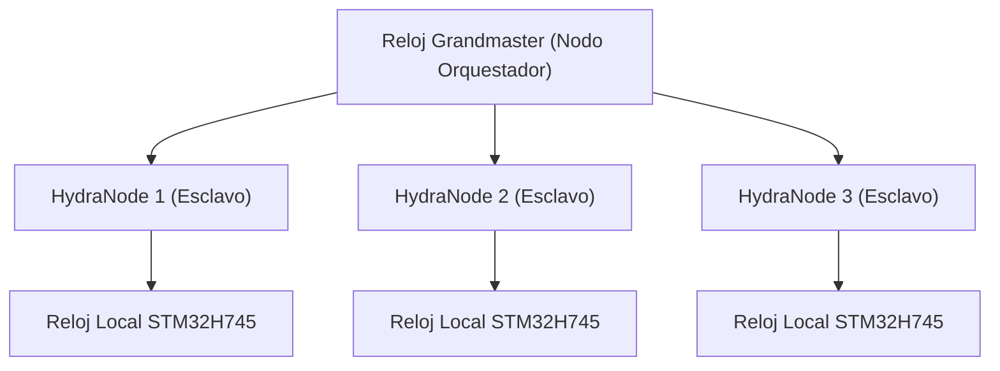

<p align="center">
  
</p>

# ⏱️ HYDRA-UMC-SWARM-SYNC

<p align="center"><a href="README.md">🇺🇸 English</a> | 🇪🇸 <b>Español</b> | <a href="README_fra.md">🇫🇷 Français</a> | <a href="README_ita.md">🇮🇹 Italiano</a> | <a href="README_deu.md">🇩🇪 Deutsch</a> | <a href="README_zho.md">🇨🇳 简体中文</a> | <a href="README_jpn.md">🇯🇵 日本語</a></p>

### 📡 Protocolo de Tiempo de Precisión (PTP) y Sincronización Multi-Nodo

<p align="left">
  
  
  
</p>

---

## 1. 🛠️ VISIÓN GENERAL TÉCNICA

**HYDRA-UMC-SWARM-SYNC** es el latido de la fábrica distribuida. Implementa una versión especializada de PTP (Precision Time Protocol / IEEE 1588) para asegurar que cada controlador en la red comparta un reloj global perfectamente sincronizado.

Esta sincronización es crítica para el movimiento coordinado multi-robot, donde múltiples brazos deben comenzar y finalizar trayectorias en el mismo microsegundo exacto para evitar colisiones o realizar tareas de ensamblaje conjunto.

### Características Clave:
* ⏱️ **Sincronización Ultra-Precisa:** Logra un jitter inferior a 100ns a través de la red local.
* 🔄 **Inicio/Parada Sincronizados:** Asegura la ejecución atómica de comandos de trayectoria multi-robot.
* 📡 **Marcado de Tiempo por Hardware:** Aprovecha los temporizadores de hardware de CM5 y STM32 para la máxima precisión.
* 🛡️ **Resiliente a la Red:** Maneja el jitter de paquetes y los retrasos temporales de la red.
* 🔍 **Visibilidad Real de Conflictos y Prueba de Convergencia a Escala de Enjambre (v0):** `merge_report()` devuelve un registro real, por clave, de cada conflicto de escritura genuino resuelto durante la reconciliación - qué célula le ganó a cuál otra, y con qué timestamp. Un test simulado de 4 células demuestra que la convergencia se mantiene a través de múltiples rondas de partición y reconexión parcial, no solo un único merge entre dos células.

---

## 2. 🔄 JERARQUÍA DE SINCRONIZACIÓN



---

## 3. 🧱 ARQUITECTURA Y DECISIONES DE DISEÑO

* **Por qué sincronización basada en CRDT, no una única fuente de verdad.** Varias células HYDRA-UMC pueden operar de forma semi-autónoma y reconectarse después - una estrategia de fusión CRDT converge sin un árbitro central que decida qué estado 'gana', algo que un enfoque ingenuo de 'gana la última escritura' no puede garantizar ante una partición de red real.
* **Por qué es hermana, no un submódulo, de HYDRA-UMC-ORCHESTRATOR.** La reconciliación de estado es una preocupación continua de fondo, independiente de cualquier decisión de orquestación puntual - mantenerla como proceso separado significa que un reinicio del orquestador no interrumpe una fusión en curso.
* **Por qué la fusión CRDT ya es real hoy pero la sincronización PTP por hardware no.** `src/crdt.rs` implementa un LWW-Element-Map (mapa de última escritura gana) real, un CRDT basado en estado cuya `merge` es demostrablemente conmutativa, asociativa e idempotente - no solo "parece converger" en un ejemplo, ver los tests de propiedades de ese propio módulo. `src/lamport.rs` lo respalda con un reloj lógico de Lamport real. PTP (IEEE 1588, marcado de tiempo por hardware sub-100ns) es un problema fundamentalmente distinto y dependiente de hardware - necesita NICs/temporizadores de hardware reales para tener sentido, y sigue diferido hasta que haya hardware real contra el que validarlo. Un reloj lógico es lo que la fusión CRDT realmente necesita para resolver conflictos de forma determinista, y esa parte es real y está probada hoy.
* **Cómo encaja en el resto del ecosistema.** Un servicio hermano bajo HYDRA-UMC-ORCHESTRATOR, junto a HYDRA-UMC-PATH-PLANNER-3D, HYDRA-UMC-JOB-DISPATCHER y HYDRA-UMC-NODE-HEALING - mantiene consistente la visión que cada célula tiene del estado del enjambre, sin importar cuál ostente el rol de orquestador en cada momento.
* **Por qué `merge_report()` es un método nuevo en vez de cambiar lo que devuelve `merge()`.** `merge()` sigue siendo una caja negra pura, barata y obviamente correcta - esa simplicidad es lo que la hace fácil de confiar. `merge_report()` añade encima visibilidad real de conflictos para un llamador (un operador, una herramienta de depuración) que específicamente quiere saber qué sobreescribió una reconciliación, sin obligar a cada llamador del camino crítico `merge()` a pagar por esa contabilidad o manejarla.
* **Por qué los reportes de conflicto muestran orden de timestamp, no "happened-before" causal.** Un reloj de Lamport garantiza que un happens-before causal real implica un timestamp anterior - pero lo contrario no es cierto: un timestamp anterior NO prueba que dos eventos estuvieran causalmente relacionados en vez de simplemente ser concurrentes. `MergeConflict` es deliberadamente honesto al reportar solo lo que un reloj de Lamport puede realmente probar (un orden total consistente), no una afirmación de causalidad que necesitaría un reloj vectorial.

---

## 📂 ESTRUCTURA DE DIRECTORIOS

```text
HYDRA-UMC-SWARM-SYNC/
├── src/
│   ├── main.rs       # Punto de entrada CLI: carga un escenario, reconcilia, imprime JSON
│   ├── lamport.rs    # LamportClock - el reloj lógico detrás del orden del CRDT
│   ├── crdt.rs       # LwwMap - el CRDT real: set/get/merge/snapshot
│   ├── reconcile.rs  # Reconciliación real, separada para que server.rs también pueda usarla
│   └── server.rs     # Superficie JSON/HTTP plana (tiny_http) - POST /reconcile por red
├── scenarios/        # Escenarios JSON de ejemplo (ver BUILD Y EJECUCIÓN abajo)
├── docs/
│   └── CLI_REFERENCE.md # Referencia de comandos
├── images/
│   └── HYDRA_UMC_BANNER.svg # Banner del README
├── systemd/
│   └── hydra-umc-swarm-sync.service # Unidad systemd de la API local de reconciliación en la CM5
├── tools/
│   ├── build_test.py # Comprobación de compilación sin versionado
│   └── ci_validate.py # Validación de manifiesto/CHANGELOG/docs usada por CI
├── build/            # Binarios compilados (salida de build.sh/build.bat)
├── Cargo.toml        # Manifiesto del paquete Rust (nombre, versión, deps)
├── bump_version.py   # Bump de versión nativa tipo cuentakilómetros
├── bump_manifest_version.py # Sincroniza la versión de hydra-umc.project.json con la nativa (--sync)
├── build.sh/.bat     # Sube la versión y ejecuta `cargo build --release`
├── run.sh/.bat       # Ejecuta el binario compilado
└── README.md
```

Podado de la plantilla original: `hardware/`, `firmware/` y `os/` — es un
servicio de software puro (binario Rust) sin hardware ni firmware propios
y sin imagen de sistema operativo que mantener.

---

## 🔧 BUILD Y EJECUCIÓN

Una fusión CRDT real y probada, no solo un esqueleto que compila:
reconcilia un escenario JSON multi-célula e imprime el estado convergido.

```bash
# Windows
build.bat
run.bat scenarios/example.json

# Linux / macOS
./build.sh
./run.sh scenarios/example.json
```

`build.sh`/`build.bat` suben la versión en `Cargo.toml` (regla cuentakilómetros
del ecosistema, ver `bump_version.py`) y luego ejecutan
`cargo build --release`. `run.sh`/`run.bat` ejecutan directamente el binario
resultante, reenviando cualquier argumento (la ruta del escenario).

Un escenario es un archivo JSON con un array `cells` - cada célula tiene
un `id` (por legibilidad), un `writer` (ID de escritor), y una lista de
`writes` (`{key, value, time}`, siendo `time` una marca de tiempo Lamport
explícita, reproducida en vez de generada en vivo - el mismo patrón de
"entrada explícita y determinista" que usa el `seed` de
HYDRA-UMC-PATH-PLANNER-3D). Los writes de cada célula se pliegan en su
propio mapa, y luego el mapa de cada célula se fusiona dos veces - una de
izquierda a derecha (vía `merge_report()`, así que cada conflicto real en
el camino queda registrado), otra de derecha a izquierda (via `merge()`
normal) - y el resultado imprime `converged: true` solo si ambos órdenes
produjeron el mismo estado final, que es la propiedad real del CRDT de
la que depende este servicio, no solo una suposición.

Al correrlo contra `scenarios/example.json` (donde `cell-a` y `cell-b`
escribieron ambas a `cell-a-node-2`) se ve la resolución real del
conflicto, no solo el resultado final opaco:

```bash
./run.sh scenarios/example.json
```
```json
{
  "cells_merged": 2,
  "converged": true,
  "merged_state": { "...": "..." },
  "conflicts_resolved": 1,
  "conflicts": [
    { "key": "cell-a-node-2",
      "local_time": 2, "local_writer": 1, "local_value": "ok",
      "remote_time": 3, "remote_writer": 2, "remote_value": "unhealthy",
      "kept_remote": true }
  ],
  "next_local_time": 6
}
```

```bash
cargo test   # el reloj de Lamport, y el CRDT en si - incluyendo
             # comprobaciones directas de que merge es conmutativa,
             # asociativa e idempotente (no solo "parece correcto" en un
             # ejemplo), un test de desempate determinista para
             # escrituras verdaderamente concurrentes, el comportamiento
             # propio de deteccion de conflictos de merge_report(), y una
             # simulacion de 4 celulas que demuestra convergencia a
             # traves de multiples rondas de particion y reconexion
             # parcial - 22 tests en total
```

La misma llamada a `reconcile()` también es alcanzable a través de una
API JSON/HTTP real (`src/server.rs`, `tiny_http`, bloqueante, sin
runtime asíncrono) en lugar de un fichero de escenario local -
`run.sh serve [--addr ADDR] [--port PORT]` la arranca (por defecto
`127.0.0.1:8112`), exponiendo `POST /reconcile` (el escenario en el
cuerpo de la petición, con la misma forma JSON) y `GET /stats`. Esto es
lo que `systemd/hydra-umc-swarm-sync.service` ejecuta sin supervisión en
la CM5. El uso completo, los códigos de salida y la referencia completa
de rutas están en [`docs/CLI_REFERENCE.md`](docs/CLI_REFERENCE.md).

---

## 🚀 HOJA DE RUTA
* **Fase 1:** Sincronización determinista de enjambre sobre TSN y reducción de jitter sub-ms.
* **Fase 2:** Planificación de trayectorias 3D con evitación dinámica de obstáculos en celdas multi-robot.
* **Fase 3:** Optimización del despacho de trabajos multi-robot utilizando disponibilidad de recursos en tiempo real.
* **Fase 4:** Soporte para sincronización PTP inalámbrica sobre Wi-Fi 6 (Modo de Alta Fiabilidad) y validación de precisión sub-100ns.

---

## 🔗 Proyectos Relacionados

Este proyecto es parte del ecosistema de robótica HYDRA-UMC del mismo autor (JuanenRac / Electro Hobby 3D). Vale la pena conocerlo, ya que una petición podría en realidad ser sobre alguno de estos en vez de sobre este repositorio.

**Proyecto Padre**
- **[HYDRA-UMC-ORCHESTRATOR](https://github.com/JuanenRac/HYDRA-UMC-ORCHESTRATOR)** — nodo de integración con un contrato real de informe de salud gRPC/Protobuf y una máquina de estados de misión; el padre del que este repositorio es un servicio de orquestación específico, dentro de su propia capa de coordinación de enjambre.

**Proyectos Hermanos** — los demás servicios de orquestación de la propia capa de coordinación de enjambre de HYDRA-UMC-ORCHESTRATOR
- **[HYDRA-UMC-PATH-PLANNER-3D](https://github.com/JuanenRac/HYDRA-UMC-PATH-PLANNER-3D)** — planificador de rutas 3D real basado en RRT, con validación real de colisión de obstáculos/espacio de trabajo.
- **[HYDRA-UMC-JOB-DISPATCHER](https://github.com/JuanenRac/HYDRA-UMC-JOB-DISPATCHER)** — cola de trabajos real basada en prioridad con deduplicación, sobre una API HTTP real.
- **[HYDRA-UMC-NODE-HEALING](https://github.com/JuanenRac/HYDRA-UMC-NODE-HEALING)** — watchdog de salud de flota real basado en gRPC, con reintento/backoff y detección de discrepancia de identidad.

**También Forma Parte del Ecosistema**

*Hardware y Plataforma Base*
- **[HYDRA-UMC](https://github.com/JuanenRac/HYDRA-UMC)** — la placa madre física del brazo robótico: host CM5 + coprocesador STM32H745 de doble núcleo, coordinando hasta 8 brazos herramienta por CAN-OTA/SPI-OTA.
- **[HYDRA-UMC-OS](https://github.com/JuanenRac/HYDRA-UMC-OS)** — capa de producto reproducible sobre Raspberry Pi OS para el CM5: agente de solo lectura, config/perfiles validados, aprovisionamiento WiFi de primer contacto.
- **[HYDRA-UMC-SDK](https://github.com/JuanenRac/HYDRA-UMC-SDK)** — el contrato JSON-Schema compartido y la barrera de seguridad contra la que cada bridge valida sus comandos.

*Backend Central y Clientes*
- **[HYDRA-UMC-SERVER](https://github.com/JuanenRac/HYDRA-UMC-SERVER)** — el backend headless real (REST/WebSocket) con el que habla de verdad cada cliente de control.
- **[HYDRA-UMC-STUDIO](https://github.com/JuanenRac/HYDRA-UMC-STUDIO)** — panel de control web con visualización 3D multi-robot en tiempo real.
- **[HYDRA-UMC-SUITE](https://github.com/JuanenRac/HYDRA-UMC-SUITE)** — centro de mando de enjambre de escritorio (PySide6) para varios servidores a la vez, empaquetado como ejecutable independiente.
- **[HYDRA-UMC-ANDROID-CONTROL](https://github.com/JuanenRac/HYDRA-UMC-ANDROID-CONTROL)** — app nativa de control para Android con inicio de sesión biométrico y un compañero Wear OS emparejado.
- **[HYDRA-UMC-IOS-CONTROL](https://github.com/JuanenRac/HYDRA-UMC-IOS-CONTROL)** — app de control para iOS/iPadOS (Flutter) con sincronización en tiempo real por WebSocket.
- **[HYDRA-UMC-DSI](https://github.com/JuanenRac/HYDRA-UMC-DSI)** — interfaz táctil nativa para la pantalla táctil DSI de 7" a bordo, embebida en el propio CM5.
- **[HYDRA-UMC-EDITOR-URDF](https://github.com/JuanenRac/HYDRA-UMC-EDITOR-URDF)** — creador/editor gráfico de URDF de escritorio que envía los modelos terminados al propio catálogo de STUDIO.
- **[HYDRA-UMC-BRIDGE-AMR](https://github.com/JuanenRac/HYDRA-UMC-BRIDGE-AMR)** — barrera de coordinación para flotas AGV/AMR mediante un publicador MQTT VDA 5050 real.
- **[HYDRA-UMC-BRIDGE-CNC](https://github.com/JuanenRac/HYDRA-UMC-BRIDGE-CNC)** — coordinador de alto nivel para celdas CNC con acceso real a estado/bytes de control GRBL.
- **[HYDRA-UMC-BRIDGE-DROIDS](https://github.com/JuanenRac/HYDRA-UMC-BRIDGE-DROIDS)** — barrera de coordinación para droides con patas/humanoides, con un emisor de comandos real para Boston Dynamics Spot.
- **[HYDRA-UMC-BRIDGE-LASER](https://github.com/JuanenRac/HYDRA-UMC-BRIDGE-LASER)** — coordinador de seguridad para celdas láser que lee 3 salvaguardas GPIO reales de llave/carcasa/enclavamiento.
- **[HYDRA-UMC-BRIDGE-OPENPNP](https://github.com/JuanenRac/HYDRA-UMC-BRIDGE-OPENPNP)** — coordinador de alto nivel seguro para el flujo de placas de pick-and-place OpenPnP.
- **[HYDRA-UMC-BRIDGE-PRINTER3D](https://github.com/JuanenRac/HYDRA-UMC-BRIDGE-PRINTER3D)** — barrera de coordinación segura para impresoras 3D Moonraker/Klipper, con comandos de trabajo reales y controlados.
- **[HYDRA-UMC-BRIDGE-ROS2](https://github.com/JuanenRac/HYDRA-UMC-BRIDGE-ROS2)** — coordinador de seguridad con un transporte ROS 2 rclpy real, importado de forma perezosa.
- **[HYDRA-UMC-BRIDGE-UAV](https://github.com/JuanenRac/HYDRA-UMC-BRIDGE-UAV)** — barrera de coordinación para UAV equipados con cámara, con un emisor de comandos MAVLink real.

*Plataforma de Herramientas URTC*
- **[URTC](https://github.com/JuanenRac/URTC)** — firmware para la placa física del Universal Robot Tool Controller, más de 25 perfiles de herramienta por bus CAN.
- **[URTC-FLASHER](https://github.com/JuanenRac/URTC-FLASHER)** — herramienta de escritorio con GUI para flashear placas URTC, CAN-OTA más SWD/JTAG de chip completo.
- **[URTC-TESTER](https://github.com/JuanenRac/URTC-TESTER)** — herramienta de escritorio de diagnóstico CAN-bus en vivo para placas URTC, un panel por perfil de herramienta.
- **[URTC-WEB-STUDIO](https://github.com/JuanenRac/URTC-WEB-STUDIO)** — alternativa basada en navegador a URTC-TESTER mediante la Web Serial API, sin instalación local.

*Nodo IA de Visión (Hailo-8)*
- **[HYDRA-UMC-VISION-NODE](https://github.com/JuanenRac/HYDRA-UMC-VISION-NODE)** — nodo de integración para el pipeline de visión Hailo-8, con una comprobación real de disponibilidad de hardware por etapa.
- **[HYDRA-UMC-DETECTION-HEF](https://github.com/JuanenRac/HYDRA-UMC-DETECTION-HEF)** — registro real de modelos compilados con verificación de carga segura por arquitectura Hailo/checksum.
- **[HYDRA-UMC-VISION-STREAMER](https://github.com/JuanenRac/HYDRA-UMC-VISION-STREAMER)** — generador real de pipeline GStreamer + config MediaMTX, con una frontera de integración HailoRT real.
- **[HYDRA-UMC-VISUAL-SERVOING-API](https://github.com/JuanenRac/HYDRA-UMC-VISUAL-SERVOING-API)** — ley de corrección real de Position-Based Visual Servoing, con puerta de seguridad según el estado de zona previo.
- **[HYDRA-UMC-SAFETY-ZONES](https://github.com/JuanenRac/HYDRA-UMC-SAFETY-ZONES)** — comprobación real de invasión de zona y solicitud de E-STOP, con exigencia de vigencia de calibración.

*Nodo IA Cognitivo (Hailo-10)*
- **[HYDRA-UMC-COGNITIVE-NODE](https://github.com/JuanenRac/HYDRA-UMC-COGNITIVE-NODE)** — nodo de integración para el pipeline cognitivo Hailo-10 (orquestación de LLM/VLA/voz).
- **[HYDRA-UMC-VLA-ENGINE](https://github.com/JuanenRac/HYDRA-UMC-VLA-ENGINE)** — codificación/decodificación real de tokens de acción y generación de trayectoria para un modelo Vision-Language-Action.
- **[HYDRA-UMC-VOICE-UI](https://github.com/JuanenRac/HYDRA-UMC-VOICE-UI)** — front-end de voz real (VAD + analizador de intención) con un relé a Watch acotado y con confirmación.
- **[HYDRA-UMC-SEMANTIC-PLANNER](https://github.com/JuanenRac/HYDRA-UMC-SEMANTIC-PLANNER)** — descomposición real de tareas basada en reglas y recuperación semántica de errores sobre códigos de error del MCU.
- **[HYDRA-UMC-DOCS-QA](https://github.com/JuanenRac/HYDRA-UMC-DOCS-QA)** — búsqueda real de documentos TF-IDF (solo librería estándar) sobre los propios documentos Markdown de este ecosistema.

*Gemelo Digital y Simulación*
- **[HYDRA-UMC-TWIN](https://github.com/JuanenRac/HYDRA-UMC-TWIN)** — nodo de integración para el motor de gemelo digital, con un contrato real de sincronización por compatibilidad de versión.
- **[HYDRA-UMC-HIL-BRIDGE](https://github.com/JuanenRac/HYDRA-UMC-HIL-BRIDGE)** — enclavamiento de seguridad real hardware-in-the-loop que enruta comandos entre simulación y hardware real.
- **[HYDRA-UMC-PHYSICS-REPLICA](https://github.com/JuanenRac/HYDRA-UMC-PHYSICS-REPLICA)** — cinemática directa real y validación de límites articulares sobre un subconjunto real de URDF.
- **[HYDRA-UMC-SYNTHETIC-DATA-GEN](https://github.com/JuanenRac/HYDRA-UMC-SYNTHETIC-DATA-GEN)** — generador real de escenas 2D procedurales con exportación de anotaciones YOLO/COCO.

*Datos y Analítica*
- **[HYDRA-UMC-DATALAKE](https://github.com/JuanenRac/HYDRA-UMC-DATALAKE)** — almacén de series temporales real respaldado por sqlite3, con una API HTTP real de ingesta/consulta.
- **[HYDRA-UMC-ANOMALY-DETECTOR](https://github.com/JuanenRac/HYDRA-UMC-ANOMALY-DETECTOR)** — detector de anomalías real basado en FFT + línea base estadística, con monitorización de deriva.
- **[HYDRA-UMC-PRODUCTION-REPORTS](https://github.com/JuanenRac/HYDRA-UMC-PRODUCTION-REPORTS)** — cálculo real de OEE/disponibilidad sobre el histórico de DATALAKE, con exportación CSV reproducible.
- **[HYDRA-UMC-TELEMETRY-COLLECTOR](https://github.com/JuanenRac/HYDRA-UMC-TELEMETRY-COLLECTOR)** — pipeline real de ingesta CAN/WebSocket hacia DATALAKE, con deduplicación por secuencia.

*Pasarela Industrial*
- **[HYDRA-UMC-GATEWAY-INDUSTRIAL](https://github.com/JuanenRac/HYDRA-UMC-GATEWAY-INDUSTRIAL)** — nodo de integración que retransmite a protocolos industriales, con una capa real de lista blanca de comandos/contrapresión.
- **[HYDRA-UMC-OPCUA-SERVER](https://github.com/JuanenRac/HYDRA-UMC-OPCUA-SERVER)** — espacio de direcciones OPC-UA real, verificado con una sesión de cliente real del protocolo binario.
- **[HYDRA-UMC-MQTT-BROKER](https://github.com/JuanenRac/HYDRA-UMC-MQTT-BROKER)** — broker MQTT real con autenticación por cliente opcional y ACL de tópicos.
- **[HYDRA-UMC-MTCONNECT-ADAPTER](https://github.com/JuanenRac/HYDRA-UMC-MTCONNECT-ADAPTER)** — endpoints XML reales `/probe` y `/current` de MTConnect, con salida en modo degradado.

*Herramientas Complementarias y Operaciones del Ecosistema*
- **[HYDRA-UMC-DASHBOARD-AI](https://github.com/JuanenRac/HYDRA-UMC-DASHBOARD-AI)** — paneles de Resúmenes Inteligentes y Resaltado de Anomalías sobre DATALAKE/ANOMALY-DETECTOR, con un respaldo estadístico honesto.
- **[HYDRA-UMC-TOOL-CLI](https://github.com/JuanenRac/HYDRA-UMC-TOOL-CLI)** — CLI de flota con un contrato real y estable de códigos de salida, cliente real y en vivo de la propia API de HYDRA-UMC-SERVER.
- **[HYDRA-UMC-WATCH](https://github.com/JuanenRac/HYDRA-UMC-WATCH)** — app compañera de WearOS con alertas hápticas reales y un relé de voz al teléfono emparejado.
- **[URTC-SMART-RACK](https://github.com/JuanenRac/URTC-SMART-RACK)** — firmware para un rack de montaje de placas con decodificación real de ID de herramienta y lógica de precalentamiento Smart Idle.
- **[URTC-VISION-TOOL](https://github.com/JuanenRac/URTC-VISION-TOOL)** — firmware más un compañero de visión real en Python para un cabezal de inspección térmica/RGB.
- **[HYDRA-UMC-UPDATER](https://github.com/JuanenRac/HYDRA-UMC-UPDATER)** — herramienta administrativa de escritorio que descubre, clona y actualiza cada repositorio de este ecosistema.
- **[HYDRA-UMC-OS-REBUILDER](https://github.com/JuanenRac/HYDRA-UMC-OS-REBUILDER)** — herramienta de escritorio Windows/Linux que construye una imagen de la CM5 lista para grabar, precargada con las versiones más actuales del ecosistema, con configuración de primer arranque de Wi-Fi/usuario/SSH al estilo de Raspberry Pi Imager.


---

## 📚 Documentación y Comunidad

- **[CONTRIBUTING.md](CONTRIBUTING.md)** — stack tecnológico y pautas de codificación para un pull request.
- **[CODE_OF_CONDUCT.md](CODE_OF_CONDUCT.md)** — los estándares de comportamiento esperados en esta comunidad.
- **[SECURITY.md](SECURITY.md)** — cómo reportar una vulnerabilidad, y las áreas reales de enfoque en seguridad de este proyecto.
- **[SUPPORT.md](SUPPORT.md)** — dónde hacer preguntas y reportar errores.
- **[LICENSE.md](LICENSE.md)** — la licencia propia de este proyecto.

## 👤 AUTOR
**JuanenRac** (Electro Hobby 3D)
📧 electrohobby3d@gmail.com
📺 [youtube.com/@electrohobby3d](https://youtube.com/@electrohobby3d)

## 📜 LICENCIA
GPL-3.0 - Ver archivo LICENSE para más detalles.
