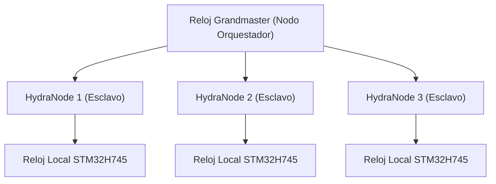

<p align="center">
  
</p>

# ⏱️ HYDRA-UMC-SWARM-SYNC

<p align="center"><a href="README.md">🇺🇸 English</a> | 🇪🇸 <b>Español</b> | <a href="README_fra.md">🇫🇷 Français</a> | <a href="README_ita.md">🇮🇹 Italiano</a> | <a href="README_deu.md">🇩🇪 Deutsch</a> | <a href="README_zho.md">🇨🇳 简体中文</a> | <a href="README_jpn.md">🇯🇵 日本語</a></p>

### 📡 Protocolo de Tiempo de Precisión (PTP) y Sincronización Multi-Nodo

<p align="left">
  
  
  
</p>

---

## 1. 🛠️ VISIÓN GENERAL TÉCNICA

**HYDRA-UMC-SWARM-SYNC** es el latido de la fábrica distribuida. Implementa una versión especializada de PTP (Precision Time Protocol / IEEE 1588) para asegurar que cada controlador en la red comparta un reloj global perfectamente sincronizado.

Esta sincronización es crítica para el movimiento coordinado multi-robot, donde múltiples brazos deben comenzar y finalizar trayectorias en el mismo microsegundo exacto para evitar colisiones o realizar tareas de ensamblaje conjunto.

### Características Clave:
* ⏱️ **Sincronización Ultra-Precisa:** Logra un jitter inferior a 100ns a través de la red local.
* 🔄 **Inicio/Parada Sincronizados:** Asegura la ejecución atómica de comandos de trayectoria multi-robot.
* 📡 **Marcado de Tiempo por Hardware:** Aprovecha los temporizadores de hardware de CM5 y STM32 para la máxima precisión.
* 🛡️ **Resiliente a la Red:** Maneja el jitter de paquetes y los retrasos temporales de la red.
* 🔍 **Visibilidad Real de Conflictos y Prueba de Convergencia a Escala de Enjambre (v0):** `merge_report()` devuelve un registro real, por clave, de cada conflicto de escritura genuino resuelto durante la reconciliación - qué célula le ganó a cuál otra, y con qué timestamp. Un test simulado de 4 células demuestra que la convergencia se mantiene a través de múltiples rondas de partición y reconexión parcial, no solo un único merge entre dos células.

---

## 2. 🔄 JERARQUÍA DE SINCRONIZACIÓN



---

## 3. 🧱 ARQUITECTURA Y DECISIONES DE DISEÑO

* **Por qué sincronización basada en CRDT, no una única fuente de verdad.** Varias células HYDRA-UMC pueden operar de forma semi-autónoma y reconectarse después - una estrategia de fusión CRDT converge sin un árbitro central que decida qué estado 'gana', algo que un enfoque ingenuo de 'gana la última escritura' no puede garantizar ante una partición de red real.
* **Por qué es hermana, no un submódulo, de HYDRA-UMC-ORCHESTRATOR.** La reconciliación de estado es una preocupación continua de fondo, independiente de cualquier decisión de orquestación puntual - mantenerla como proceso separado significa que un reinicio del orquestador no interrumpe una fusión en curso.
* **Por qué la fusión CRDT ya es real hoy pero la sincronización PTP por hardware no.** `src/crdt.rs` implementa un LWW-Element-Map (mapa de última escritura gana) real, un CRDT basado en estado cuya `merge` es demostrablemente conmutativa, asociativa e idempotente - no solo "parece converger" en un ejemplo, ver los tests de propiedades de ese propio módulo. `src/lamport.rs` lo respalda con un reloj lógico de Lamport real. PTP (IEEE 1588, marcado de tiempo por hardware sub-100ns) es un problema fundamentalmente distinto y dependiente de hardware - necesita NICs/temporizadores de hardware reales para tener sentido, y sigue diferido hasta que haya hardware real contra el que validarlo. Un reloj lógico es lo que la fusión CRDT realmente necesita para resolver conflictos de forma determinista, y esa parte es real y está probada hoy.
* **Cómo encaja en el resto del ecosistema.** Un servicio hermano bajo HYDRA-UMC-ORCHESTRATOR, junto a HYDRA-UMC-PATH-PLANNER-3D, HYDRA-UMC-JOB-DISPATCHER y HYDRA-UMC-NODE-HEALING - mantiene consistente la visión que cada célula tiene del estado del enjambre, sin importar cuál ostente el rol de orquestador en cada momento.
* **Por qué `merge_report()` es un método nuevo en vez de cambiar lo que devuelve `merge()`.** `merge()` sigue siendo una caja negra pura, barata y obviamente correcta - esa simplicidad es lo que la hace fácil de confiar. `merge_report()` añade encima visibilidad real de conflictos para un llamador (un operador, una herramienta de depuración) que específicamente quiere saber qué sobreescribió una reconciliación, sin obligar a cada llamador del camino crítico `merge()` a pagar por esa contabilidad o manejarla.
* **Por qué los reportes de conflicto muestran orden de timestamp, no "happened-before" causal.** Un reloj de Lamport garantiza que un happens-before causal real implica un timestamp anterior - pero lo contrario no es cierto: un timestamp anterior NO prueba que dos eventos estuvieran causalmente relacionados en vez de simplemente ser concurrentes. `MergeConflict` es deliberadamente honesto al reportar solo lo que un reloj de Lamport puede realmente probar (un orden total consistente), no una afirmación de causalidad que necesitaría un reloj vectorial.

---

## 📂 ESTRUCTURA DE DIRECTORIOS

```text
HYDRA-UMC-SWARM-SYNC/
├── src/
│   ├── main.rs       # Punto de entrada CLI: carga un escenario, reconcilia, imprime JSON
│   ├── lamport.rs    # LamportClock - el reloj lógico detrás del orden del CRDT
│   ├── crdt.rs       # LwwMap - el CRDT real: set/get/merge/snapshot
│   ├── reconcile.rs  # Reconciliación real, separada para que server.rs también pueda usarla
│   └── server.rs     # Superficie JSON/HTTP plana (tiny_http) - POST /reconcile por red
├── scenarios/        # Escenarios JSON de ejemplo (ver BUILD Y EJECUCIÓN abajo)
├── docs/
│   └── CLI_REFERENCE.md # Referencia de comandos
├── images/
│   └── HYDRA_UMC_BANNER.svg # Banner del README
├── systemd/
│   └── hydra-umc-swarm-sync.service # Unidad systemd de la API local de reconciliación en la CM5
├── tools/
│   ├── build_test.py # Comprobación de compilación sin versionado
│   └── ci_validate.py # Validación de manifiesto/CHANGELOG/docs usada por CI
├── build/            # Binarios compilados (salida de build.sh/build.bat)
├── Cargo.toml        # Manifiesto del paquete Rust (nombre, versión, deps)
├── bump_version.py   # Bump de versión nativa tipo cuentakilómetros
├── bump_manifest_version.py # Sincroniza la versión de hydra-umc.project.json con la nativa (--sync)
├── build.sh/.bat     # Sube la versión y ejecuta `cargo build --release`
├── run.sh/.bat       # Ejecuta el binario compilado
└── README.md
```

Podado de la plantilla original: `hardware/`, `firmware/` y `os/` — es un
servicio de software puro (binario Rust) sin hardware ni firmware propios
y sin imagen de sistema operativo que mantener.

---

## 🔧 BUILD Y EJECUCIÓN

Una fusión CRDT real y probada, no solo un esqueleto que compila:
reconcilia un escenario JSON multi-célula e imprime el estado convergido.

```bash
# Windows
build.bat
run.bat scenarios/example.json

# Linux / macOS
./build.sh
./run.sh scenarios/example.json
```

`build.sh`/`build.bat` suben la versión en `Cargo.toml` (regla cuentakilómetros
del ecosistema, ver `bump_version.py`) y luego ejecutan
`cargo build --release`. `run.sh`/`run.bat` ejecutan directamente el binario
resultante, reenviando cualquier argumento (la ruta del escenario).

Un escenario es un archivo JSON con un array `cells` - cada célula tiene
un `id` (por legibilidad), un `writer` (ID de escritor), y una lista de
`writes` (`{key, value, time}`, siendo `time` una marca de tiempo Lamport
explícita, reproducida en vez de generada en vivo - el mismo patrón de
"entrada explícita y determinista" que usa el `seed` de
HYDRA-UMC-PATH-PLANNER-3D). Los writes de cada célula se pliegan en su
propio mapa, y luego el mapa de cada célula se fusiona dos veces - una de
izquierda a derecha (vía `merge_report()`, así que cada conflicto real en
el camino queda registrado), otra de derecha a izquierda (via `merge()`
normal) - y el resultado imprime `converged: true` solo si ambos órdenes
produjeron el mismo estado final, que es la propiedad real del CRDT de
la que depende este servicio, no solo una suposición.

Al correrlo contra `scenarios/example.json` (donde `cell-a` y `cell-b`
escribieron ambas a `cell-a-node-2`) se ve la resolución real del
conflicto, no solo el resultado final opaco:

```bash
./run.sh scenarios/example.json
```
```json
{
  "cells_merged": 2,
  "converged": true,
  "conflicts_resolved": 1,
  "conflicts": [
    { "key": "cell-a-node-2",
      "local_time": 2, "local_writer": 1, "local_value": "ok",
      "remote_time": 3, "remote_writer": 2, "remote_value": "unhealthy",
      "kept_remote": true }
  ],
  "merged_state": { "...": "..." }
}
```

```bash
cargo test   # el reloj de Lamport, y el CRDT en si - incluyendo
             # comprobaciones directas de que merge es conmutativa,
             # asociativa e idempotente (no solo "parece correcto" en un
             # ejemplo), un test de desempate determinista para
             # escrituras verdaderamente concurrentes, el comportamiento
             # propio de deteccion de conflictos de merge_report(), y una
             # simulacion de 4 celulas que demuestra convergencia a
             # traves de multiples rondas de particion y reconexion
             # parcial - 22 tests en total
```

---

## 🚀 HOJA DE RUTA
* **Fase 1:** Sincronización determinista de enjambre sobre TSN y reducción de jitter sub-ms.
* **Fase 2:** Planificación de trayectorias 3D con evitación dinámica de obstáculos en celdas multi-robot.
* **Fase 3:** Optimización del despacho de trabajos multi-robot utilizando disponibilidad de recursos en tiempo real.
* **Fase 4:** Soporte para sincronización PTP inalámbrica sobre Wi-Fi 6 (Modo de Alta Fiabilidad) y validación de precisión sub-100ns.

---

## 🔗 Proyectos Relacionados

Este proyecto forma parte de un ecosistema de robótica más amplio del mismo autor (JuanenRac / Electro Hobby 3D), que abarca firmware, software de control, nodos de IA y herramientas de flota. Vale la pena conocerlo, ya que una petición podría en realidad ser sobre uno de estos proyectos en vez de sobre este repositorio.

### Familia

**Padre:** **[HYDRA-UMC-ORCHESTRATOR](https://github.com/JuanenRac/HYDRA-UMC-ORCHESTRATOR)** — el padre de integración cuya coherencia mantiene esta capa de sincronización.

**Hermanos:**
- **[HYDRA-UMC-PATH-PLANNER-3D](https://github.com/JuanenRac/HYDRA-UMC-PATH-PLANNER-3D)** — servicio de orquestación hermano, mismo padre.
- **[HYDRA-UMC-JOB-DISPATCHER](https://github.com/JuanenRac/HYDRA-UMC-JOB-DISPATCHER)** — servicio de orquestación hermano, mismo padre.
- **[HYDRA-UMC-NODE-HEALING](https://github.com/JuanenRac/HYDRA-UMC-NODE-HEALING)** — servicio de orquestación hermano, mismo padre.

### Relación Directa (fuera de la familia)

Este proyecto no tiene relación directa fuera de la familia Orquestación y Enjambre (según el mapa de relaciones del ecosistema) - ver "Resto del Ecosistema" abajo para todo lo demás.

### Resto del Ecosistema

**Plataforma HYDRA-UMC** — la célula de micro-fábrica multi-robot
- **[HYDRA-UMC](https://github.com/JuanenRac/HYDRA-UMC)** — la placa base CM5 + STM32H745 que orquesta hasta 8 brazos robóticos.
- **[HYDRA-UMC-SERVER](https://github.com/JuanenRac/HYDRA-UMC-SERVER)** — el backend Express/WebSocket con el que habla cada cliente de control.
- **[HYDRA-UMC-STUDIO](https://github.com/JuanenRac/HYDRA-UMC-STUDIO)** — panel de control web, visualización 3D multi-robot.
- **[HYDRA-UMC-ANDROID-CONTROL](https://github.com/JuanenRac/HYDRA-UMC-ANDROID-CONTROL)** — app de control Android por Wi-Fi/Bluetooth.
- **[HYDRA-UMC-IOS-CONTROL](https://github.com/JuanenRac/HYDRA-UMC-IOS-CONTROL)** — app de control iOS/iPadOS construida en Flutter.
- **[HYDRA-UMC-SUITE](https://github.com/JuanenRac/HYDRA-UMC-SUITE)** — centro de mando de enjambre de escritorio (Python/PySide6).
- **[HYDRA-UMC-EDITOR-URDF](https://github.com/JuanenRac/HYDRA-UMC-EDITOR-URDF)** — editor de modelos URDF de escritorio para el catálogo de robots.
- **[HYDRA-UMC-DSI](https://github.com/JuanenRac/HYDRA-UMC-DSI)** — interfaz táctil nativa para la pantalla DSI integrada.

**Plataforma URTC** — el controlador de cabezal de herramienta que lleva cada brazo HYDRA-UMC
- **[URTC](https://github.com/JuanenRac/URTC)** — controlador de cabezal de herramienta CAN, 25 perfiles de herramienta.
- **[URTC-FLASHER](https://github.com/JuanenRac/URTC-FLASHER)** — herramienta de escritorio de flasheo CAN-OTA + SWD/JTAG.
- **[URTC-TESTER](https://github.com/JuanenRac/URTC-TESTER)** — herramienta de escritorio de diagnóstico CAN en vivo.
- **[URTC-WEB-STUDIO](https://github.com/JuanenRac/URTC-WEB-STUDIO)** — alternativa basada en navegador vía Web Serial API.

**🎥 Nodo de IA de Visión (Hailo-8)**
- [HYDRA-UMC-VISION-NODE](https://github.com/JuanenRac/HYDRA-UMC-VISION-NODE)
- [HYDRA-UMC-VISION-STREAMER](https://github.com/JuanenRac/HYDRA-UMC-VISION-STREAMER)
- [HYDRA-UMC-DETECTION-HEF](https://github.com/JuanenRac/HYDRA-UMC-DETECTION-HEF)
- [HYDRA-UMC-SAFETY-ZONES](https://github.com/JuanenRac/HYDRA-UMC-SAFETY-ZONES)
- [HYDRA-UMC-VISUAL-SERVOING-API](https://github.com/JuanenRac/HYDRA-UMC-VISUAL-SERVOING-API)

**🧠 Nodo de IA Cognitiva (Hailo-10)**
- [HYDRA-UMC-COGNITIVE-NODE](https://github.com/JuanenRac/HYDRA-UMC-COGNITIVE-NODE)
- [HYDRA-UMC-VLA-ENGINE](https://github.com/JuanenRac/HYDRA-UMC-VLA-ENGINE)
- [HYDRA-UMC-VOICE-UI](https://github.com/JuanenRac/HYDRA-UMC-VOICE-UI)
- [HYDRA-UMC-SEMANTIC-PLANNER](https://github.com/JuanenRac/HYDRA-UMC-SEMANTIC-PLANNER)
- [HYDRA-UMC-DOCS-QA](https://github.com/JuanenRac/HYDRA-UMC-DOCS-QA)

**🎮 Gemelo Digital y Simulación**
- [HYDRA-UMC-TWIN](https://github.com/JuanenRac/HYDRA-UMC-TWIN)
- [HYDRA-UMC-PHYSICS-REPLICA](https://github.com/JuanenRac/HYDRA-UMC-PHYSICS-REPLICA)
- [HYDRA-UMC-HIL-BRIDGE](https://github.com/JuanenRac/HYDRA-UMC-HIL-BRIDGE)
- [HYDRA-UMC-SYNTHETIC-DATA-GEN](https://github.com/JuanenRac/HYDRA-UMC-SYNTHETIC-DATA-GEN)

**📊 Datos y Analítica**
- [HYDRA-UMC-DATALAKE](https://github.com/JuanenRac/HYDRA-UMC-DATALAKE)
- [HYDRA-UMC-TELEMETRY-COLLECTOR](https://github.com/JuanenRac/HYDRA-UMC-TELEMETRY-COLLECTOR)
- [HYDRA-UMC-ANOMALY-DETECTOR](https://github.com/JuanenRac/HYDRA-UMC-ANOMALY-DETECTOR)
- [HYDRA-UMC-PRODUCTION-REPORTS](https://github.com/JuanenRac/HYDRA-UMC-PRODUCTION-REPORTS)

**🏭 Pasarela Industrial**
- [HYDRA-UMC-GATEWAY-INDUSTRIAL](https://github.com/JuanenRac/HYDRA-UMC-GATEWAY-INDUSTRIAL)
- [HYDRA-UMC-OPCUA-SERVER](https://github.com/JuanenRac/HYDRA-UMC-OPCUA-SERVER)
- [HYDRA-UMC-MQTT-BROKER](https://github.com/JuanenRac/HYDRA-UMC-MQTT-BROKER)
- [HYDRA-UMC-MTCONNECT-ADAPTER](https://github.com/JuanenRac/HYDRA-UMC-MTCONNECT-ADAPTER)

**🛠️ Herramientas Complementarias**
- [URTC-SMART-RACK](https://github.com/JuanenRac/URTC-SMART-RACK)
- [URTC-VISION-TOOL](https://github.com/JuanenRac/URTC-VISION-TOOL)
- [HYDRA-UMC-WATCH](https://github.com/JuanenRac/HYDRA-UMC-WATCH)
- [HYDRA-UMC-TOOL-CLI](https://github.com/JuanenRac/HYDRA-UMC-TOOL-CLI)
- [HYDRA-UMC-DASHBOARD-AI](https://github.com/JuanenRac/HYDRA-UMC-DASHBOARD-AI)


## 👤 AUTOR
**JuanenRac** (Electro Hobby 3D)
📧 electrohobby3d@gmail.com
📺 [youtube.com/@electrohobby3d](https://youtube.com/@electrohobby3d)

## 📜 LICENCIA
GPL-3.0 - Ver archivo LICENSE para más detalles.
