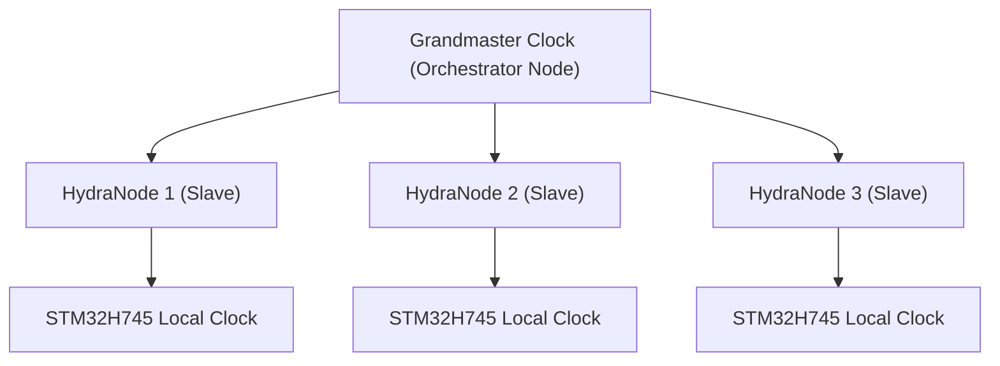

<p align="center">
  
</p>

# ⏱️ HYDRA-UMC-SWARM-SYNC

<p align="center"><a href="README.md">🇺🇸 English</a> | <a href="README_spa.md">🇪🇸 Español</a> | <a href="README_fra.md">🇫🇷 Français</a> | <a href="README_ita.md">🇮🇹 Italiano</a> | <a href="README_deu.md">🇩🇪 Deutsch</a> | 🇨🇳 <b>简体中文</b> | <a href="README_jpn.md">🇯🇵 日本語</a></p>

### 📡 精密时间协议（PTP）与多节点同步

<p align="left">
  
  
  
</p>

---

## 1. 🛠️ 技术概述

**HYDRA-UMC-SWARM-SYNC** 是分布式工厂的心跳。它实现了 PTP（精密时间协议
/ IEEE 1588）的专用版本，以确保网络中的每个控制器都共享一个完全同步的
全局时钟。

这种同步对于多机器人协同运动至关重要，多条机械臂必须在完全相同的微秒
时刻开始和结束轨迹，以避免碰撞或执行联合装配任务。

### 关键特性：
* ⏱️ **超精密同步：** 在本地网络中实现亚 100ns 的抖动。
* 🔄 **同步启停：** 确保多机器人轨迹指令的原子化执行。
* 📡 **硬件时间戳：** 利用 CM5 和 STM32 硬件定时器实现最高精度。
* 🛡️ **网络容错：** 处理数据包抖动和临时网络延迟。
* 🔍 **真实的冲突可见性与集群规模的收敛证明（v0）：** `merge_report()` 会返回一份真实的、按键分类的记录，列出协调过程中解决的每一个真实写入冲突——哪个单元战胜了哪个单元，用的是什么时间戳。一个 4 单元的模拟测试证明了收敛性在多轮分区和部分重连中依然成立，而不仅仅是两个单元之间的一次性合并。

---

## 2. 🔄 同步层级结构



---

## 3. 🧱 架构与设计决策

* **为何采用基于 CRDT 的同步，而非单一真实来源。** 多个 HYDRA-UMC 单元可以半自主运行并在之后重新连接——CRDT 合并策略无需中央仲裁者决定"谁的状态获胜"即可收敛，这是朴素的"最后写入者获胜"方法在真实网络分区场景下无法保证的。
* **为何这是 HYDRA-UMC-ORCHESTRATOR 的兄弟项目，而非子模块。** 状态协调是一项持续的后台关注点，独立于任何单一的编排决策——将其保持为独立进程意味着编排器的重启不会中断正在进行中的合并。
* **为何 CRDT 合并今天已经真实存在，而 PTP 硬件同步尚未实现。** `src/crdt.rs` 实现了一个真实的 LWW-Element-Map（最后写入者获胜映射）——一种基于状态的 CRDT，其 `merge` 可证明是可交换、可结合且幂等的（不仅仅是在某个例子上“看起来收敛”，见该模块自身的属性测试）。`src/lamport.rs` 用一个真实的 Lamport 逻辑时钟为其提供支撑。PTP（IEEE 1588，亚 100ns 硬件时间戳）是一个根本不同、依赖硬件的问题——它需要真实的网卡/硬件计时器才有意义，在有真实硬件可供验证之前将继续推迟。逻辑时钟才是 CRDT 合并真正需要用来确定性地解决冲突的东西，而这部分今天已经是真实且经过测试的。
* **这如何融入生态系统的其余部分。** 作为 HYDRA-UMC-ORCHESTRATOR 下的同级服务，与 HYDRA-UMC-PATH-PLANNER-3D、HYDRA-UMC-JOB-DISPATCHER 和 HYDRA-UMC-NODE-HEALING 并列——无论当前由哪个单元持有编排器角色，都能保持每个单元自身对集群状态的视图一致。
* **为何 `merge_report()` 是一个新方法，而不是修改 `merge()` 的返回值。** `merge()` 依然保持纯粹、廉价、明显正确的黑盒特性——正是这种简单性使它易于被信任。`merge_report()` 在其之上为调用方（一个运维人员、一个调试工具）叠加了真实的冲突可见性，供其明确想知道一次协调究竟覆盖了什么，而不必强迫热路径 `merge()` 的每一个调用方都为这份记账买单或去处理它。
* **为何冲突报告展示的是时间戳顺序，而不是因果上的“先于发生”。** Lamport 时钟保证真正的因果先于关系意味着更早的时间戳——但反过来并不成立：更早的时间戳并不能证明两个事件是因果相关的，而不仅仅是并发的。`MergeConflict` 刻意保持诚实，只报告 Lamport 时钟真正能够证明的东西（一个一致的全序关系），而不是需要向量时钟才能做出的因果性断言。

---

## 📂 目录结构

```text
HYDRA-UMC-SWARM-SYNC/
├── src/
│   ├── main.rs       # CLI 入口点：加载场景、协调、打印 JSON
│   ├── lamport.rs    # LamportClock——CRDT 排序背后的逻辑时钟
│   ├── crdt.rs       # LwwMap——真正的 CRDT：set/get/merge/snapshot
│   ├── reconcile.rs  # 真实的协调逻辑,拆分出来以便 server.rs 也能使用
│   └── server.rs     # 简洁的 JSON/HTTP 接口(tiny_http) - 通过网络的 POST /reconcile
├── scenarios/        # 示例 JSON 场景（见下方"构建与运行"）
├── docs/
│   └── CLI_REFERENCE.md # 命令参考
├── images/
│   └── HYDRA_UMC_BANNER.svg # README 横幅图
├── systemd/
│   └── hydra-umc-swarm-sync.service # 本地 CM5 协调 API 的 systemd 单元
├── tools/
│   ├── build_test.py # 不递增版本号的构建检查
│   └── ci_validate.py # CI 使用的清单/CHANGELOG/文档校验
├── build/            # 编译后的二进制文件（build.sh/build.bat 的输出）
├── Cargo.toml        # Rust 包清单（名称、版本、依赖项）
├── bump_version.py   # 原生版本的里程表式递增，由 build.sh/.bat 运行
├── bump_manifest_version.py # 将 hydra-umc.project.json 的版本与原生版本同步(--sync)
├── build.sh/.bat     # 递增版本号，然后执行 `cargo build --release`
├── run.sh/.bat       # 运行编译后的二进制文件
└── README.md
```

从原始模板中省略：`hardware/`、`firmware/` 和 `os/`——这是一个纯软件服务
（Rust 二进制文件），没有专属硬件或固件，也没有需要维护的操作系统镜像。

---

## 🔧 构建与运行

一个真实、经过测试的 CRDT 合并——而不只是一个能编译的骨架：它会
协调一个多单元的 JSON 场景并打印收敛后的状态。

```bash
# Windows
build.bat
run.bat scenarios/example.json

# Linux / macOS
./build.sh
./run.sh scenarios/example.json
```

`build.sh`/`build.bat` 会递增 `Cargo.toml` 中的版本号（生态系统统一的
里程表规则，见 `bump_version.py`），然后执行 `cargo build --release`。
`run.sh`/`run.bat` 直接执行生成的二进制文件，并将任何参数（场景路径）
转发给它。

场景是一个包含 `cells` 数组的 JSON 文件——每个单元有一个 `id`（便于
阅读）、一个 `writer`（写入者 ID），以及一组 `writes`
（`{key, value, time}`，其中 `time` 是显式的 Lamport 时间戳，是回放
而非实时生成的——与 HYDRA-UMC-PATH-PLANNER-3D 的 `seed` 使用的
"显式、确定性输入"模式相同）。每个单元的写入会被折叠进它自己的
映射中，然后每个单元的映射会被合并两次——一次从左到右（通过
`merge_report()`，因此沿途每一个真实冲突都会被记录），一次从右到左
（通过普通的 `merge()`）——只有当两种顺序都产生完全相同的最终状态时，
结果才会打印 `converged: true`，这才是这个服务真正依赖的 CRDT 属性，
而不仅仅是一个假设。

对照 `scenarios/example.json`（其中 `cell-a` 和 `cell-b` 都写入了
`cell-a-node-2`）运行时，可以看到真实的冲突解决过程，而不只是最终的
不透明结果：

```bash
./run.sh scenarios/example.json
```
```json
{
  "cells_merged": 2,
  "converged": true,
  "conflicts_resolved": 1,
  "conflicts": [
    { "key": "cell-a-node-2",
      "local_time": 2, "local_writer": 1, "local_value": "ok",
      "remote_time": 3, "remote_writer": 2, "remote_value": "unhealthy",
      "kept_remote": true }
  ],
  "merged_state": { "...": "..." }
}
```

```bash
cargo test   # Lamport 时钟，以及 CRDT 本身——包括直接验证 merge
             # 具有可交换性、可结合性和幂等性的测试（不仅仅是在某个
             # 例子上"看起来正确"）、一个针对真正并发写入的确定性
             # 平局判定测试、merge_report() 自身的冲突检测行为，以及
             # 一个证明多轮分区和部分重连后依然收敛的 4 单元模拟——
             # 共 22 个测试
```

---

## 🚀 路线图
* **第一阶段：** 基于 TSN 的确定性集群同步与亚毫秒级抖动降低。
* **第二阶段：** 多机器人单元中带动态避障的 3D 路径规划。
* **第三阶段：** 利用实时资源可用性进行多机器人任务分发优化。
* **第四阶段：** 支持通过 Wi-Fi 6（高可靠性模式）进行无线 PTP 同步，以及亚 100ns 精度验证。

---

## 🔗 相关项目

本项目是同一作者(JuanenRac / Electro Hobby 3D)打造的 HYDRA-UMC 机器人生态系统的一部分。值得了解,因为某个请求实际上可能是关于这些项目之一,而非本仓库本身。

**父项目**
- **[HYDRA-UMC-ORCHESTRATOR](https://github.com/JuanenRac/HYDRA-UMC-ORCHESTRATOR)** — 具备真实 gRPC/Protobuf 健康报告契约与任务状态机的集成中枢;本仓库是其自身集群协调层中一个具体编排服务所属的父项目。

**兄弟项目** —— HYDRA-UMC-ORCHESTRATOR 自身集群协调层中的其他编排服务
- **[HYDRA-UMC-PATH-PLANNER-3D](https://github.com/JuanenRac/HYDRA-UMC-PATH-PLANNER-3D)** — 具备真实障碍物/工作空间碰撞校验的真实基于 RRT 的三维路径规划器。
- **[HYDRA-UMC-JOB-DISPATCHER](https://github.com/JuanenRac/HYDRA-UMC-JOB-DISPATCHER)** — 基于真实 HTTP API 的真实优先级任务队列，支持去重。
- **[HYDRA-UMC-NODE-HEALING](https://github.com/JuanenRac/HYDRA-UMC-NODE-HEALING)** — 具备重试/退避与身份不匹配检测的真实基于 gRPC 的车队健康看门狗。

**生态系统中的其他项目**

*核心硬件与平台*
- **[HYDRA-UMC](https://github.com/JuanenRac/HYDRA-UMC)** — 机器人手臂的真实主板——CM5 主机 + 双核 STM32H745，通过 CAN-OTA/SPI-OTA 协调最多 8 条工具臂。
- **[HYDRA-UMC-OS](https://github.com/JuanenRac/HYDRA-UMC-OS)** — 面向 CM5 的可复现 Raspberry Pi OS 产品层——只读代理、经过验证的配置/配置文件、WiFi 首次配网。
- **[HYDRA-UMC-SDK](https://github.com/JuanenRac/HYDRA-UMC-SDK)** — 每个桥接都据此校验自身指令的共享 JSON-Schema 契约与安全门限边界。

*核心后端与客户端*
- **[HYDRA-UMC-SERVER](https://github.com/JuanenRac/HYDRA-UMC-SERVER)** — 每个控制客户端真正通信的真实无头后端(REST/WebSocket)。
- **[HYDRA-UMC-STUDIO](https://github.com/JuanenRac/HYDRA-UMC-STUDIO)** — 具有实时多机器人 3D 可视化的网页控制面板。
- **[HYDRA-UMC-SUITE](https://github.com/JuanenRac/HYDRA-UMC-SUITE)** — 面向多台服务器的桌面(PySide6)集群指挥中心，打包为独立可执行文件。
- **[HYDRA-UMC-ANDROID-CONTROL](https://github.com/JuanenRac/HYDRA-UMC-ANDROID-CONTROL)** — 具有生物识别登录和配对 Wear OS 伴侣应用的原生 Android 控制应用。
- **[HYDRA-UMC-IOS-CONTROL](https://github.com/JuanenRac/HYDRA-UMC-IOS-CONTROL)** — 具有实时 WebSocket 同步的 iOS/iPadOS 控制应用(Flutter)。
- **[HYDRA-UMC-DSI](https://github.com/JuanenRac/HYDRA-UMC-DSI)** — 面向机载 7 英寸 DSI 触摸屏的原生触控界面，直接嵌入 CM5 本体。
- **[HYDRA-UMC-EDITOR-URDF](https://github.com/JuanenRac/HYDRA-UMC-EDITOR-URDF)** — 将完成的模型推送到 STUDIO 自身目录的桌面版图形化 URDF 创建/编辑工具。
- **[HYDRA-UMC-BRIDGE-AMR](https://github.com/JuanenRac/HYDRA-UMC-BRIDGE-AMR)** — 通过真实的 VDA 5050 MQTT 发布者为 AGV/AMR 车队提供的协调边界。
- **[HYDRA-UMC-BRIDGE-CNC](https://github.com/JuanenRac/HYDRA-UMC-BRIDGE-CNC)** — 具备真实 GRBL 状态/控制字节访问能力的高层 CNC 单元协调器。
- **[HYDRA-UMC-BRIDGE-DROIDS](https://github.com/JuanenRac/HYDRA-UMC-BRIDGE-DROIDS)** — 面向足式/人形机器人的协调边界，具备真实的 Boston Dynamics Spot 指令发送器。
- **[HYDRA-UMC-BRIDGE-LASER](https://github.com/JuanenRac/HYDRA-UMC-BRIDGE-LASER)** — 读取 3 项真实钥匙/外壳/联锁 GPIO 安全信号的激光单元安全协调器。
- **[HYDRA-UMC-BRIDGE-OPENPNP](https://github.com/JuanenRac/HYDRA-UMC-BRIDGE-OPENPNP)** — 面向 OpenPnP 贴片机板级流程的安全高层协调器。
- **[HYDRA-UMC-BRIDGE-PRINTER3D](https://github.com/JuanenRac/HYDRA-UMC-BRIDGE-PRINTER3D)** — 面向 Moonraker/Klipper 3D 打印机的安全协调边界，具备真实的受控作业指令。
- **[HYDRA-UMC-BRIDGE-ROS2](https://github.com/JuanenRac/HYDRA-UMC-BRIDGE-ROS2)** — 具备真实的惰性导入 rclpy ROS 2 传输层的安全协调器。
- **[HYDRA-UMC-BRIDGE-UAV](https://github.com/JuanenRac/HYDRA-UMC-BRIDGE-UAV)** — 面向搭载摄像头的无人机的协调边界，具备真实的 MAVLink 指令发送器。

*URTC 工具平台*
- **[URTC](https://github.com/JuanenRac/URTC)** — 面向实体 Universal Robot Tool Controller 板卡的固件，通过 CAN 总线支持 25 种以上工具配置。
- **[URTC-FLASHER](https://github.com/JuanenRac/URTC-FLASHER)** — 面向 URTC 板卡的桌面图形烧录工具，支持 CAN-OTA 以及全芯片 SWD/JTAG。
- **[URTC-TESTER](https://github.com/JuanenRac/URTC-TESTER)** — 面向 URTC 板卡的桌面实时 CAN 总线诊断工具，每种工具配置对应一个面板。
- **[URTC-WEB-STUDIO](https://github.com/JuanenRac/URTC-WEB-STUDIO)** — 通过 Web Serial API 实现的浏览器版 URTC-TESTER 替代方案，无需本地安装。

*视觉 AI 节点(Hailo-8)*
- **[HYDRA-UMC-VISION-NODE](https://github.com/JuanenRac/HYDRA-UMC-VISION-NODE)** — 面向 Hailo-8 视觉流水线的集成中枢，具备逐阶段的真实硬件就绪检测。
- **[HYDRA-UMC-DETECTION-HEF](https://github.com/JuanenRac/HYDRA-UMC-DETECTION-HEF)** — 具备 Hailo 架构/校验和安全加载验证的真实编译模型注册表。
- **[HYDRA-UMC-VISION-STREAMER](https://github.com/JuanenRac/HYDRA-UMC-VISION-STREAMER)** — 具备真实 HailoRT 集成边界的真实 GStreamer 流水线 + MediaMTX 配置生成器。
- **[HYDRA-UMC-VISUAL-SERVOING-API](https://github.com/JuanenRac/HYDRA-UMC-VISUAL-SERVOING-API)** — 具备真实 Position-Based Visual Servoing 修正律，并依据上游区域状态进行安全门控。
- **[HYDRA-UMC-SAFETY-ZONES](https://github.com/JuanenRac/HYDRA-UMC-SAFETY-ZONES)** — 具备校准新鲜度强制检查的真实区域入侵检测与 E-STOP 请求。

*认知 AI 节点(Hailo-10)*
- **[HYDRA-UMC-COGNITIVE-NODE](https://github.com/JuanenRac/HYDRA-UMC-COGNITIVE-NODE)** — 面向 Hailo-10 认知流水线(LLM/VLA/语音编排)的集成中枢。
- **[HYDRA-UMC-VLA-ENGINE](https://github.com/JuanenRac/HYDRA-UMC-VLA-ENGINE)** — 面向 Vision-Language-Action 模型的真实动作 token 编解码与轨迹生成。
- **[HYDRA-UMC-VOICE-UI](https://github.com/JuanenRac/HYDRA-UMC-VOICE-UI)** — 具备受限、需确认的 Watch 中继的真实语音前端(VAD + 意图解析)。
- **[HYDRA-UMC-SEMANTIC-PLANNER](https://github.com/JuanenRac/HYDRA-UMC-SEMANTIC-PLANNER)** — 基于真实规则的任务分解，以及针对 MCU 错误码的语义化错误恢复。
- **[HYDRA-UMC-DOCS-QA](https://github.com/JuanenRac/HYDRA-UMC-DOCS-QA)** — 面向本生态系统自身 Markdown 文档的真实纯标准库 TF-IDF 文档检索。

*数字孪生与仿真*
- **[HYDRA-UMC-TWIN](https://github.com/JuanenRac/HYDRA-UMC-TWIN)** — 面向数字孪生引擎的集成中枢，具备真实的版本兼容性同步契约。
- **[HYDRA-UMC-HIL-BRIDGE](https://github.com/JuanenRac/HYDRA-UMC-HIL-BRIDGE)** — 在仿真与真实硬件之间路由指令的真实硬件在环安全联锁。
- **[HYDRA-UMC-PHYSICS-REPLICA](https://github.com/JuanenRac/HYDRA-UMC-PHYSICS-REPLICA)** — 面向真实 URDF 子集的真实正向运动学与关节限位校验。
- **[HYDRA-UMC-SYNTHETIC-DATA-GEN](https://github.com/JuanenRac/HYDRA-UMC-SYNTHETIC-DATA-GEN)** — 具备 YOLO/COCO 标注导出功能的真实程序化 2D 场景生成器。

*数据与分析*
- **[HYDRA-UMC-DATALAKE](https://github.com/JuanenRac/HYDRA-UMC-DATALAKE)** — 具备真实数据摄入/查询 HTTP API 的真实 sqlite3 时序数据存储。
- **[HYDRA-UMC-ANOMALY-DETECTOR](https://github.com/JuanenRac/HYDRA-UMC-ANOMALY-DETECTOR)** — 具备漂移监测能力的真实 FFT + 统计基线异常检测器。
- **[HYDRA-UMC-PRODUCTION-REPORTS](https://github.com/JuanenRac/HYDRA-UMC-PRODUCTION-REPORTS)** — 基于 DATALAKE 历史数据的真实 OEE/可用率计算，支持可复现的 CSV 导出。
- **[HYDRA-UMC-TELEMETRY-COLLECTOR](https://github.com/JuanenRac/HYDRA-UMC-TELEMETRY-COLLECTOR)** — 面向 DATALAKE 的真实 CAN/WebSocket 数据摄入管道，支持序列去重。

*工业网关*
- **[HYDRA-UMC-GATEWAY-INDUSTRIAL](https://github.com/JuanenRac/HYDRA-UMC-GATEWAY-INDUSTRIAL)** — 中继至工业协议的集成中枢，具备真实的指令白名单/背压控制层。
- **[HYDRA-UMC-OPCUA-SERVER](https://github.com/JuanenRac/HYDRA-UMC-OPCUA-SERVER)** — 经真实二进制协议客户端会话验证的真实 OPC-UA 地址空间。
- **[HYDRA-UMC-MQTT-BROKER](https://github.com/JuanenRac/HYDRA-UMC-MQTT-BROKER)** — 具备可选按客户端认证与主题 ACL 的真实 MQTT 代理。
- **[HYDRA-UMC-MTCONNECT-ADAPTER](https://github.com/JuanenRac/HYDRA-UMC-MTCONNECT-ADAPTER)** — 具备降级模式输出的真实 MTConnect `/probe` 与 `/current` XML 端点。

*辅助工具与生态系统运维*
- **[HYDRA-UMC-DASHBOARD-AI](https://github.com/JuanenRac/HYDRA-UMC-DASHBOARD-AI)** — 基于 DATALAKE/ANOMALY-DETECTOR 的智能摘要与异常高亮面板，具备诚实的统计回退机制。
- **[HYDRA-UMC-TOOL-CLI](https://github.com/JuanenRac/HYDRA-UMC-TOOL-CLI)** — 具备真实、稳定退出码契约的车队 CLI，是 HYDRA-UMC-SERVER 自身 API 的真实在线客户端。
- **[HYDRA-UMC-WATCH](https://github.com/JuanenRac/HYDRA-UMC-WATCH)** — 具备真实触觉提醒与配对手机语音中继功能的 WearOS 伴侣应用。
- **[URTC-SMART-RACK](https://github.com/JuanenRac/URTC-SMART-RACK)** — 面向板卡安装机架的固件，具备真实的工具 ID 解码与 Smart Idle 预热逻辑。
- **[URTC-VISION-TOOL](https://github.com/JuanenRac/URTC-VISION-TOOL)** — 面向热成像/RGB 检测工具头的固件及真实 Python 视觉伴侣程序。
- **[HYDRA-UMC-UPDATER](https://github.com/JuanenRac/HYDRA-UMC-UPDATER)** — 发现、克隆并更新本生态系统中每个仓库的管理类桌面工具。


## 👤 作者
**JuanenRac** (Electro Hobby 3D)
📧 electrohobby3d@gmail.com
📺 [youtube.com/@electrohobby3d](https://youtube.com/@electrohobby3d)

## 📜 许可证
GPL-3.0 —— 详见 LICENSE。
