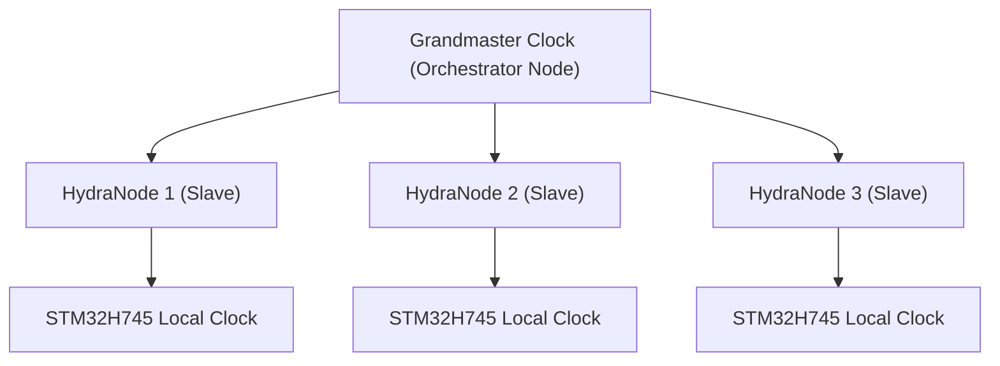

<p align="center">
  
</p>

# ⏱️ HYDRA-UMC-SWARM-SYNC

<p align="center"><a href="README.md">🇺🇸 English</a> | <a href="README_spa.md">🇪🇸 Español</a> | <a href="README_fra.md">🇫🇷 Français</a> | <a href="README_ita.md">🇮🇹 Italiano</a> | <a href="README_deu.md">🇩🇪 Deutsch</a> | 🇨🇳 <b>简体中文</b> | <a href="README_jpn.md">🇯🇵 日本語</a></p>

### 📡 精密时间协议（PTP）与多节点同步

<p align="left">
  
  
  
</p>

---

## 1. 🛠️ 技术概述

**HYDRA-UMC-SWARM-SYNC** 是分布式工厂的心跳。它实现了 PTP（精密时间协议
/ IEEE 1588）的专用版本，以确保网络中的每个控制器都共享一个完全同步的
全局时钟。

这种同步对于多机器人协同运动至关重要，多条机械臂必须在完全相同的微秒
时刻开始和结束轨迹，以避免碰撞或执行联合装配任务。

### 关键特性：
* ⏱️ **超精密同步：** 在本地网络中实现亚 100ns 的抖动。
* 🔄 **同步启停：** 确保多机器人轨迹指令的原子化执行。
* 📡 **硬件时间戳：** 利用 CM5 和 STM32 硬件定时器实现最高精度。
* 🛡️ **网络容错：** 处理数据包抖动和临时网络延迟。

---

## 2. 🔄 同步层级结构



---

## 3. 🧱 架构与设计决策

* **为何采用基于 CRDT 的同步，而非单一真实来源。** 多个 HYDRA-UMC 单元可以半自主运行并在之后重新连接——CRDT 合并策略无需中央仲裁者决定"谁的状态获胜"即可收敛，这是朴素的"最后写入者获胜"方法在真实网络分区场景下无法保证的。
* **为何这是 HYDRA-UMC-ORCHESTRATOR 的兄弟项目，而非子模块。** 状态协调是一项持续的后台关注点，独立于任何单一的编排决策——将其保持为独立进程意味着编排器的重启不会中断正在进行中的合并。
* **为何 CRDT 合并今天已经真实存在，而 PTP 硬件同步尚未实现。** `src/crdt.rs` 实现了一个真实的 LWW-Element-Map（最后写入者获胜映射）——一种基于状态的 CRDT，其 `merge` 可证明是可交换、可结合且幂等的（不仅仅是在某个例子上“看起来收敛”，见该模块自身的属性测试）。`src/lamport.rs` 用一个真实的 Lamport 逻辑时钟为其提供支撑。PTP（IEEE 1588，亚 100ns 硬件时间戳）是一个根本不同、依赖硬件的问题——它需要真实的网卡/硬件计时器才有意义，在有真实硬件可供验证之前将继续推迟。逻辑时钟才是 CRDT 合并真正需要用来确定性地解决冲突的东西，而这部分今天已经是真实且经过测试的。
* **这如何融入生态系统的其余部分。** 作为 HYDRA-UMC-ORCHESTRATOR 下的同级服务，与 HYDRA-UMC-PATH-PLANNER-3D、HYDRA-UMC-JOB-DISPATCHER 和 HYDRA-UMC-NODE-HEALING 并列——无论当前由哪个单元持有编排器角色，都能保持每个单元自身对集群状态的视图一致。

---

## 📂 目录结构

```text
HYDRA-UMC-SWARM-SYNC/
├── src/
│   ├── main.rs       # CLI 入口点：加载场景、协调、打印 JSON
│   ├── lamport.rs    # LamportClock——CRDT 排序背后的逻辑时钟
│   └── crdt.rs       # LwwMap——真正的 CRDT：set/get/merge/snapshot
├── scenarios/        # 示例 JSON 场景（见下方"构建与运行"）
├── build/            # 编译后的二进制文件（build.sh/build.bat 的输出）
├── Cargo.toml        # Rust 包清单（名称、版本、依赖项）
├── bump_version.py   # 里程表式版本递增，由 build.sh/.bat 运行
├── build.sh/.bat     # 递增版本号，然后执行 `cargo build --release`
├── run.sh/.bat       # 运行编译后的二进制文件
└── README.md
```

从原始模板中省略：`hardware/`、`firmware/`、`os/`、`docs/`、
`images/` 和 `scripts/`——这是一个纯软件服务（Rust 二进制文件），
没有专属硬件或固件，没有需要维护的操作系统镜像，目前也还没有
足够多的文档/媒体/实用脚本内容值得为它们单独建立文件夹。

---

## 🔧 构建与运行

一个真实、经过测试的 CRDT 合并——而不只是一个能编译的骨架：它会
协调一个多单元的 JSON 场景并打印收敛后的状态。

```bash
# Windows
build.bat
run.bat scenarios/example.json

# Linux / macOS
./build.sh
./run.sh scenarios/example.json
```

`build.sh`/`build.bat` 会递增 `Cargo.toml` 中的版本号（生态系统统一的
里程表规则，见 `bump_version.py`），然后执行 `cargo build --release`。
`run.sh`/`run.bat` 直接执行生成的二进制文件，并将任何参数（场景路径）
转发给它。

场景是一个包含 `cells` 数组的 JSON 文件——每个单元有一个 `id`（便于
阅读）、一个 `writer`（写入者 ID），以及一组 `writes`
（`{key, value, time}`，其中 `time` 是显式的 Lamport 时间戳，是回放
而非实时生成的——与 HYDRA-UMC-PATH-PLANNER-3D 的 `seed` 使用的
"显式、确定性输入"模式相同）。每个单元的写入会被折叠进它自己的
映射中，然后每个单元的映射会被合并两次——一次从左到右，一次从右到
左——只有当两种顺序都产生完全相同的最终状态时，结果才会打印
`converged: true`，这才是这个服务真正依赖的 CRDT 属性，而不仅仅是
一个假设。

```bash
cargo test   # Lamport 时钟，以及 CRDT 本身——包括直接验证 merge
             # 具有可交换性、可结合性和幂等性的测试（不仅仅是在某个
             # 例子上"看起来正确"）、一个针对真正并发写入的确定性
             # 平局判定测试，以及一个模拟 2 个单元自主运行后再进行
             # 协调的测试，这正对应本 README 自身的设计理由
```

---

## 🚀 路线图
* **第一阶段：** 基于 TSN 的确定性集群同步与亚毫秒级抖动降低。
* **第二阶段：** 多机器人单元中带动态避障的 3D 路径规划。
* **第三阶段：** 利用实时资源可用性进行多机器人任务分发优化。
* **第四阶段：** 支持通过 Wi-Fi 6（高可靠性模式）进行无线 PTP 同步，以及亚 100ns 精度验证。

---

## 🔗 相关项目

本项目是同一作者（JuanenRac / Electro Hobby 3D）打造的更大规模机器人生态
系统的一部分，涵盖固件、控制软件、AI 节点和车队工具。值得了解，因为某个
需求实际上可能是关于这些项目之一，而非本仓库。

### 项目族

**父项目：** **[HYDRA-UMC-ORCHESTRATOR](https://github.com/JuanenRac/HYDRA-UMC-ORCHESTRATOR)** —— 本同步层所维护一致性的集成父项目。

**同族项目：**
- **[HYDRA-UMC-PATH-PLANNER-3D](https://github.com/JuanenRac/HYDRA-UMC-PATH-PLANNER-3D)** —— 同级编排服务，同一父项目。
- **[HYDRA-UMC-JOB-DISPATCHER](https://github.com/JuanenRac/HYDRA-UMC-JOB-DISPATCHER)** —— 同级编排服务，同一父项目。
- **[HYDRA-UMC-NODE-HEALING](https://github.com/JuanenRac/HYDRA-UMC-NODE-HEALING)** —— 同级编排服务，同一父项目。

### 直接相关（项目族之外）

本项目在 Orchestration & Swarm 系列之外没有直接关联的项目（根据生态系统
自身的关系图谱）——其余所有内容请见下方"生态系统的其余部分"。

### 生态系统的其余部分

**HYDRA-UMC 平台** —— 多机器人微工厂单元
- **[HYDRA-UMC](https://github.com/JuanenRac/HYDRA-UMC)** —— 协调最多 8 条机械臂的 CM5 + STM32H745 主板。
- **[HYDRA-UMC-SERVER](https://github.com/JuanenRac/HYDRA-UMC-SERVER)** —— 每个控制客户端所对接的 Express/WebSocket 后端。
- **[HYDRA-UMC-STUDIO](https://github.com/JuanenRac/HYDRA-UMC-STUDIO)** —— 基于 Web 的控制仪表盘，多机器人 3D 可视化。
- **[HYDRA-UMC-ANDROID-CONTROL](https://github.com/JuanenRac/HYDRA-UMC-ANDROID-CONTROL)** —— 通过 Wi-Fi/蓝牙的 Android 控制应用。
- **[HYDRA-UMC-IOS-CONTROL](https://github.com/JuanenRac/HYDRA-UMC-IOS-CONTROL)** —— 基于 Flutter 构建的 iOS/iPadOS 控制应用。
- **[HYDRA-UMC-SUITE](https://github.com/JuanenRac/HYDRA-UMC-SUITE)** —— 桌面端集群指挥中心（Python/PySide6）。
- **[HYDRA-UMC-EDITOR-URDF](https://github.com/JuanenRac/HYDRA-UMC-EDITOR-URDF)** —— 用于机器人目录的桌面端 URDF 模型编辑器。
- **[HYDRA-UMC-DSI](https://github.com/JuanenRac/HYDRA-UMC-DSI)** —— 机载 DSI 触摸屏的原生触控 UI。

**URTC 平台** —— 每台 HYDRA-UMC 机械臂搭载的工具头控制器
- **[URTC](https://github.com/JuanenRac/URTC)** —— CAN 总线工具头控制器，25 种工具配置。
- **[URTC-FLASHER](https://github.com/JuanenRac/URTC-FLASHER)** —— 桌面端 CAN-OTA + SWD/JTAG 刷写工具。
- **[URTC-TESTER](https://github.com/JuanenRac/URTC-TESTER)** —— 桌面端实时 CAN 总线诊断工具。
- **[URTC-WEB-STUDIO](https://github.com/JuanenRac/URTC-WEB-STUDIO)** —— 通过 Web Serial API 的浏览器端替代方案。

**🎥 视觉 AI 节点（Hailo-8）**
- [HYDRA-UMC-VISION-NODE](https://github.com/JuanenRac/HYDRA-UMC-VISION-NODE)
- [HYDRA-UMC-VISION-STREAMER](https://github.com/JuanenRac/HYDRA-UMC-VISION-STREAMER)
- [HYDRA-UMC-DETECTION-HEF](https://github.com/JuanenRac/HYDRA-UMC-DETECTION-HEF)
- [HYDRA-UMC-SAFETY-ZONES](https://github.com/JuanenRac/HYDRA-UMC-SAFETY-ZONES)
- [HYDRA-UMC-VISUAL-SERVOING-API](https://github.com/JuanenRac/HYDRA-UMC-VISUAL-SERVOING-API)

**🧠 认知 AI 节点（Hailo-10）**
- [HYDRA-UMC-COGNITIVE-NODE](https://github.com/JuanenRac/HYDRA-UMC-COGNITIVE-NODE)
- [HYDRA-UMC-VLA-ENGINE](https://github.com/JuanenRac/HYDRA-UMC-VLA-ENGINE)
- [HYDRA-UMC-VOICE-UI](https://github.com/JuanenRac/HYDRA-UMC-VOICE-UI)
- [HYDRA-UMC-SEMANTIC-PLANNER](https://github.com/JuanenRac/HYDRA-UMC-SEMANTIC-PLANNER)
- [HYDRA-UMC-DOCS-QA](https://github.com/JuanenRac/HYDRA-UMC-DOCS-QA)

**🎮 数字孪生与仿真**
- [HYDRA-UMC-TWIN](https://github.com/JuanenRac/HYDRA-UMC-TWIN)
- [HYDRA-UMC-PHYSICS-REPLICA](https://github.com/JuanenRac/HYDRA-UMC-PHYSICS-REPLICA)
- [HYDRA-UMC-HIL-BRIDGE](https://github.com/JuanenRac/HYDRA-UMC-HIL-BRIDGE)
- [HYDRA-UMC-SYNTHETIC-DATA-GEN](https://github.com/JuanenRac/HYDRA-UMC-SYNTHETIC-DATA-GEN)

**📊 数据与分析**
- [HYDRA-UMC-DATALAKE](https://github.com/JuanenRac/HYDRA-UMC-DATALAKE)
- [HYDRA-UMC-TELEMETRY-COLLECTOR](https://github.com/JuanenRac/HYDRA-UMC-TELEMETRY-COLLECTOR)
- [HYDRA-UMC-ANOMALY-DETECTOR](https://github.com/JuanenRac/HYDRA-UMC-ANOMALY-DETECTOR)
- [HYDRA-UMC-PRODUCTION-REPORTS](https://github.com/JuanenRac/HYDRA-UMC-PRODUCTION-REPORTS)

**🏭 工业网关**
- [HYDRA-UMC-GATEWAY-INDUSTRIAL](https://github.com/JuanenRac/HYDRA-UMC-GATEWAY-INDUSTRIAL)
- [HYDRA-UMC-OPCUA-SERVER](https://github.com/JuanenRac/HYDRA-UMC-OPCUA-SERVER)
- [HYDRA-UMC-MQTT-BROKER](https://github.com/JuanenRac/HYDRA-UMC-MQTT-BROKER)
- [HYDRA-UMC-MTCONNECT-ADAPTER](https://github.com/JuanenRac/HYDRA-UMC-MTCONNECT-ADAPTER)

**🛠️ 配套工具**
- [URTC-SMART-RACK](https://github.com/JuanenRac/URTC-SMART-RACK)
- [URTC-VISION-TOOL](https://github.com/JuanenRac/URTC-VISION-TOOL)
- [HYDRA-UMC-WATCH](https://github.com/JuanenRac/HYDRA-UMC-WATCH)
- [HYDRA-UMC-TOOL-CLI](https://github.com/JuanenRac/HYDRA-UMC-TOOL-CLI)
- [HYDRA-UMC-DASHBOARD-AI](https://github.com/JuanenRac/HYDRA-UMC-DASHBOARD-AI)


## 👤 作者
**JuanenRac**（Electro Hobby 3D）
📧 electrohobby3d@gmail.com

## 📜 许可证
GPL-3.0 —— 详见 LICENSE。
